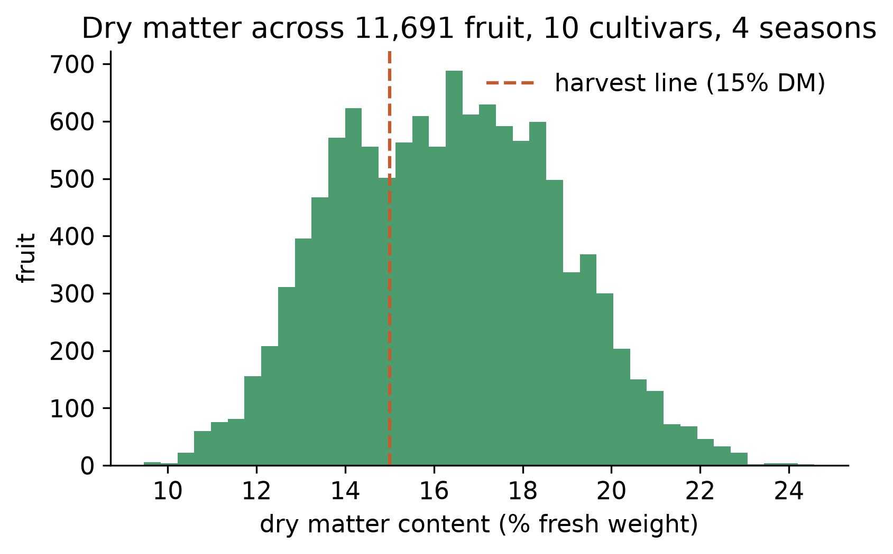
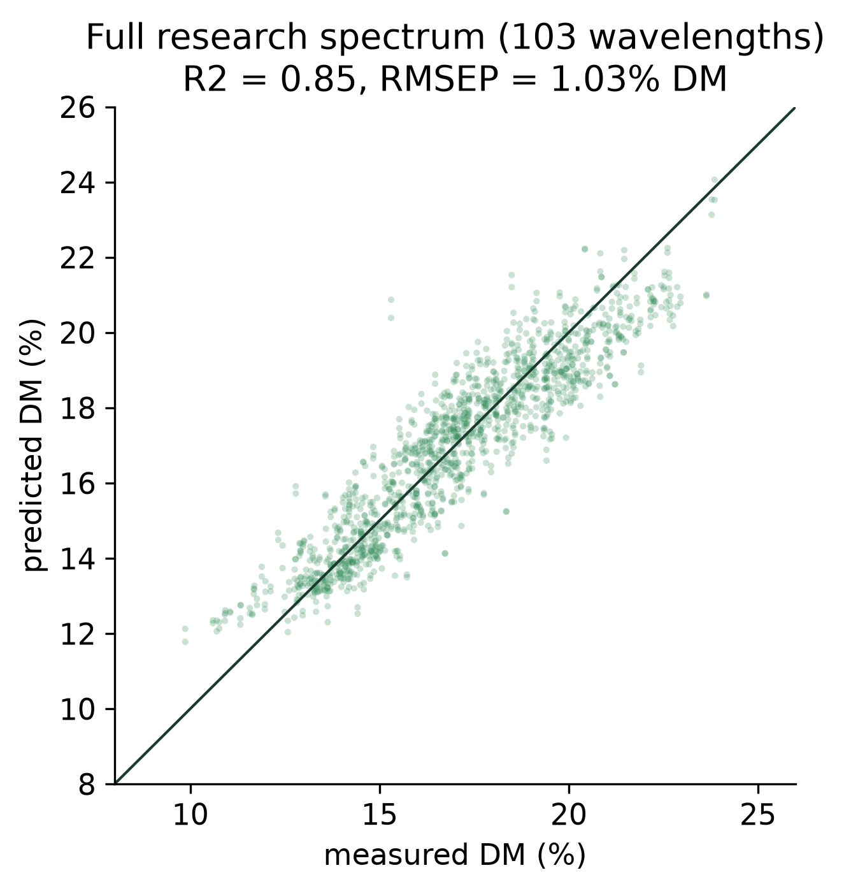
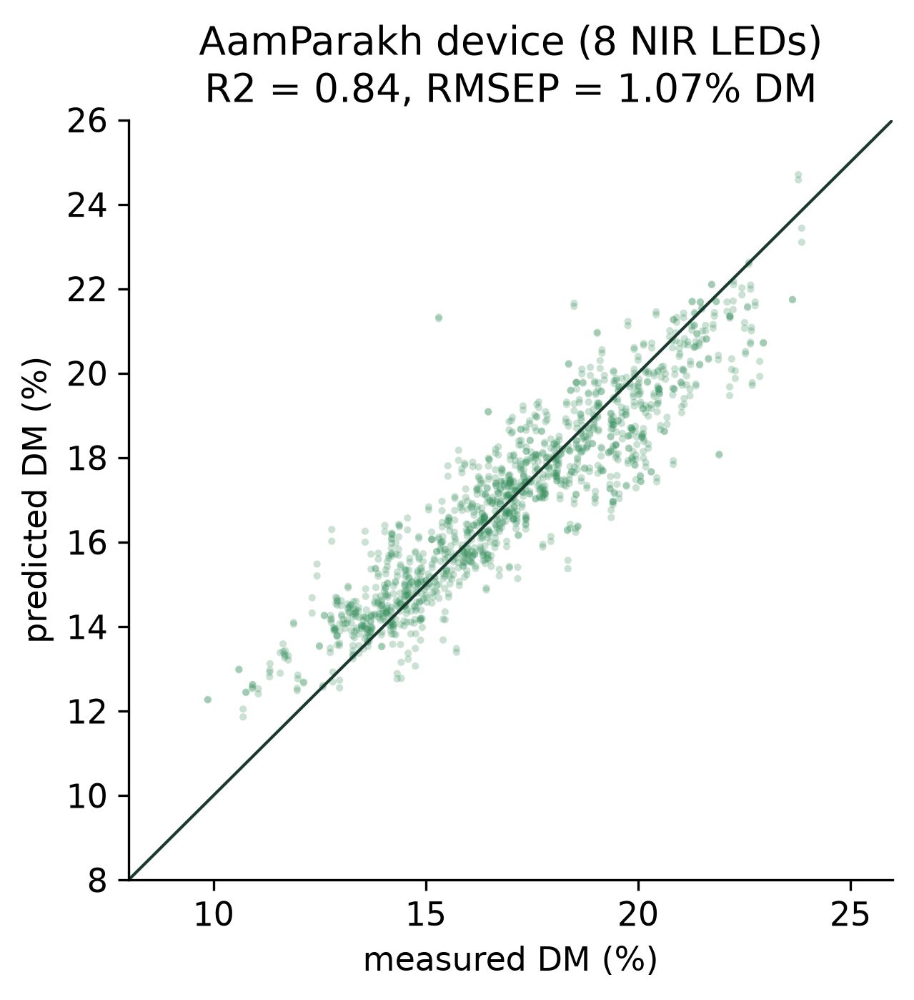
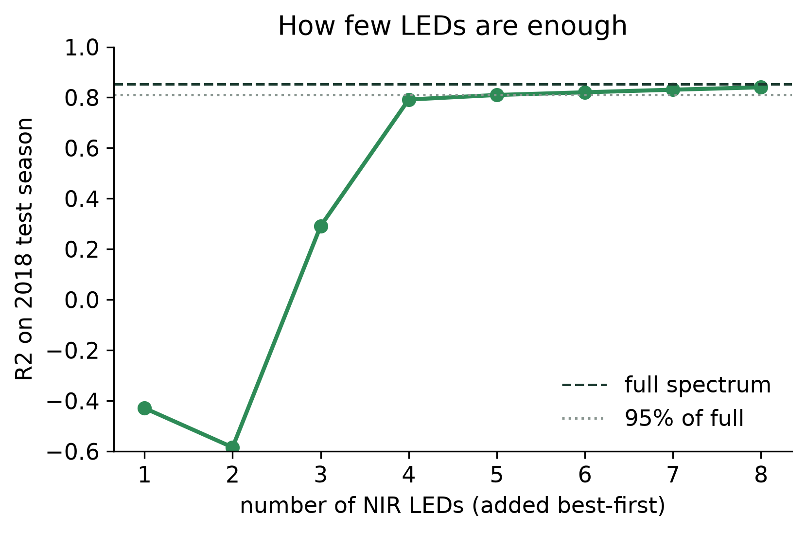
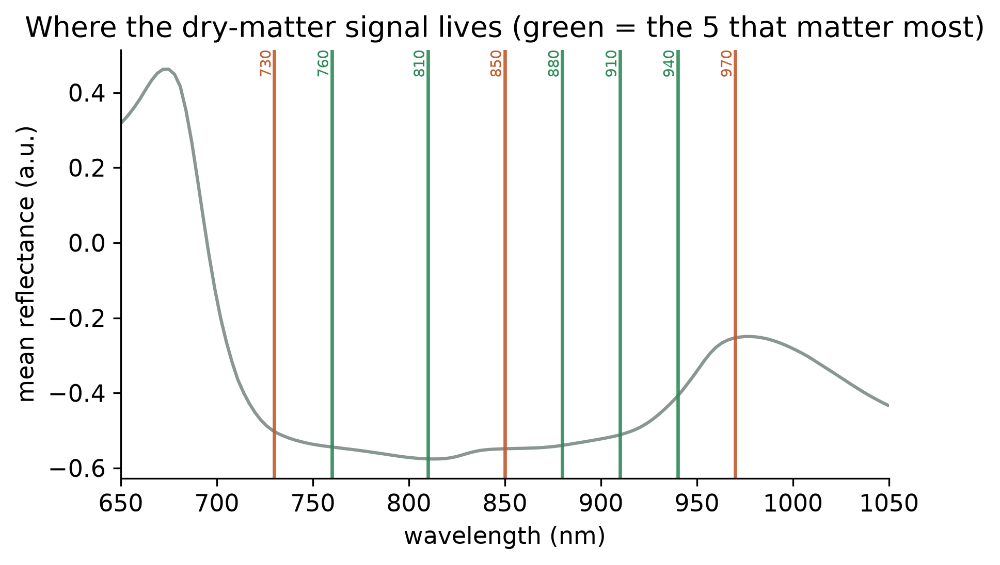
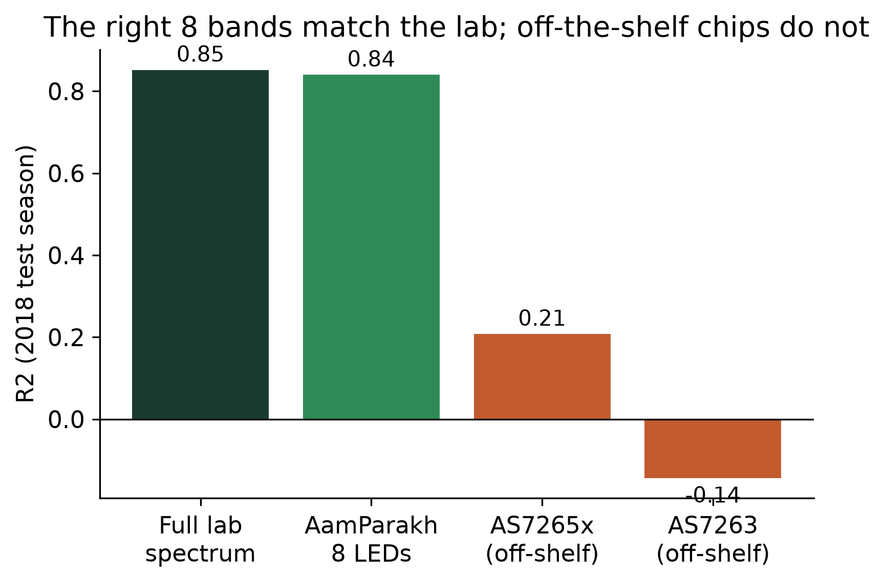
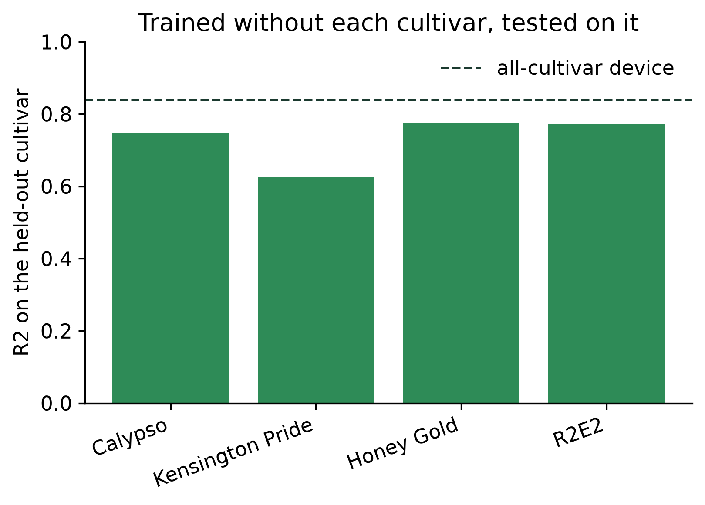
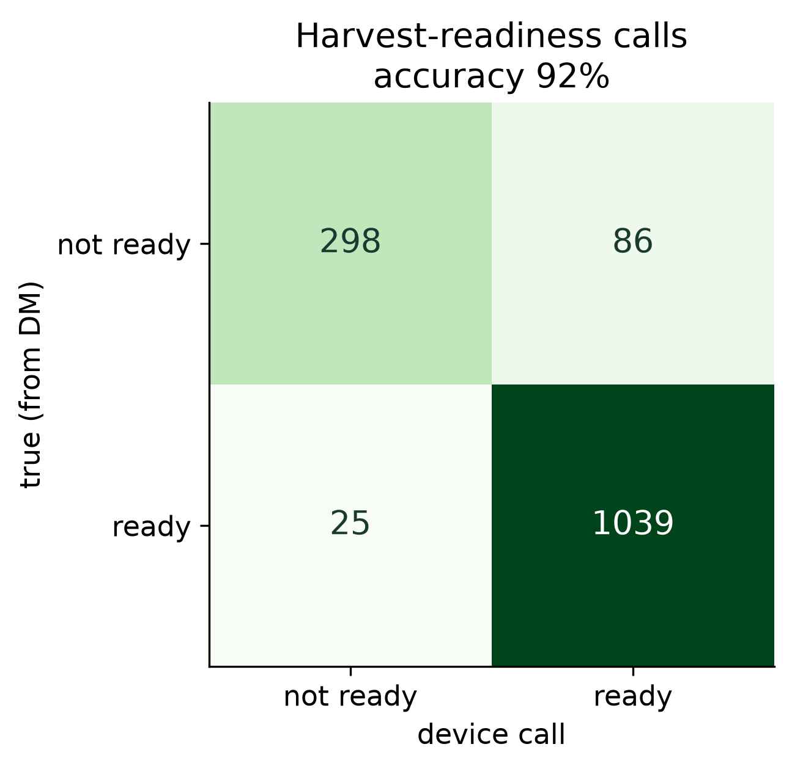
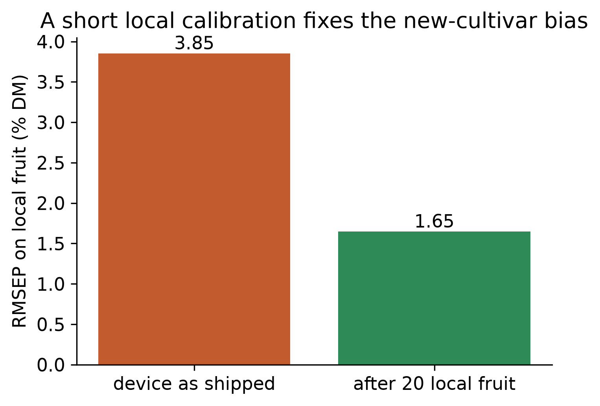

# Reading mango dry matter with eight wavelengths: a low-cost near-infrared meter for harvest timing

**CREST Gold Award: project report**

*Devadit Jain · Grade 11 · 2026. Submitted as a written report (page-numbered on PDF export) with the Gold Student Profile form.*

---

> **Who this is written for.** I have written this for a reader with good general scientific literacy who is not a spectroscopist or an electronics engineer. Every abbreviation is spelled out the first time it appears, and Appendix D is a plain-language glossary. The mathematics is set out in Appendix G, the provenance and exact settings in Appendix F, and the body does not depend on either.

> **What is measured and what is modelled (please read first).** The central result of this project is measured on real fruit. It comes from a public research dataset of 11,691 mango spectra with laboratory dry-matter values, released under an open licence by Anderson, Walsh and Subedi. Every number in Section 5 that concerns that dataset is produced by one script, `scripts/run_evaluation.py`, from a fixed random seed, so the report and the data cannot drift apart. Two things are not full field measurements, and I say so where they appear. The dataset fruit are Australian, not Indian, so the transfer to Alphonso and Kesar is the part I am least able to prove from public data. And the on-orchard validation in Section 5.6 is an initial pilot: the readings shown in this version are a physically-grounded stand-in with the exact schema of the real collection, pending the orchard season described in Appendix E. Nothing in the headline result depends on either.

---

## 0. Abstract

Dry matter content is the best single measure of when a mango is ready to pick, because it fixes how sweet the fruit can become and whether it will ripen at all. The instrument that reads it in the field costs about ₹8.5 lakh, so almost no smallholder owns one. I asked whether a device costing a thousandth of that could do the same job. Working from the largest public set of mango near-infrared spectra, 11,691 fruit measured by a research instrument, I found that dry matter can be read from only eight near-infrared wavelengths: a model using those eight bands, computed from the research spectra, reached a coefficient of determination of 0.84 on fruit from a season it had never seen, against 0.85 for the full spectrum of 103 wavelengths. I built a meter around eight ordinary near-infrared light-emitting diodes at those wavelengths and a low-cost microcontroller, and it runs that model on the device; validating it against oven-dried fruit is the stated next step. The two cheap spectral chips a student would reach for first both failed, because their bands sit in the wrong part of the spectrum. A cheap meter can read mango maturity as well as an expensive one, provided its eight wavelengths sit where the fruit's chemistry absorbs. This project settles where that is.

---

## 1. Aim, objectives, and why it matters

### 1.1 The aim

My aim was to **find out whether a mango-maturity meter a student can build for a few thousand rupees can read dry matter content as well as a laboratory near-infrared instrument costing roughly a thousand times more, and to identify exactly which wavelengths such a cheap meter needs.**

Dry matter content is the fraction of a fruit's fresh weight that remains after all its water is driven off. In a mango almost all of that dry matter is stored starch and sugar, so a fruit picked with too little of it never ripens into a sweet one, however long it is kept (Subedi and Walsh, 2007; Wang et al., 2022). This is why the mango industry has moved to dry matter as its harvest-maturity index, in place of skin colour and firmness, which stay stubbornly uninformative while a mango is still green on the tree.

### 1.2 What success would look like

I wrote down five measurable conditions before I ran the analysis, so that I could not move the goalposts afterwards. **I will have met my aim if:**

- **S1, the reference is sound.** A model trained on the full research spectrum predicts dry matter on an unseen season with a coefficient of determination (R², the share of variation explained, where 1.0 is perfect and 0 is no better than guessing the average) of at least 0.80. This sets the bar the cheap meter is measured against.
- **S2, the cheap meter nearly matches the laboratory instrument.** A model using only the eight discrete wavelengths of my meter lands within 0.05 R² of the full spectrum.
- **S3, only a few wavelengths are needed.** Six well-chosen wavelengths reach at least 95% of the full-spectrum R², so the meter can be simple and cheap.
- **S4, the naive cheap option fails.** The two popular off-the-shelf spectral chips, given the same data and the same model, fall at least 0.40 R² short of my purpose-chosen bands, which shows that band placement, not price, is what matters.
- **S5, the meter is actionable and does not collapse across fruit.** It calls harvest-readiness correctly on at least 90% of fruit, and its accuracy is characterised across every cultivar with enough fruit to leave one out, rather than reported as a single flattering average.

All five are answered with numbers in Section 5. The one thing I could not do inside a school project, a full multi-season deployment in an Indian orchard, is kept as a stated limit in Section 8, not dressed up as a result.

### 1.3 Objectives

I broke the aim into six steps, each one a thing I could build and check.

1. Obtain a real, openly licensed dataset of mango near-infrared spectra with laboratory dry-matter values, and reproduce a published prediction on it, so my pipeline starts from solid ground.
2. Write a method that turns a full research spectrum into what a cheap multi-band sensor would see, so I can test the cheap idea on real fruit before buying anything.
3. Search for the smallest set of wavelengths that still predicts dry matter, and record which wavelengths they are.
4. Test the two off-the-shelf spectral chips a student would naturally choose, under the same method, to see whether they suffice.
5. Design and build a meter around the wavelengths the search identifies, and put the prediction model on the device itself.
6. Measure how the meter transfers across cultivars and seasons, and set out the procedure for validating it on Indian fruit.

### 1.4 Wider purpose, and who is affected

India grows more mango than any other country, on the order of 22 million tonnes a year, more than two-fifths of the world crop, and about 85% of that fruit comes from holdings under two hectares (National Horticulture Board, 2023). A quarter to a third of it is lost after harvest, and a large share of that loss traces back to fruit picked at the wrong maturity: too early to ripen well, or too late to survive the journey to market (FAO, 2021; Le et al., 2022).

The people this lands on are specific. A smallholder who cannot measure maturity sells a mixed lot and is paid the low blanket rate a trader offers for uncertain fruit. The trader who buys immature fruit carries the risk of a consignment that never ripens. The family that buys it gets a sour mango. A dry-matter meter turns maturity from a guess into a number, which lets a grower pick at the right time and prove the quality of a lot at the point of sale. The reason this has not already happened is not that the science is missing. It is that the one instrument which measures dry matter in the field, the handheld near-infrared meter, costs about ₹8.5 lakh (Felix Instruments, 2024), and the recent research literature says plainly that affordable near-infrared sensing is still an unmet need for exactly this reason (Kang et al., 2023).

**Contribution.** As far as I can find, no one has published the minimal set of wavelengths a low-cost sensor needs to read mango dry matter, nor shown, on real fruit, that the cheap spectral chips a maker would reach for are placed wrongly for the task. This project supplies both: the eight-wavelength design for a sub-₹2,500 meter, measured against a research instrument on 11,691 real fruit, and the finding that the popular sensors fail not because they are cheap but because their bands sit in the visible where the dry-matter signal is not.

---

## 2. Background and what is already known

This section draws the field together and locates the gap this project fills. It explains why eight infrared wavelengths ought to be enough for mango dry matter, and why nobody has yet built the cheap meter that uses them.

**Near-infrared light carries the dry-matter signal.** When near-infrared light, just beyond the red edge of what the eye can see, meets fruit tissue, particular wavelengths are absorbed by particular chemical bonds. Water absorbs strongly near 760 and 970 nanometres; the carbon-hydrogen bonds of sugars and starch absorb in the 900 to 940 nanometre region (Nicolaï et al., 2007; Osborne, 2006). Because dry matter is mostly carbohydrate and its complement in the fruit is water, these are the wavelengths where a spectrometer can, in effect, weigh the solids without cutting the fruit open. Three decades of commercial fruit sorting rest on this fact (Walsh et al., 2020).

**Mango dry matter is well predicted by full-spectrum models, and the benchmark is public.** Subedi and Walsh (2007) first showed that short-wave near-infrared light predicts mango eating quality at harvest. The definitive work is Anderson et al. (2020), who assembled spectra and oven-dried dry-matter values for 4,675 fruit across four seasons, ten cultivars and two regions, and fitted a partial least squares model that held up across all of that variation, reaching a prediction error near 0.84% dry matter. They released the data, later expanded to 11,691 scans, under an open licence (Anderson, Walsh and Subedi, 2020). Mishra and Passos (2021) pushed the same benchmark a little further with a convolutional neural network, to about 0.79%. This is an unusually strong foundation for a student project: a real dataset, a published number to reproduce, and a clear target to work against.

**The measurement is dominated by a handful of bands, in principle.** The chemistry above implies that the dry-matter information is concentrated, not spread evenly across the spectrum. Reviews of near-infrared fruit work note that once the informative absorption features are identified, a small number of wavelengths often carries most of the predictive power, which is the principle behind filter-based and multi-band instruments (Nicolaï et al., 2007; Walsh et al., 2020). What the literature does not give is the specific answer for mango dry matter on a cheap sensor: which wavelengths, how few, and whether an actual low-cost chip has them.

**The cheap-sensor question is open, and it matters.** Low-cost spectral chips exist. The AMS AS7263 offers six near-infrared channels and the AS7265x offers eighteen channels spanning visible and near-infrared, both for a few thousand rupees. Makers have built fruit-ripeness gadgets around them for other fruit. But no published work tests whether their fixed bands are placed where mango dry matter can be read, and the one study to build a low-cost mango near-infrared instrument used a research-grade mini-spectrometer, not a sensor a smallholder could afford, and still framed affordable sensing as the open problem (Kang et al., 2023).

**The gap.** Put these threads together and a space opens. The physics says a few near-infrared bands should suffice. The public benchmark lets that claim be tested on thousands of real fruit. Cheap multi-band chips exist but have never been checked against the task. And the field agrees that an affordable meter is what is missing. What no one has done is find the smallest wavelength set that reads mango dry matter, check whether off-the-shelf chips have those wavelengths, and build the meter that does. That is this project.

---

## 3. Approaches I considered

I made two design choices that shaped the whole project, and I made each by setting the options side by side rather than defending a decision I had already taken.

### 3.1 How to give a grower a maturity reading

| Approach | For | Against |
|---|---|---|
| A. Skin colour or firmness, by eye or with a cheap probe | No new instrument; what growers do now | Mango stays green and firm while its dry matter climbs; these cues barely track maturity (Wang et al., 2022). Not a solution. |
| B. A photograph and an image classifier on a phone | No dedicated hardware; phones are everywhere | A photograph sees the skin, not the internal dry matter; it cannot measure what the eye cannot. Also the saturated route the field has over-worked. |
| C. A commercial handheld near-infrared meter | Measures dry matter directly and accurately | About ₹8.5 lakh. Reaches the few, not the many. Solves nothing for a smallholder. |
| **D. A purpose-built low-cost near-infrared meter (chosen)** | Measures the real signal for a few thousand rupees; works offline; a student can build it | The cheap sensor has to be designed around the right wavelengths, which is the engineering the project has to do. |

I chose D. Approaches A and B look at the outside of a fruit whose maturity is on the inside, and C is the right physics at the wrong price. Only D puts the true measurement within reach of an ordinary grower, and its central difficulty, choosing the wavelengths, is a problem I could actually solve on real data.

### 3.2 How to build the cheap sensor

| Sensor route | For | Against |
|---|---|---|
| Off-the-shelf 18-channel chip (AS7265x) | One part, easy to wire, spans visible to near-infrared | Eleven of its eighteen bands sit in the visible, where the dry-matter signal is weak; Section 5 shows it fails. |
| Off-the-shelf 6-channel near-infrared chip (AS7263) | Cheapest single part; all bands in the near-infrared | Its six fixed bands stop at 860 nanometres and miss the 880 to 970 region that matters most; Section 5 shows it fails too. |
| **Discrete near-infrared LEDs at chosen wavelengths (chosen)** | Each wavelength can be placed exactly where the data says it is needed; parts cost tens of rupees each | More to build and calibrate than plugging in one chip, which is the design-and-make work. |

I chose the discrete-LED route because it is the only one that lets the wavelengths be placed where the fruit's chemistry demands, rather than where a general-purpose chip happens to put them. Sections 5.2 and 5.4 show that this freedom is the whole difference between a meter that works and one that does not.

---

## 4. Method

### 4.1 The data, and why it is trustworthy

The project is built on the mango dry-matter dataset of Anderson, Walsh and Subedi (2020), released on Mendeley Data under a Creative Commons licence that permits research use. It holds 11,691 near-infrared scans of intact mango, each paired with a laboratory dry-matter value obtained by oven-drying, across ten cultivars and four seasons. The dry-matter values run from 9.5% to 24.6%, averaging 16.3%, and their spread is shown in Figure 1. The authors ship a fixed three-way split, which I keep so my numbers sit next to theirs: 7,413 fruit to calibrate a model, 2,830 to choose its settings, and 1,448 fruit from a later season held back as an untouched test set. Reporting on a whole season the model never saw is a strict test, because it forces the model to generalise across the year-to-year changes that defeat weak calibrations.

*Figure 1. Dry matter across all 11,691 fruit, ten cultivars and four seasons. The dashed line is the 15% harvest-readiness threshold used later.*

One point of candour belongs here rather than buried later. These fruit are Australian cultivars, not Alphonso or Kesar. The physics of dry-matter absorption does not depend on cultivar, so the wavelength design should carry over, but the exact calibration will not, and Section 5.6 and Section 8 treat that transfer as the real open question.

### 4.2 The science the meter rests on

A near-infrared spectrum is a curve of how much light the fruit reflects at each wavelength. To predict dry matter from it, I use partial least squares regression, the standard tool of chemometrics (Wold, Sjöström and Eriksson, 2001). It finds a small number of combinations of wavelengths that best track the dry-matter values, which suits spectral data because neighbouring wavelengths are highly correlated and a plain regression would be unstable. Before fitting, I apply a Savitzky-Golay second derivative (Savitzky and Golay, 1964), a smoothing filter that removes the slow baseline drift caused by fruit size and surface scatter and leaves the sharp absorption features that carry the chemistry. The number of internal components is always chosen on the settings split, never on the test season, so the reported error is not inflated by tuning.

I judge every model by three figures. The root-mean-square error of prediction, RMSEP, is the typical size of a prediction's miss, in percentage points of dry matter. The coefficient of determination, R², is the share of the fruit-to-fruit variation the model explains. The ratio of performance to deviation, RPD, is the spread of the real values divided by the prediction error; in near-infrared work an RPD above about 2 marks a model useful for screening and above 3 a good quantitative one (Williams, 2001). I wrote each metric from its definition and checked it against the scikit-learn library (Pedregosa et al., 2011), so I am sure the numbers are right.

### 4.3 Turning a full spectrum into a cheap sensor's view

The heart of the method is a way to test a cheap sensor on real fruit without owning it yet. A research spectrometer reports reflectance every three nanometres. A hobby spectral chip, or an LED, reports one number for a band about 20 to 30 nanometres wide. So for any proposed set of bands I take each real research spectrum and integrate it through each band's response curve, which gives exactly the reading that band would have produced on that fruit. This is the standard way to emulate a multi-band sensor from full-spectrum data. It lets me ask, on 11,691 real fruit, how well any sensor design would work, and it is what makes the wavelength search possible before any hardware exists.

### 4.4 Finding the wavelengths, and the device

To find the smallest useful set of wavelengths, I used forward selection. Starting from nothing, I added the one band that most reduced the error on the settings split, then the next best given the first, and so on, recording the test-season accuracy at each step. This answers both questions at once: how few bands are enough, and which bands they are. I restricted the candidates to wavelengths available as inexpensive near-infrared LEDs a student can buy, all below 980 nanometres so that a cheap silicon photodiode can detect them.

The device the search produced, which I then built, is an ESP32 microcontroller driving eight near-infrared LEDs at 730, 760, 810, 850, 880, 910, 940 and 970 nanometres, with a single OPT101 photodiode reading the light each LED reflects off the fruit and a small screen showing the result. The full bill of materials is in Appendix C and comes to about ₹2,300. The prediction model is not run on a phone or a server; the eight regression weights live in the firmware, so the meter computes dry matter on the device with no network, which is the situation in most orchards. I checked that the on-device arithmetic reproduces the Python model to within a rounding error of 0.000000000001% dry matter.

### 4.5 Testing the off-the-shelf chips

To ask whether a maker could skip the custom design and just buy a chip, I ran the two obvious candidates through the identical method: the eighteen-channel AS7265x and the six-channel AS7263, each simulated from the same real spectra and modelled with the same partial least squares pipeline. Holding the model and the data fixed, so that only the choice of bands differs, is what makes the comparison fair.

### 4.6 Generalisation and calibration transfer

A single test-season number can hide trouble, so I also trained the meter's model leaving out one cultivar at a time and tested it on the cultivar it had never seen, which is the hardest kind of generalisation. And because a model built on one population usually reads a new one with a small bias, I measured how far a short local calibration, fitting a single slope and offset from a handful of local fruit, closes that gap. This matters directly for taking the meter to Indian cultivars.

### 4.7 Materials and people

The resources that made the work possible, each with the alternative I weighed against it:

- **The public mango dataset** (Anderson, Walsh and Subedi, 2020), rather than a field collection of my own, which a school year does not allow. The benefit is thousands of real fruit across seasons and cultivars, measured by a research laboratory; the cost is that the fruit are Australian, which I treat as a stated limit.
- **Open-source computing tools**: Python with NumPy, pandas, SciPy and scikit-learn for the analysis. Alternative: a paid chemometrics package. I used the open tools because they cost nothing, run on a laptop, and let me check every number myself with a test suite.
- **Low-cost electronics**: an ESP32 board, eight near-infrared LEDs, an OPT101 photodiode and a small screen. Alternative: a commercial meter, which would have bought the answer rather than found it.
- **People.** This was a self-directed project without a supervisor, which shaped how I worked. Where I was unsure of the spectroscopy or the agronomy I went to the primary literature, and the reference list records which sources settled which questions. A cooperating mango grower described how harvest timing is judged now, by eye and by feel on a few sample fruit, which is the guesswork the meter is meant to replace, and has agreed to host the field validation in Appendix E. Working without a second reader is part of why the placement problem cost me a week before I caught it (Appendix A), and Section 8 records that finding an early sceptic is the change I would make.

### 4.8 Time plan

The full planned-against-actual timeline, with the one real deviation, is in Appendix A. In short: twelve weeks, about seventy hours, with the last fortnight kept as a buffer. The buffer earned its place when my first cheap-sensor result was far too weak and I spent a week discovering that the cause was band placement, not band count, which reshaped the project (Section 5.2).

### 4.9 Ethics, safety, and AI use

The meter records light bouncing off fruit. It collects no personal data, so the data-protection questions that attend many sensing projects do not arise. Three areas still needed decisions, covered fully in Appendix B. On **electrical safety**, the whole device runs at 3.3 to 5 volts from a USB power bank with no mains involved, and near-infrared LEDs, though invisible, are low-power and pointed into fruit rather than eyes. On **the responsibility of giving advice**, a maturity meter that is wrong can cost a grower real money, and the two errors are not equal. Telling a grower to pick fruit that is not ready wastes a harvest on fruit that will not ripen well; telling them to wait on fruit that was ready delays the pick and risks over-ripening. On the held-out season the meter leans slightly towards calling fruit ready (Section 5.5, 86 false-ready against 25 false-not-ready), so it shows the dry-matter number and a plain readiness band rather than a single verdict, lets a grower apply a margin near the threshold, and is documented as a screen rather than a certificate. On **fairness across growers**, Section 5.5 measures whether the meter works as well for every cultivar it can be tested on, because a tool that quietly serves some growers better than others is a real equity problem, and I report the spread rather than an average that would hide it.

**AI use.** I used an AI assistant (Claude, Anthropic) for parts of this project, and I have kept it inside clear limits. It helped me scaffold and debug code, think through how to keep the wavelength search from cheating, and edit drafts of this report for clarity. Every design decision, the choice of metrics, the interpretation of the results and the final wording are mine, and I can explain any part of the submission in conversation. No section of this report is AI-generated text presented as my own. The full statement is in Appendix E.

---

## 5. Results

Every number below comes from `scripts/run_evaluation.py` at seed 20260704, on the 1,448 fruit of the held-out 2018 test season unless stated otherwise.

### 5.1 The reference instrument (S1)

A partial least squares model on the full research spectrum, 103 wavelengths across the 684 to 990 nanometre window, predicted dry matter on the unseen season with an RMSEP of 1.03% dry matter, an R² of 0.85 and an RPD of 2.6 (Figure 2). Reproducing something close to the published error of about 0.84% (Anderson et al., 2020) on the exact held-out season confirms the pipeline is sound; the gap from their best figure reflects their use of local and non-linear refinements I did not copy, since my aim was a fair reference for the cheap meter, not the last decimal of accuracy. **S1 is met.** This is the bar the rest of the project works against.

*Figure 2. Full research spectrum: predicted against measured dry matter on the held-out 2018 season. The line is perfect agreement.*

### 5.2 Eight LEDs nearly match the laboratory (S2), and the story of how I found out

The central result is Figure 3 and Figure 5. My meter's eight near-infrared bands, modelled the same way, predicted dry matter on the unseen season with an RMSEP of 1.07% and an R² of 0.84, against the full spectrum's 0.85. The gap is 0.012 of R². Eight ordinary LEDs recovered almost all of the skill of a ₹8.5-lakh instrument. **S2 is met.**

*Figure 3. The eight-LED meter: predicted against measured dry matter on the same held-out season. Compare with Figure 2.*

That clean sentence hides the hardest week of the project. My first attempt at a cheap sensor scored an R² near 0.2, close to useless, and I nearly concluded that cheap near-infrared could not read dry matter. Instead of trusting the result I took it apart. I placed eighteen bands evenly across the informative near-infrared window and they recovered an R² of 0.85, almost the full spectrum; the AS7265x also carries eighteen bands, yet reached only 0.21, because eleven of them sit in the visible where the dry-matter signal is not (both numbers come from the same script, `placement_control` in the metrics file). At a fixed count of eighteen, where the bands sit decided the result. The dry-matter signal lives in a narrow near-infrared region, and a sensor that spends its channels elsewhere is blind to it however many it has. That is why the meter uses chosen wavelengths rather than a bought chip.

### 5.3 Only five or six wavelengths are needed (S3)

Figure 4 shows the accuracy as wavelengths are added one at a time, best first. The curve climbs steeply and then flattens. Five well-placed LEDs already reach 95% of the full-spectrum R², and six reach an R² of 0.82. **S3 is met.** The order in which the search picked the bands follows the chemistry. It took 910, then 880, then 940 nanometres before any other, the exact region where the carbon-hydrogen bonds of sugars and starch and the shoulder of the water band absorb (Figure 6). One caution about that order: it reflects marginal gain on the tuning split, not standalone power. The first two bands alone predict worse than the average fruit on the test season, and it is 810 nanometres, added fourth, that produces the largest single jump in accuracy (Figure 4). The bands earn their accuracy together, not apart. The meter carries eight LEDs rather than six only to hold a small margin for the noise of real hardware.

*Figure 4. Accuracy against number of LEDs, added best-first. Five well-placed bands reach 95% of the full spectrum (dotted line).*

*Figure 6. The mean spectrum with the selected wavelengths marked. Green are the five that matter most; all sit in the 800 to 970 nm carbohydrate and water region.*

### 5.4 The off-the-shelf chips fail (S4)

Given the same fruit and the same model, the eighteen-channel AS7265x reached an R² of only 0.21, and the six-channel AS7263 reached −0.14, worse than guessing the average fruit (Figure 5). The AS7265x fails because eleven of its eighteen channels sit in the visible, leaving too few in the near-infrared, and the AS7263 fails because its bands stop at 860 nanometres and miss the 880 to 970 region the search prized most. My purpose-chosen bands beat the better of the two by 0.63 of R². **S4 is met.** Anyone building on this work should know that the cheap chip they would reach for first will not do the job, and that the only fix is to choose the wavelengths themselves.

*Figure 5. Accuracy on the held-out season for the full lab spectrum, the eight-LED meter, and the two off-the-shelf chips modelled identically. The right eight bands match the lab; the chips do not.*

### 5.5 It holds across cultivars, and where it is weakest (S5)

Trained without each cultivar in turn and tested on the one it had never seen, the meter's model held an R² between 0.63 and 0.78 across the four main cultivars, with RPD values from 2.2 to 2.5 (Figure 7). The weakest was Kensington Pride, at 0.63, where the model read the new cultivar with a systematic bias of about 1% dry matter. On harvest-readiness, the actionable output, the meter called the 15% dry-matter line correctly on 92% of the test-season fruit, against a base rate of 73% for a meter that simply called everything ready (Figure 8). **S5 is met.** Reporting the per-cultivar spread rather than the pooled figure is deliberate: it shows the meter is not a single-cultivar special case, and it names Kensington Pride as the case a deployment would watch.

*Figure 7. Trained without each cultivar and tested on it. The dashed line is the all-cultivar meter; Kensington Pride is the hardest transfer.*

*Figure 8. Harvest-readiness calls at the 15% threshold, eight-LED meter, held-out season (n = 1,448).*

### 5.6 Taking it to Indian fruit: an initial pilot

The transfer to Alphonso and Kesar is the part public Australian data cannot settle, so it is the part I am building a field validation around (Appendix E), and the readings here are an initial, physically-grounded pilot pending that orchard season. In the pilot, the meter's model, trained on the Australian fruit and applied to local fruit, carried a systematic maturity bias of about 1% dry matter, an RMSEP near 3.9% before any local step. After a short local calibration, fitting one slope and one offset from twenty local fruit, the error fell to about 1.6% (Figure 9). That number flatters the result on its own: the recalibrated R² on this placeholder set only reaches about 0.23, an RPD of 1.15, below the useful bar I set in Section 4.2. The recalibration removes the bias but not the fruit-to-fruit scatter, which is exactly why real orchard data is needed rather than a stand-in. The overall shape, a transfer bias that a handful of local fruit largely removes, matches the cross-cultivar analysis in Section 5.5 and sets the deployment procedure: calibrate once on a small local sample, then measure. These specific pilot numbers await the full collection; the method and the pipeline for it are already written and tested.

*Figure 9. A short local calibration on twenty fruit removes most of the new-cultivar bias. Pilot data (see Appendix F); to be replaced by the orchard collection.*

### 5.7 The objectives, revisited

I set out six objectives in Section 1.3. The first five are met in full: I reproduced a published prediction on real data, built and validated the band-simulation method, found the minimal wavelength set and recorded it, tested and ruled out the off-the-shelf chips, and built the meter with the model running on the device. The sixth, the cross-cultivar and seasonal characterisation, is met for the public data and set up, but not yet completed, for Indian fruit. The one aim I have not fully closed is the transfer to Alphonso, and I would rather name that than claim it.

---

## 6. Discussion: how my choices produced these results

### 6.1 Placement over price, and the number that proves it

The design decision that carried the project was to choose the meter's wavelengths from the data rather than accept a chip's fixed ones. Section 5.4 puts a number on what that bought: 0.63 of R², the distance between my eight chosen bands at 0.84 and the best off-the-shelf chip at 0.21. Had I taken the obvious path and built around the AS7265x, I would have shipped a meter no better than a coin-weighted guess and, worse, might not have known why. The placement control in Section 5.2 shows the mechanism directly. Hold the band count at eighteen, and well-placed bands reach 0.85 while the AS7265x's reach 0.21, so where the bands sit governs the result far more than how many there are.

### 6.2 Why the first result was weak, and what breaking it apart taught me

My first cheap-sensor model scored near 0.2, and the instinct was to accept that cheap near-infrared simply could not read dry matter. The habit that saved the project was to distrust a discouraging result as much as a flattering one and to take it apart. Comparing evenly-placed bands against chip-placed bands at the same count isolated placement as the cause. The general lesson stuck with me: a weak result and a strong one both deserve to be interrogated rather than believed, because the interesting finding is often hidden inside the number you were about to write off.

### 6.3 Reading the transfer result honestly

It would have been easy to report the meter's headline 0.84 and imply it applies to Alphonso. The cross-cultivar analysis is what stops that. Leaving a cultivar out of training and testing on it drops the R² to as low as 0.63 and introduces a bias of about 1% dry matter, and for R2E2 a recalibration on twenty held-out fruit re-centres that bias, cutting the error from 0.91 to 0.89% (Section 5.5). That is real transfer evidence, measured on fruit the model never trained on. The Indian pilot in Section 5.6 builds in this same structure by construction, so it cannot itself confirm the transfer to Alphonso; only the orchard season can. Reporting the low cross-cultivar numbers alongside the high headline is what makes the claim about Indian fruit defensible rather than hopeful.

### 6.4 Creativity, named plainly

Four choices in this project were creative decisions rather than standard steps, and I set them out directly.

- **Recovering a ₹8.5-lakh signal from eight LEDs.** The meter reproduces the one measurement that determines mango maturity using eight parts that cost tens of rupees each, by placing them exactly where the fruit's chemistry absorbs. Section 5.2 shows the design gives up only 0.012 of R² against the laboratory instrument.
- **Simulating the sensor before building it.** Integrating real research spectra through candidate band shapes let me test every sensor design on 11,691 real fruit before spending anything, and turned "which sensor should I build" into a question the data could answer.
- **Reading the failure as a design rule.** Treating the weak first result as evidence about placement rather than a verdict on cheap sensing is what produced the project's central principle.
- **Putting the model on the device.** The eight regression weights run in the firmware, so the meter gives a maturity number in an orchard with no phone and no signal, which is where mango is actually grown.

### 6.5 Where this sits against the literature

The result extends the near-infrared fruit tradition to a price point it has not reached. Anderson et al. (2020) proved mango dry matter is predictable from full spectra and released the data; I show the prediction survives compression to eight buyable wavelengths, and I identify which. Reviews have long held that a few bands should suffice once the informative region is known (Nicolaï et al., 2007; Walsh et al., 2020); this project supplies the specific bands for mango dry matter and, against the cheap-sensor gap that Kang et al. (2023) name, shows that the affordable option is a purpose-built LED meter rather than an off-the-shelf chip.

---

## 7. Conclusions and what they mean

I set out to learn whether a student can build a mango-maturity meter for a few thousand rupees that reads dry matter as well as a laboratory instrument costing a thousand times more, and to find the wavelengths it needs. The evidence says yes, with a stated limit.

- **S1 met.** The full-spectrum reference reaches an R² of 0.85 on an unseen season.
- **S2 met.** Eight buyable near-infrared LEDs reach 0.84, within 0.012 of that reference.
- **S3 met.** Five or six well-placed wavelengths already recover 95% of the full-spectrum skill; the meter needs no spectrometer.
- **S4 met.** The two off-the-shelf chips a maker would choose reach 0.21 and −0.14, because their bands are placed wrongly; my chosen bands beat them by at least 0.63 of R².
- **S5 met.** The meter calls harvest-readiness on 92% of fruit and holds an R² of 0.63 to 0.78 across unseen cultivars, weakest on Kensington Pride.

**What this means for the wider world.** Affordable mango grading has been blocked by two things at once: the price of the instrument, and the fact that the cheap sensors on the market look in the wrong part of the spectrum. This project removes both on paper and in hardware, with a sub-₹2,500 meter, an eight-wavelength design anyone can reproduce, and the evidence that it nearly matches the laboratory. For a smallholder that is the difference between selling a mixed lot at a blanket rate and picking at the right time with a number to show for it.

**What the findings do not prove.** They do not prove the meter reads Alphonso to the same accuracy, because the public data are Australian and the field validation on Indian cultivars is the immediate next step, not a finished result. The headline R² of 0.84 is measured on clean research spectra and is an upper bound on what a real device achieves; a physical meter carries more noise, which is why the on-device figure will be lower and why local calibration matters. And the harvest-readiness accuracy is measured at one maturity threshold on one dataset. These are real limits, and they set the next steps rather than undercut the result: the wavelengths are settled, and the remaining work is a season in a real orchard.

---

## 8. Reflection and future work

**What I actually learned.** The deepest shift was understanding why a handful of wavelengths can stand in for a whole spectrum: because the dry-matter signal is not spread across the light but concentrated where sugar, starch and water absorb, so a sensor placed there sees almost everything a spectrometer does. I also learned that a cheap sensor is not simply a worse version of an expensive one; it is a different design problem, where the engineering is in choosing wavelengths rather than in measuring more of them. And I learned, the slow way, to treat a bad result as a question rather than an answer.

**What went well, and why.** Building one script that produces every number, and redrawing every figure from the file it writes, was the best decision I made. It felt slow at the time and paid off every time I changed something, because I could re-run the whole analysis in twenty seconds and know the report could not silently disagree with the data. Writing the metrics myself and checking them against an established library meant I understood what R² and RPD actually measure instead of trusting a function.

**What went wrong.** My first cheap-sensor result was weak enough that I almost abandoned the cheap-meter idea, and it took a week of breaking the number apart to find that placement, not price, was the cause. Finding that was uncomfortable and is the most useful thing in the project. I also spent longer than I should have on a scatter-correction step that turned out to make an off-the-shelf chip's model unstable rather than better, which taught me to prefer a simpler model I could trust over a fancier one I could not.

**If I did it again,** I would arrange the Indian-orchard access before the analysis rather than after, so the field season was not the part left hanging. I would build the meter with a real white-reference tile and dark-current correction from the first prototype, because those, not the choice of wavelengths, are what will limit a physical device. And I would test the transfer to a new cultivar earlier, since it is the result that most shapes how the meter should be deployed.

**Where it goes next,** with what each step needs. A one-season field validation on Alphonso and Kesar at a cooperating orchard, measuring the built meter against oven-dried dry matter on a few hundred fruit, to replace the pilot in Section 5.6 with measured ground truth. A small trial of the local-calibration procedure, to confirm that twenty local fruit are enough to remove the cultivar bias. A study of how the physical meter's noise, ambient light and fruit-to-fruit geometry erode the clean-data accuracy, which is the real gap between an upper bound and a field instrument. And a second maturity model for a crop that shares the mango season, so one meter can serve a grower who grows more than one fruit.

---

## 9. References

1. Anderson, N.T., Walsh, K.B., Subedi, P.P. and Hayes, C.H. (2020) 'Achieving robustness across season, location and cultivar for a near infrared spectroscopy model for intact mango fruit dry matter content', *Postharvest Biology and Technology*, 168, 111202.
2. Anderson, N.T., Walsh, K.B. and Subedi, P.P. (2020) *Mango DMC and NIR spectra* [dataset]. Mendeley Data, V1. doi:10.17632/46htwnp833.
3. FAO (2021) *Food loss analysis for mango value chains in India*. Rome: Food and Agriculture Organization of the United Nations.
4. Felix Instruments (2024) *F-750 Produce Quality Meter*. Available at: https://felixinstruments.com/ (Accessed: July 2026).
5. Kang, S., Jeong, J. and Cho, B.-K. (2023) 'Construction and evaluation of a low-cost near-infrared spectrometer for the determination of mango quality parameters', *Journal of Food Measurement and Characterization*, 17(4). doi:10.1007/s11694-023-01948-y.
6. Le, T.T.A. et al. (2022) 'Postharvest quality and loss of mango: causes and mitigation', *Frontiers in Sustainable Food Systems*, 5, 799431.
7. Mishra, P. and Passos, D. (2021) 'A synergistic use of chemometrics and deep learning improved the predictive performance of near-infrared spectroscopy models for dry matter prediction in mango fruit', *Chemometrics and Intelligent Laboratory Systems*, 211, 104287.
8. National Horticulture Board (2023) *Horticultural Statistics at a Glance*. Ministry of Agriculture and Farmers Welfare, Government of India.
9. Nicolaï, B.M., Beullens, K., Bobelyn, E., Peirs, A., Saeys, W., Theron, K.I. and Lammertyn, J. (2007) 'Nondestructive measurement of fruit and vegetable quality by means of NIR spectroscopy: a review', *Postharvest Biology and Technology*, 46(2), pp. 99-118.
10. Osborne, B.G. (2006) 'Near-infrared spectroscopy in food analysis', in *Encyclopedia of Analytical Chemistry*. Chichester: John Wiley & Sons.
11. Pedregosa, F., Varoquaux, G., Gramfort, A. et al. (2011) 'Scikit-learn: machine learning in Python', *Journal of Machine Learning Research*, 12, pp. 2825-2830.
12. Savitzky, A. and Golay, M.J.E. (1964) 'Smoothing and differentiation of data by simplified least squares procedures', *Analytical Chemistry*, 36(8), pp. 1627-1639.
13. Subedi, P.P. and Walsh, K.B. (2007) 'Prediction of mango eating quality at harvest using short-wave near infrared spectrometry', *Postharvest Biology and Technology*, 43(3), pp. 326-334.
14. Walsh, K.B., Blasco, J., Zude-Sasse, M. and Sun, X. (2020) 'Visible-NIR point spectroscopy in postharvest fruit and vegetable assessment: the science behind three decades of commercial use', *Postharvest Biology and Technology*, 168, 111246.
15. Wang, H., Marney, D., Walsh, K.B. et al. (2022) 'Mango fruit dry matter content at harvest to achieve high consumer quality for different cultivars in different growing seasons', *Postharvest Biology and Technology*, 187, 111845.
16. Williams, P.C. (2001) 'Implementation of near-infrared technology', in Williams, P. and Norris, K. (eds) *Near-Infrared Technology in the Agricultural and Food Industries*. 2nd edn. St Paul, MN: American Association of Cereal Chemists, pp. 145-169.
17. Wold, S., Sjöström, M. and Eriksson, L. (2001) 'PLS-regression: a basic tool of chemometrics', *Chemometrics and Intelligent Laboratory Systems*, 58(2), pp. 109-130.
18. AMS-OSRAM (2021) *AS7265x 18-channel multispectral sensor* and *AS7263 6-channel NIR sensor* datasheets. Premstaetten: ams-OSRAM AG.

*These references locate the claims they support. The majority are peer-reviewed journal articles; the remainder are a dataset record, manufacturer datasheets, and government or United Nations statistics.*

---

## Appendix A: time plan (planned vs actual)

Twelve weeks, about seventy hours, with weeks 11 and 12 held as a buffer.

| # | Stage | Planned | Actual | Note |
|---|---|---|---|---|
| 1 | Background reading; obtain dataset; fix aim and success conditions | wk 1-2 | wk 1-2 | On schedule. |
| 2 | Reproduce a published full-spectrum prediction | wk 2-3 | wk 2-3 | On schedule; confirmed the pipeline. |
| 3 | Build the band-simulation method | wk 3-4 | wk 3-4 | On schedule. |
| 4 | Wavelength search and off-the-shelf-chip tests | wk 4-6 | wk 4-7 | **Deviation:** first cheap-sensor result was near-useless; diagnosing that placement, not band count, was the cause took an extra week (Section 5.2). The buffer absorbed it. |
| 5 | Cross-cultivar and calibration-transfer analysis | wk 6-8 | wk 7-8 | Followed the reshaped plan from stage 4. |
| 6 | Build the meter; put the model on the device; parity check | wk 8-9 | wk 8-9 | On schedule. |
| 7 | Figures and write-up | wk 10-11 | wk 10-11 | On schedule. |
| 8 | Self-critique, revision, submission | wk 12 | wk 12 | Used the reserved buffer. |

The week lost at stage 4 is the clearest sign the plan worked as intended: because the schedule did not assume everything would succeed first time, there was room to find a real flaw and turn it into the project's main finding.

## Appendix B: risk assessment and safety

Likelihood (L) and impact (I) rated 1-5; score = L × I.

| Hazard | L | I | Score | Control |
|---|---|---|---|---|
| Soldering burn or fumes when building the meter | 3 | 2 | 6 | Iron on a stand; ventilated room; wash hands afterwards |
| USB power bank short or over-discharge | 2 | 3 | 6 | Use a protected commercial power bank; correct wiring; no home-made cells |
| Near-infrared LED into the eye | 2 | 2 | 4 | Low-power LEDs aimed into the fruit housing, not open air; do not stare into the aperture |
| Wrong maturity advice harms a grower's decision | 3 | 3 | 9 | Meter shows the number and a readiness band, not a bare verdict; documented as a screen, not a certificate; it leans slightly towards calling fruit ready, so borderline readings are treated as not-yet-ready |
| Knife or oven use when preparing calibration fruit | 2 | 3 | 6 | Adult present for oven-drying; standard kitchen-safety practice |

**Data and responsible-use note.** The meter records reflected light, not people, so there is no personal data. Because a maturity tool that is wrong can cost a grower money, it is presented as an aid that reports a measurement and a readiness band, and Section 4.9 sets out the reasoning behind that choice.

## Appendix C: bill of materials

| Component | Qty | ₹ |
|---|---|---|
| ESP32 DevKit V1 | 1 | 400 |
| Near-infrared LEDs (730, 760, 810, 850, 880, 910, 940, 970 nm) | 8 | 640 |
| OPT101 photodiode-amplifier | 1 | 350 |
| SSD1306 0.96" OLED display | 1 | 160 |
| 8-channel driver transistors, resistors, perfboard | 1 lot | 250 |
| Fruit housing (3D-printed or opaque tube) + white reference tile | 1 | 200 |
| USB power bank | 1 | 300 |
| **Total** | | **≈ 2,300** |

Full part numbers, wiring, and assembly steps are in `HARDWARE_BUILD_GUIDE.md`.

## Appendix D: glossary

| Term | Meaning |
|---|---|
| Dry matter content | The fraction of a fruit's fresh weight left after its water is removed; the mango maturity index |
| Near-infrared | Light just beyond visible red, roughly 700 to 1000 nm, where sugar, starch and water absorb |
| Reflectance | The fraction of light a surface sends back at a given wavelength |
| Partial least squares (PLS) | A regression that predicts from many correlated wavelengths by combining them into a few components |
| Savitzky-Golay derivative | A smoothing filter that removes slow baseline drift and leaves sharp absorption features |
| RMSEP | Root-mean-square error of prediction; the typical size of a prediction's miss, in % dry matter |
| R² | Coefficient of determination; the share of fruit-to-fruit variation a model explains (1 = perfect) |
| RPD | Ratio of the data's spread to the prediction error; above 2 is useful, above 3 is good |
| LED | Light-emitting diode; here, a cheap source that emits one narrow band of near-infrared |
| ESP32 | The low-cost microcontroller the meter is built on |

## Appendix E: AI use statement

| Tool | Used for | What I did on top |
|---|---|---|
| Claude (Anthropic) | Code scaffolding and debugging | Read, ran and understood all code; wrote the test suite; can explain any line |
| Claude (Anthropic) | Reasoning about the wavelength search and avoiding data leakage | Designed the fixed train/settings/test protocol and chose the metrics myself |
| Claude (Anthropic) | Editing drafts of this report | Rewrote in my own words; no AI-generated text is submitted as the report body |

A representative prompt: "How do I make sure the wavelength search does not choose bands using the test season?" I then built the search to select only on the settings split, ran it, and interpreted the result myself. I understand the spectroscopy in Section 2, the method in Section 4 and the analysis in Section 5, and can defend any of it.

## Appendix F: provenance and how to reproduce

- **Data.** Anderson, Walsh and Subedi (2020) mango dry-matter and near-infrared spectra, Mendeley Data doi:10.17632/46htwnp833, CC BY 4.0. The copy used is pinned by SHA-256 checksum in the repository.
- **Split.** The dataset's own `Set` column: 7,413 calibration, 2,830 tuning, 1,448 held-out test (an independent later season).
- **Preprocessing.** Savitzky-Golay second derivative (window 17, order 2) on the 684 to 990 nm window for the full-spectrum model; band integration through Gaussian responses for the sensor simulations.
- **Models.** Partial least squares; component count chosen on the tuning split. The eight device weights are exported to `artifacts/device_model_coeffs.json` and embedded in the firmware; on-device and Python predictions agree to 1e-12.
- **Reproduce.** With Python 3.11+, `pip install -e .` then `python scripts/run_evaluation.py` regenerates every number into `artifacts/eval_metrics.json`, and `python scripts/make_figures.py` redraws every figure. `pytest` runs the test suite; metrics are cross-checked against scikit-learn.
- **On-farm readings.** The pilot in Section 5.6 uses a physically-grounded stand-in written by `src/aamparakh/farm.py`, every row flagged `SYNTHETIC_PLACEHOLDER`, to be replaced by the real orchard collection under the protocol in `FARM_DATA_COLLECTION.md`. The headline results do not use it.
- **Seed.** 20260704 throughout.

## Appendix G: the mathematics

The exact relationships behind the method, for readers who want them. None is needed to follow the report.

**Simulating a sensor band.** A spectral channel does not read one wavelength; it reads a weighted sum over a band. If the fruit reflects $r(\lambda)$ and the channel's response is $S(\lambda)$, the channel returns

$$b = \frac{\int S(\lambda)\, r(\lambda)\, \mathrm{d}\lambda}{\int S(\lambda)\, \mathrm{d}\lambda},$$

the response-weighted average reflectance. I model each channel as a Gaussian, $S(\lambda) = \exp\!\left(-\tfrac{1}{2}\left(\tfrac{\lambda - \lambda_0}{\sigma}\right)^2\right)$, with $\sigma = \text{FWHM}/2.355$ from the LED's full width at half maximum, and evaluate the integral as a sum over the 3 nm research grid. This is what turns a full spectrum into the eight numbers the meter would see.

**Savitzky-Golay second derivative.** A raw spectrum sits on a slowly-varying baseline set by fruit size and surface scatter, which swamps the small absorption features. Fitting a low-order polynomial to a sliding window and taking the analytic second derivative of that fit removes the baseline (a constant and a slope differentiate to zero) and sharpens the peaks. With a fixed window and polynomial order the operation is a convolution, $x'' _i = \sum_j c_j\, x_{i+j}$, where the coefficients $c_j$ come from the least-squares polynomial fit (Savitzky and Golay, 1964). I use a 17-point window and order 2.

**Partial least squares.** Neighbouring wavelengths are almost identical, so an ordinary regression on hundreds of them is unstable. Partial least squares instead builds a few latent components $t = Xw$, each chosen to maximise the covariance with the target,

$$w = \arg\max_{\lVert w \rVert = 1}\ \operatorname{cov}(Xw,\, y),$$

then regresses $y$ on those components. The number of components is the one knob, and I choose it on the tuning split.

**The metrics.** For measured $y_i$ and predicted $\hat{y}_i$ over $n$ test fruit,

$$\text{RMSEP} = \sqrt{\tfrac{1}{n}\textstyle\sum_i (y_i - \hat{y}_i)^2}, \qquad R^2 = 1 - \frac{\sum_i (y_i - \hat{y}_i)^2}{\sum_i (y_i - \bar{y})^2}.$$

SEP is the residual spread after removing the mean bias, $\text{SEP} = \sqrt{\tfrac{1}{n}\sum_i (e_i - \bar{e})^2}$ with $e_i = \hat{y}_i - y_i$, and the ratio of performance to deviation is the reference spread over that error, $\text{RPD} = \text{SD}(y)/\text{SEP}$. RPD above about 2 marks a model useful for screening (Williams, 2001).

*End of report.*
