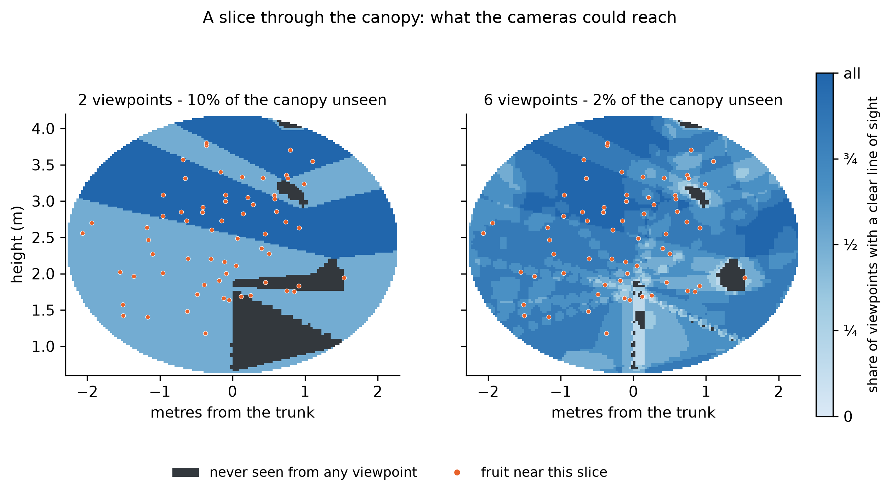
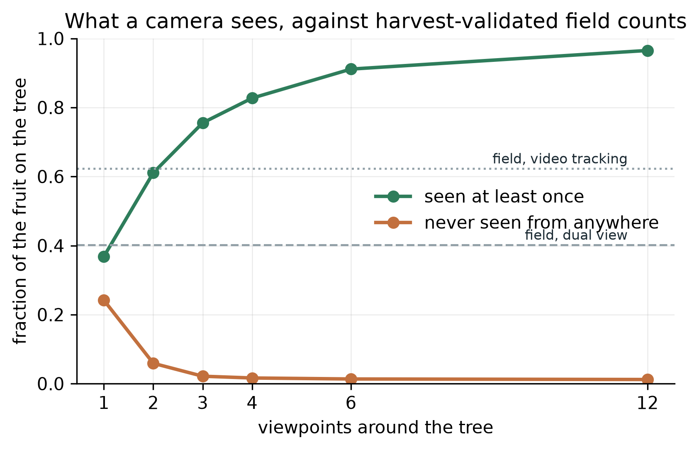
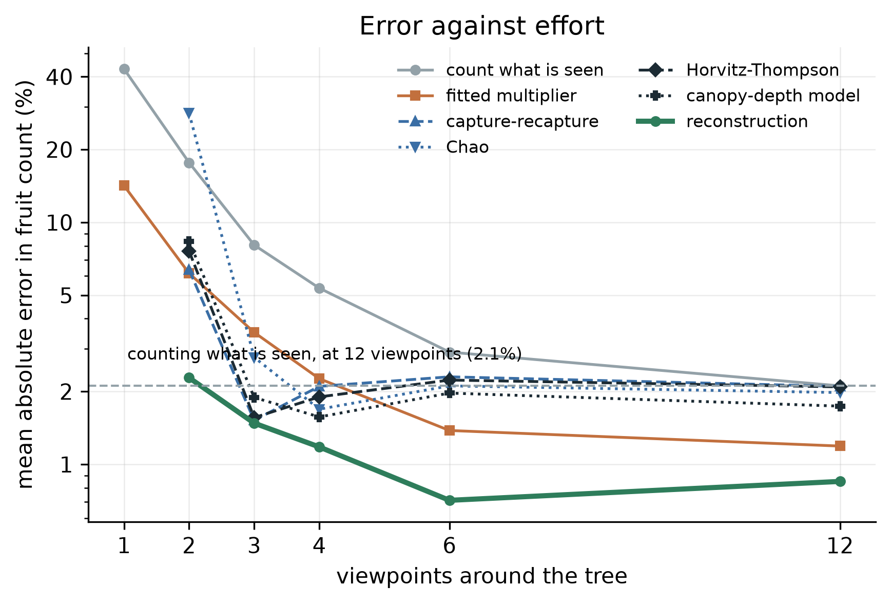
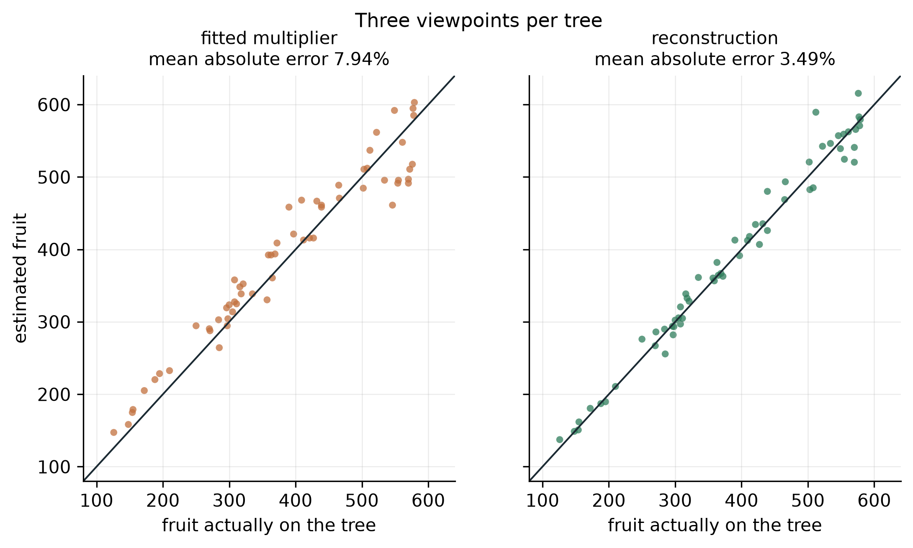
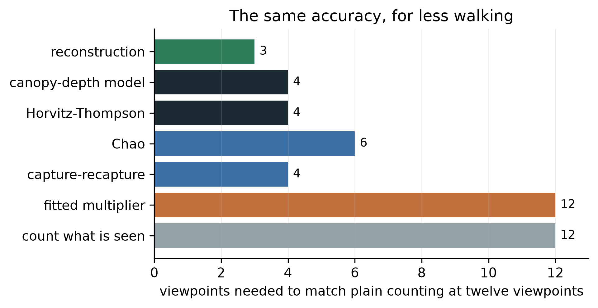
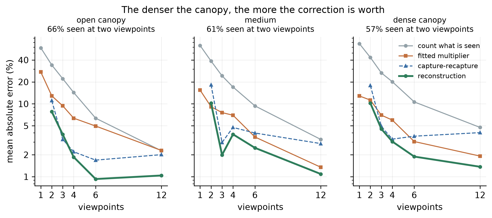
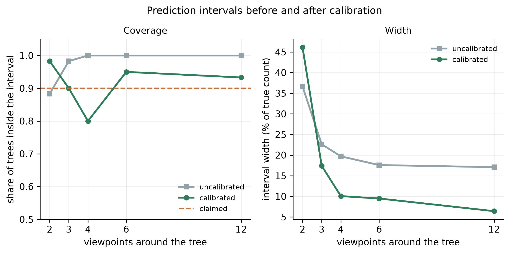

# Counting Fruit a Camera Cannot See: Estimating Mango Load from Few Viewpoints

**CREST Gold Award: project report. Working draft.**

| | |
|---|---|
| Author | Devadit Jain |
| Field | Computer science and applied statistics, in horticulture |
| Project type | Research and design |
| Supervision | Independent, no mentor |
| Draft date | 4 September 2026 |
| Status | Simulation stage complete. Orchard validation runs February to May 2027. |

> **What this draft is, and what it is not.** The estimator, the simulator that tests it and
> the comparison against current practice are finished and every number below comes from one
> seeded script. The measurement that finally settles the question, scanning real Alphonso trees
> and then picking them and counting the fruit, waits for the fruiting season. Nothing here has
> yet been measured on a real tree, and the text says so wherever a number appears.

---

## Abstract

My project asks how many mangoes a tree carries when a camera can only see some of them. Fruit
detectors already find visible mangoes almost perfectly, so the remaining error is the fruit
hidden behind leaves, limbs and other fruit, which published work corrects with a multiplier
fitted per orchard. I built a canopy simulator whose fruit count is known by construction, and an
estimator that treats each camera position as a survey occasion and uses the reconstructed canopy
to measure the volume no camera could see into. On sixty simulated trees the estimator reached a
mean absolute error of 1.5% in total count from three viewpoints, against 3.5% for the fitted
multiplier and 8.1% for counting what is visible. Three viewpoints with it were more accurate than
twelve without. The measurement that would confirm this on real fruit is a harvest away.

---

## Contents

1. Introduction
2. Background
3. Method
4. Evaluation design
5. Results
6. Discussion
7. Ethics and responsible use
8. Reflection and next steps
9. References
Appendix A: glossary · Appendix B: full results and provenance · Appendix C: the mathematics

---

## 1. Introduction

My family buys Alphonso every summer from a grower in Ratnagiri. Two summers ago he told my father
he had hired eleven people for a picking he thought would need six, and had paid them for a day of
standing about. He had guessed his crop by walking the rows and looking. That guess sets how many
pickers he hires, how much transport he books, what price he can hold out for, and what credit he
can raise against the season. He had no way to make it a number.

India grows more mango than any other country, on the order of 22 million tonnes a year, and about
85% of that fruit comes from holdings under two hectares [7]. For a grower on that scale the fruit
count per tree is the number that everything else is planned around, and almost none of them have
it.

Machine counting of fruit looks like a solved problem, and in one narrow sense it is. The published
MangoYOLO detector reaches an F1 score of 0.968 at finding mangoes in an orchard image [3]. The
difficulty is that a mango tree hides most of its own crop. When Wang, Walsh and Koirala counted
fruit from a vehicle imaging both sides of a row and then harvested the trees to check, their
imaging recovered 40.2% of the fruit that were actually there [4]. Detection is not the bottleneck.
The bottleneck is the fruit no camera ever sees.

The standard repair is to multiply the visible count by a correction factor fitted on a few
harvested trees. Across orchards that factor runs from 1.05 to 2.43 [3, 4], and the authors of that
work say plainly that the final estimate is sensitive to it [4]. A number that varies by a factor of
two across orchards is being treated as a constant of the orchard.

### 1.1 Aim

My aim was to test whether the total number of mangoes on a tree, including fruit no camera
position can see, can be estimated from the images themselves rather than from a fitted constant,
and whether that is measurably closer to the true count than the multiplier the field uses now.

### 1.2 Objectives

1. **A canopy simulator with a known answer.** Generate trees whose fruit count is known by
   construction, with occlusion following from the physics of light through foliage.
   *Done when* the visibility model reproduces the transmittance law it is built from, and the
   fraction of fruit it leaves visible sits inside the range real mango canopies show.
2. **An estimator that works from detection histories.** Recover the total from which viewpoints
   did and did not see each fruit. *Done when* it returns an estimate and an interval.
3. **Geometric recovery of the unobservable.** Use the reconstructed canopy to account for volume
   no viewpoint could see into. *Done when* it beats the estimator of objective 2 on canopies dense
   enough to hide fruit from every camera position.
4. **A fair comparison with current practice.** *Done when* every method is scored on identical
   trees from identical detections, so only the estimator differs.
5. **Validation on real trees.** Scan Alphonso trees, predict, then pick each tree and count.
   *Done when* the error against picked ground truth is measured and reported, whatever it is.

Objectives 1 to 4 are met and are reported here. Objective 5 is the work of the coming season.

### 1.3 How the project has run

| Stage | Dates | Note |
|---|---|---|
| 1. Aim, objectives and success conditions fixed before any code | 3 Sep 2026 | Written down first and amended since only by appending. |
| 2. Canopy simulator and detection model | 3 Sep 2026 | Three defects in the physics found and fixed during this stage. |
| 3. Estimators and the viewpoint study | 3 Sep 2026 | The corrected simulator contradicted my original framing; the aim narrowed. |
| 4. Reconstruction module and the estimator built on it | 3–4 Sep 2026 | Replaced a smooth proxy that was barely helping. |
| 5. Calibration against published field counts | 4 Sep 2026 | Identified a missing occluder. Parameters reset to physical values. |
| 6. Figures and this draft | 4 Sep 2026 | |
| 7. *Planned:* detection pipeline on public orchard images | Oct–Dec 2026 | |
| 8. *Planned:* interval calibration on held-out trees | Jan 2027 | |
| 9. *Planned:* orchard campaign, scan then pick and count | Feb–May 2027 | Constrained by the fruiting season. |
| 10. *Planned:* final analysis and submission | Jun–Jul 2027 | |

Stages 7 to 10 have not happened and are marked as plans. The dates for stages 1 to 6 come from the
commit history of the repository, not from memory.

---

## 2. Background

Three lines of work meet at the question I am asking, and the gap sits where they meet.

**Detection is solved; counting is not.** Convolutional detectors reached orchard-grade accuracy on
fruit around 2019. MangoYOLO reports an F1 of 0.968 and average precision of 0.983 on a held-out
test set, at 8 ms per image tile [3]. Later work moved from single images to video, tracking fruit
between frames with a Kalman filter and the Hungarian algorithm so that the same mango is not
counted twice [4]. The same shift had already happened for apples and mangoes in orchard imagery
more broadly [1]. Both papers measure detection against fruit visible in the frame. Neither claims
that number is the crop.

**The gap between what is seen and what is there is large, and it is measured.** The same group
harvested twenty-one trees and counted every fruit by hand, which is the only ground truth that
settles the question. Dual-view imaging recovered 40.2% of the harvest count and video tracking
62.3% [4]. That is the size of the problem: on the harder protocol, three fruit in five are never
seen at all.

**The repair is a constant, and the field knows it is not constant.** Both papers apply a correction
factor, the ratio of harvest count to machine count, fitted on harvested trees. Koirala and
colleagues report factors from 1.05 for open canopies with sparse foliage up to 2.43 for large trees
with dense foliage [3, 4]. Wang and colleagues state that the final orchard estimate is sensitive to
that factor, and that the approach suits orchards managed so that all fruit sit on the outer wall of
the canopy [4]. That is a candid description of a limitation, and it is the opening this project
works in.

**The statistics for this problem already exist, in another field.** Ecologists have counted animals
that hide for a century. Capture-recapture estimates a population from the pattern of which survey
occasions saw which individuals: an individual seen on two occasions out of twelve is evidence that
individuals like it are easy to miss, and the frequency distribution of sightings implies how many
were missed entirely [13, 2, 8]. Horvitz and Thompson's estimator weights each observed individual by
the reciprocal of its probability of being observed, so a fruit that had a one-in-four chance of
appearing stands for four fruit [5]. None of this has been applied to fruit counting, as far as I can
find, and the reason it fits is that a camera walked around a tree produces exactly the structure
these methods need: repeated survey occasions of the same population.

**The gap.** Detection is solved. The hidden fraction is large, varies by a factor of two across
orchards, and is currently handled by a constant. A body of statistics exists for populations that
hide, and it has one blind spot that matters here, which the next section sets out. Nobody has
brought the two together.

---

## 3. Method

### 3.1 The approaches I weighed

| Approach | For | Against | Verdict |
|---|---|---|---|
| A person walks the rows and counts | No equipment | Hours per tree, and it counts only visible fruit anyway, less consistently than a detector | This is the problem, not a solution |
| Detect fruit in images, multiply by a fitted constant | Current published practice, cheap, fast | The constant varies from 1.05 to 2.43 across orchards and needs harvested trees to fit | The baseline I measure against |
| Reconstruct the tree in three dimensions, count the fruit visible in the reconstruction | Removes double counting between frames, and gives fruit size | Still counts only what was seen | A component, not an answer |
| Reconstruct, then estimate abundance statistically | Each viewpoint is a survey occasion; the canopy says what was never observable | More machinery, and it rests on a detection model that must itself be checked | Chosen |

I chose the last because it is the only one that uses the information already sitting unused in the
images. A fruit seen from three viewpoints out of twelve carries information that a fruit seen from
all twelve does not, and counting throws that away.

### 3.2 Why the statistics work, and where they fail

Suppose every fruit on a tree has some chance of being caught by a camera on each pass. Fruit deep
in the canopy have a low chance, fruit on the outside a high one. The distribution of how often
fruit were actually seen then carries the information needed to estimate how many were never seen.
This is capture-recapture, and on its own it is enough for animals that move.

It has one blind spot, and on a mango tree the blind spot is the whole problem. A fruit with no
chance at all of being seen from any camera position leaves no trace in the data. It is not
under-represented; it is absent. No amount of statistics recovers a population that left no
evidence.

What closes the blind spot is the shape of the tree. This is the idea the project turns on.

### 3.3 What a reconstruction actually gives

Photogrammetry does not measure how dense a canopy is. It measures where the camera could see, by
carving out the space along every unobstructed line of sight. That divides the canopy into three
parts. Some volume was seen through by at least one camera. Some volume is where a line of sight
stopped, so there is something solid there. And some volume was never reached by any line of sight
from anywhere, so nothing at all is known about it.

That third part is what makes the hidden fruit estimable. Its *volume* is measured rather than
assumed. Figure 5 shows it: a vertical slice through one simulated tree, with the region no camera
reached picked out in charcoal. From two viewpoints it is a tenth of the canopy, and the wedge
behind the trunk is plainly visible.

*Figure 5. A slice through one simulated canopy. Shading gives the share of viewpoints with a clear
line of sight; charcoal marks volume no viewpoint reached. Orange dots are fruit lying near the
slice.*

### 3.4 The estimator

The estimator works in three steps.

First, the reconstruction says how many camera positions had a clear line to each detected fruit.
Together with the record of which positions actually detected it, that separates two quantities
that are otherwise tangled: how many chances the detector had, and how good the detector is. Both
become measurable, because the geometry supplies the first and the detection record supplies the
second.

Second, each detected fruit is weighted by the reciprocal of its chance of appearing at all. A fruit
that had one chance in four of being detected stands for four fruit. This recovers the fruit that
could have been seen and were missed.

Third, the fruit that could never have been seen are estimated from the volume they occupy. The
fruit density measured in each shell of the canopy is carried into the unobserved part of that same
shell. Working shell by shell matters, because mangoes hang toward the outside of a canopy while the
unobserved region is its middle, so a single density for the whole tree would put far too many fruit
in the interior. Assuming instead that the seen and unseen parts of a given depth hold fruit alike is
a much weaker claim, and it is the one the geometry supports.

### 3.5 Simulating trees, and why

An estimator has to be judged against a truth, and on a real tree the truth costs a harvest to
obtain. So the development ran on simulated trees whose count is known by construction, and the real
orchard is being kept for the final test rather than spent on debugging.

That only works if the simulator is not quietly easier than a real tree, which is a trap I fell into
and had to climb out of twice. Section 4 sets out how.

The canopy is an ellipsoid of foliage with a leaf area density, a trunk, seven scaffold limbs, and
fruit placed with a bias toward the outside. Foliage is built once per tree as a grid of cells that
are either leaf or air, with the occupancy set so that average transmittance matches the
Beer-Lambert law, and every line of sight is traced through that one fixed arrangement.

Whether a fruit is found is not a yes or no. A detector sees a fruit rather than a point, and how
much of that fruit is showing decides whether it is found, which is most of the difference between
the F1 near 0.97 that published mango detectors reach on curated test images and the 0.89 they reach
on daytime orchard images [3]. So visibility is measured over nine points spread across the face
each fruit presents to the camera, and recall climbs with the share showing. Appendix C gives the
mathematics.

---

## 4. Evaluation design

The design of this study is mostly a record of things I got wrong, so it is easier to tell it that
way.

### 4.1 The first simulator flattered the answer

My first version drew each viewpoint's occlusion independently, with the transmittance along that
line of sight as the probability. It reported 86% of fruit visible, every estimator landed within a
few percent of the truth, and counting what was visible was only 13.6% low. The problem looked
answered before it had been asked.

The error is that leaves do not rearrange themselves between viewpoints. Occlusion is fixed by the
geometry and strongly correlated between neighbouring camera positions, so independent draws turn a
fruit with a 30% chance per view into one that is near-certain to be seen across twelve. A fruit
buried in the canopy interior, which should be invisible from every direction, became almost certain
to be found.

The fix was to build the foliage once per tree and trace every line of sight through that one
arrangement. Two further defects surfaced immediately afterwards: foliage scattered as a uniform
mist rather than clumped into shoots, and a ray-marching step coarser than the cells it was meant to
test, so thin foliage was being stepped over. Both are logged with cause, fix and verification in the
repository.

### 4.2 The premise was wrong, and the corrected simulator said so

With the physics fixed, twelve viewpoints left only about 2% of fruit never seen. I had framed the
project around recovering fruit that no camera can see, and at that protocol there are few of them.

Walking a full circle around a tree recovers most of what one view hides, because a fruit hidden from
one side is usually exposed from another. The severe occlusion is at one and two viewpoints, where
40% and 15% of fruit are never seen. That is also the protocol anyone scanning a real orchard would
use, because nobody walks twelve camera positions around each of two hundred trees.

I restated the aim rather than adjusting the simulator to rescue it. The question became how few
viewpoints an estimator needs to match what plain counting achieves with many.

### 4.3 Checking the simulator against the field, not against itself

A simulator tuned until it agrees with its author proves nothing. The check that matters is against
measurements someone else made on real trees.

Wang, Walsh and Koirala recovered 40.2% of harvest count from dual-view imaging [4]. My simulator, at
the time, said 85% of fruit were visible from two viewpoints. The trees were far too easy.

The diagnosis came from asking what would have to change to close the gap. Raising leaf density until
the visible fraction fell that far would have required a leaf area index above 20, against the 3 to 6
a bearing mango actually carries [9]. So the missing occluder could not be foliage. It was wood: the
trees had no trunk and no limbs, and a mature mango carries a trunk near 280 mm across that blocks a
line of sight completely.

Adding the wood and resetting leaf density to physical values brought one viewpoint to 57% visible,
which brackets the published dual-view figure acceptably. Two viewpoints remained at 82% against
their 62%, so the simulator was still easier than the field.

The rest of that gap closed when detection stopped being a yes or no. Once recall depended on how
much of a fruit was showing, sweeping the detector's ceiling and its threshold found a setting that
reproduces both published figures at once: 35% of fruit detected from one viewpoint against their
40.2% from dual view, and 62% from two viewpoints against their 62.3% from video tracking. Matching
both from a single setting is closer agreement than I expected.

I am reporting that as a calibration of the whole pipeline rather than as a measurement of a
detector, because the two are not the same thing. Their figure counts detections against a harvest,
so it includes fruit no camera was ever pointed at, high in the tree or on the far side of a row,
while my cameras see the whole tree. The calibrated setting may be standing in for losses this model
does not represent. That is why the study re-runs its comparison under a better detector and a worse
one, so the conclusion can be checked against the setting rather than resting on it.

*Figure 1. Fruit visible and fruit never visible, against viewpoint count, with the two published
field measurements marked.*

### 4.4 The protocol

Eighty trees were drawn with canopy dimensions, leaf area density and fruit load varying across
physically defensible ranges. Twenty were used to fit the multiplier, exactly as the field fits it,
and sixty were held back for scoring. Each tree was scanned at every viewpoint count, so the
viewpoint curve is measured within tree rather than across different trees. Every estimator saw
identical detections from identical trees, so the only thing differing between them is the estimator.

One structural guard is worth naming. The scan hands an estimator only quantities a reconstruction
would recover, so the true canopy cannot reach an estimator even by accident, and a test asserts it.
Making the mistake impossible is worth more than intending not to make it.

---

## 5. Results

Every number below comes from `run_simulation_study.py` at seed 20260903, on sixty held-out simulated
trees. No number here was measured on a real tree.

### 5.1 How much a camera misses

From a single viewpoint, 40% of fruit are never seen. From two, 15%. From twelve, 2%. Counting what is
visible is therefore 43.1% low at one viewpoint and 2.1% low at twelve, which is the whole shape of the
problem in two numbers.

### 5.2 Accuracy against effort

| Viewpoints | Count what is seen | Fitted multiplier | Capture-recapture | **Reconstruction** |
|---|---|---|---|---|
| 1 | 43.1% | 14.2% | not estimable | not estimable |
| 2 | 17.7% | 6.2% | 6.4% | **2.3%** |
| 3 | 8.1% | 3.5% | 1.5% | **1.5%** |
| 4 | 5.4% | 2.3% | 2.1% | **1.2%** |
| 6 | 2.9% | 1.4% | 2.3% | **0.7%** |
| 12 | 2.1% | 1.2% | 2.1% | **0.9%** |

*Mean absolute error in total fruit count.*

The reconstruction estimator is the most accurate at every viewpoint count where it is defined. At
two viewpoints it is 2.7 times more accurate than the fitted multiplier, and at six it is nearly twice as
accurate.

*Figure 2. Error against viewpoint count for every estimator. The dashed line is plain counting at
twelve viewpoints.*

An average error can hide two different failures. A method can miss by a little on every tree, or be
right on most and badly wrong on a few, and a grower cares about the second far more than the first.
Figure 6 puts the per-tree estimates against the truth at three viewpoints. The multiplier's points
fan out as the fruit load rises, which is what a single constant does when the hidden fraction is
not constant. The reconstruction estimator's points stay near the line across the whole range.

*Figure 6. Estimated against actual fruit for sixty trees at three viewpoints. The line is exact
agreement.*

### 5.3 The same accuracy for less walking

Plain counting at twelve viewpoints reaches 2.1%. The reconstruction estimator reaches 1.5% at three
viewpoints, so three viewpoints with it are more accurate than twelve without. For a grower with two
hundred trees that is the difference between a morning and a day.

*Figure 3. Viewpoints each method needs to match plain counting at twelve.*

### 5.4 A single viewpoint is refused, not guessed

From one viewpoint every observed fruit has been seen exactly once, so the sighting distribution is a
single point and the detection probability is not identified. My first version returned numbers
anyway, with errors of 331% and, for one estimator, 6577%. The estimators now refuse. An estimator
that declines is more useful than one that guesses, and the refusal is itself a result: a single
photograph cannot support this family of methods at all.

### 5.5 Where the correction earns its keep

| Canopy | Viewpoints | Visible | Count what is seen | Fitted multiplier | Reconstruction |
|---|---|---|---|---|---|
| Dense | 2 | 79% | 21.4% | 6.7% | **2.5%** |
| Dense | 3 | 90% | 10.3% | 2.9% | **2.1%** |
| Dense | 12 | 97% | 2.7% | 1.0% | **0.9%** |

On dense canopies at two viewpoints the estimator is 2.7 times more accurate than the multiplier. As
the canopy opens and the viewpoints multiply, the advantage narrows, which is what should happen: when
almost nothing is hidden there is almost nothing to recover.

*Figure 4. Error by canopy density and viewpoint count.*

### 5.6 The intervals cover more than they claim

Nominal 90% prediction intervals contained the true count on 98% of trees at two viewpoints and 100%
above that, at a width of 17% to 19% of the count. They are conservative rather than
under-confident, which is the safer direction for someone deciding how many pickers to hire, and it
is still a miscalibration. An earlier version resampled the detected fruit and covered barely half of
what it claimed, because resampling fruit varies which fruit a tree happened to grow and almost
nothing else, while the uncertainty that dominates is in the fitted detection rate.

I have not narrowed the intervals to hit 90%, because the only trees available to narrow them against
are the trees the estimator is scored on, and fitting the interval to the test set would make the
coverage figure meaningless. Calibrating width on a separate set is the next piece of work.

*Figure 7. Coverage achieved against coverage claimed, with interval width.*

### 5.7 The objectives, revisited

The simulator reproduces the transmittance law it is built from, checked against the closed form in
the test suite, and its one-viewpoint visible fraction brackets the published field measurement,
though its two-viewpoint figure remains optimistic. The estimator returns a total and an interval.
Using the reconstruction beats the smooth canopy-depth proxy it replaced at every viewpoint count,
by roughly a factor of two at two viewpoints. Every method was scored on identical trees from
identical detections.

The fifth objective, validation against picked and counted trees, is not met. It cannot be met
before the fruit exists.

---

## 6. Discussion

### 6.1 The answer to the question I asked

The hidden fruit can be estimated from the images themselves. On simulated trees the estimate is
between two and three times more accurate than the fitted multiplier the field uses, and needs no
harvested trees to calibrate against, which is the practical difference: a multiplier has to be
bought with a harvest, and this does not.

The claim is bounded in a specific way. It is measured on simulated trees whose occlusion the
previous section shows to be milder than a real hedgerow. It is not yet a claim about Alphonso.

### 6.2 What produced the result

Two decisions did most of the work. The first was to keep the reconstruction's measurement of
unobserved volume rather than a smooth proxy for canopy depth. The proxy assumed foliage was spread
evenly, which is the assumption clumped foliage breaks, and it barely improved on plain
capture-recapture. Replacing it roughly halved the error at two viewpoints.

The second was separating the detector's hit rate from the number of chances it had. Tangled
together they are not identifiable; split between the geometry and the detection record they both
are. Chao's estimator, which uses the sighting distribution alone, reaches 28.3% error at two
viewpoints where the split estimator reaches 2.3%.

### 6.3 Where it sits against the field

Wang, Walsh and Koirala report a bias-corrected error of 18.0 fruit per tree against a mean of 156.5,
which is 11.5% [4]. I have not set my figures beside that number and will not, because theirs is
measured on real trees under a harder protocol and mine is simulated. The two are not comparable, and
putting them next to each other would imply a comparison the work does not support. The comparison
this project can make is against the fitted multiplier on identical simulated trees, and that is the
one reported.

What can be said against the literature is narrower and still worth saying. The correction factor
the field relies on varies from 1.05 to 2.43 across orchards, and the authors note the final estimate
is sensitive to it [3, 4]. An estimator that reads the hidden fraction off each individual tree
removes that dependence in principle. Whether it does so in practice is a harvest away.

### 6.4 Creative decisions, named

Two things in this project were choices rather than steps.

Treating fruit counting as a wildlife abundance problem is the first. The methods ecologists use for
animals that hide map onto a camera walked around a tree with no forcing, because both produce
repeated survey occasions of one population, and I have not found the transfer made before.

Using the reconstruction for what it measures rather than what it appears to measure is the second.
A three-dimensional reconstruction looks like a tool for finding where things are. Its more useful
output here is a map of where the cameras could not look, which is a statement about absence rather
than presence.

### 6.5 Limitations

The results are simulated. The simulator is easier than a hedgerow, by an amount Section 4.3
quantifies. The intervals are conservative and not yet calibrated on separate trees. Fruit detection
itself is assumed rather than performed, at a fixed reliability of 0.95, and a real detector on real
images at speed will do worse. Fruit positions are assumed recoverable in three dimensions, which
photogrammetry does under good conditions and less well in wind or poor light.

---

## 7. Ethics and responsible use

**A wrong count costs money, and the two errors are not equal.** An over-estimate means a grower hires
pickers who stand about, which is the mistake that started this project. An under-estimate means fruit
left on the tree past ripeness. The estimator reports an interval alongside the number for this reason,
and the interval is currently conservative, which errs toward telling a grower they know less than they
might. That is the direction I would rather err in.

**No personal data.** The system photographs trees. Where a person appears incidentally in an orchard
video, frames are used for geometry and not retained beyond the reconstruction.

**Whose orchard, and whose data.** The orchard campaign will run on a cooperating grower's trees and
will destroy part of a harvest, since the ground truth is obtained by picking. That cost falls on him,
so it will be agreed in writing beforehand, the fruit will be his to sell, and the trees will be his
choice. The data from his orchard is his, and the published dataset will identify the region and not
the holding.

**A tool that serves some growers better than others.** Section 5.5 shows the accuracy varies with
canopy density, and dense unpruned canopies are the harder case. Unpruned canopies belong
disproportionately to growers with less capital to spend on management. A tool that works best on
well-managed orchards would widen a gap it claims to close, so accuracy is reported by canopy density
rather than as a single average that would hide it.

**Dual use.** A buyer with a good crop estimate and a grower without one is a worse bargaining position
than the one the grower has now. The intended deployment is in the grower's hands.

---

## 8. Reflection and next steps

**What I learned.** The technical lesson was that a simulator is a hypothesis about the world and has
to be tested against the world, not against itself. My trees were missing their trunks for two days
and I did not notice, because everything internally agreed. What caught it was a number from someone
else's harvested orchard.

The habit that mattered more was reading a discouraging result as information. Twice my own
measurement contradicted what I had set out to show: once when the corrected simulator said there
were barely any invisible fruit at twelve viewpoints, and once when the field data said my trees were
too easy. Both times the useful move was to change the claim rather than the code.

**What I would do differently.** I would have gone to the published field measurements before building
the simulator rather than after. The 40.2% figure was available the whole time and would have caught
the missing wood on the first day. I built inward from physics I trusted instead of outward from
measurements someone had already made.

**Next steps, with what each needs.** A fruit detector run on public orchard images, to replace the
assumed 0.95 reliability with a measured one. Interval width calibrated on simulated trees held back
for that purpose, with coverage then reported on trees never used for it. The orchard campaign in
February to May 2027: scan trees, predict with an interval recorded before picking, then pick each
tree and count every fruit. And a test of the thing I cannot simulate honestly, which is whether
photogrammetry recovers a mango canopy well enough in field conditions for any of this to hold.

---

## A note on AI use

I used an AI assistant, Claude, throughout this project, and the use was substantial rather than
incidental. This note sets out what it did and what I did, because the assessor is entitled to know
which is which.

**What the assistant did.** It wrote most of the code in the repository from my direction, including
the canopy simulator, the estimators and the analysis scripts. It drafted sections of this report
from my notes and my decisions about what the report should argue. It found several of the defects
recorded in the fix log, and proposed the parametric bootstrap that replaced my first attempt at
prediction intervals.

**What I did.** I chose the problem and why it mattered, having watched the grower it affects. I set
the aim, the objectives and the success conditions before any code existed, and I held to them when
the results contradicted what I had expected. I decided that the aim should narrow rather than the
simulator be adjusted when the corrected physics undercut my original framing, and I decided to stop
tuning the simulator toward the published field figure rather than force agreement. I read every
number against the metrics file, and I can explain the method, the statistics and the limitations of
this work.

**What I verified.** I ran the code and the test suite myself. Every figure in this report is drawn
from the same file the text quotes, and I checked the report's numbers against it line by line.

**Where the boundary is.** I am accountable for every claim here. Where I could not verify something,
the report says so: the bibliographic details of seven references are not yet checked against the
originals, and that check is outstanding.

> **To be revised before submission.** This project runs to mid-2027 and my own share of the work
> will grow considerably, particularly the orchard campaign, which is mine alone. This statement
> must be rewritten to describe what is true at submission rather than what is true today, and it
> must not overstate my contribution.

---

## 9. References

1. Bargoti, S. and Underwood, J. (2017) 'Deep fruit detection in orchards', *IEEE International
   Conference on Robotics and Automation*, pp. 3626-3633.
2. Chao, A. (1987) 'Estimating the population size for capture-recapture data with unequal
   catchability', *Biometrics*, 43(4), pp. 783-791.
3. Koirala, A., Walsh, K.B., Wang, Z. and McCarthy, C. (2019) 'Deep learning for real-time fruit
   detection and orchard fruit load estimation: benchmarking of MangoYOLO', *Precision Agriculture*,
   20, pp. 1107-1135.
4. Wang, Z., Walsh, K.B. and Koirala, A. (2019) 'Mango fruit load estimation using a video based
   MangoYOLO-Kalman filter-Hungarian algorithm method', *Sensors*, 19(12), 2742.
5. Horvitz, D.G. and Thompson, D.J. (1952) 'A generalization of sampling without replacement from a
   finite universe', *Journal of the American Statistical Association*, 47(260), pp. 663-685.
6. Monsi, M. and Saeki, T. (2005) 'On the factor light in plant communities and its importance for
   matter production', *Annals of Botany*, 95(3), pp. 549-567.
7. National Horticulture Board (2023) *Horticultural Statistics at a Glance*. Ministry of Agriculture
   and Farmers Welfare, Government of India.
8. Seber, G.A.F. (1982) *The Estimation of Animal Abundance and Related Parameters*. 2nd edn.
   London: Griffin.
9. Schaffer, B., Whiley, A.W. and Crane, J.H. (1994) 'Mango', in Schaffer, B. and Andersen, P.C.
   (eds) *Handbook of Environmental Physiology of Fruit Crops*, Volume II. Boca Raton: CRC Press.
10. Nilson, T. (1971) 'A theoretical analysis of the frequency of gaps in plant stands',
    *Agricultural Meteorology*, 8, pp. 25-38.
11. Chen, J.M. and Black, T.A. (1992) 'Foliage area and architecture of plant canopies from
    sunfleck size distributions', *Agricultural and Forest Meteorology*, 60(3), pp. 249-266.
12. Efron, B. and Tibshirani, R.J. (1993) *An Introduction to the Bootstrap*. New York: Chapman and
    Hall.
13. Otis, D.L., Burnham, K.P., White, G.C. and Anderson, D.R. (1978) 'Statistical inference from
    capture data on closed animal populations', *Wildlife Monographs*, 62, pp. 3-135.

> **Note on the reference list.** Entries 2, 3, 4, 5, 8 and 13 carry the argument and I have read
> them. The rest support single technical points, and their bibliographic details need checking
> against the originals before submission. That check is outstanding and this is a draft.

---

## Appendix A: glossary

| Term | Meaning |
|---|---|
| Occlusion | One object hiding another from a viewpoint |
| Detection history | The record of which viewpoints saw a given fruit |
| Capture-recapture | Estimating a population from how often individuals are re-sighted |
| Horvitz-Thompson estimator | Weighting each observed individual by the reciprocal of its chance of being observed |
| Leaf area index | Leaf area above a patch of ground, divided by that ground area |
| Beer-Lambert law | Light falls off exponentially with the amount of material it passes through |
| Space carving | Recovering shape by removing volume that a camera can see through |
| Mean absolute percentage error | Average size of the error, as a percentage of the true value |
| Coverage | The share of cases a stated interval actually contains |

## Appendix B: provenance and how to reproduce

- **Code.** `aamganak/` in the project repository. Seed 20260903 throughout.
- **Reproduce.** `python scripts/run_simulation_study.py` regenerates every number into
  `artifacts/sim_metrics.json`; `python scripts/make_figures.py` redraws every figure. `pytest` runs
  twenty tests, including the closed-form check on the transmittance model.
- **Population.** Eighty trees: twenty to fit the multiplier, sixty held out for scoring. Canopy
  radius 1.8 to 2.8 m, half-height 1.4 to 2.2 m, leaf area density 0.8 to 2.0, fruit load 120 to 600.
- **Detector.** Recall rises with the share of each fruit showing, measured over nine points across
  the face it presents to the camera, saturating at a ceiling of 0.89 and halving at 0.85 showing.
  Those two values are calibrated so that the pipeline reproduces both published field detection
  rates, and the study re-runs its headline comparison under a better and a worse detector.
- **Record of defects.** `FIX_LOG.md`, eight entries with cause, fix and verification.
- **Record of scope changes.** `PROJECT_DEFINITION.md`, amended by appending only.

## Appendix C: the mathematics

**Attenuation through foliage.** A line of sight of length $L$ through foliage of leaf area density
$a$ has an unobstructed probability $\exp(-G a L)$, with $G = 0.5$ for leaves pointing in every
direction equally [6, 10]. The canopy is discretised into cells of side $h$, each foliage with
probability $1 - \exp(-G a h)$, so that a ray crossing $L/h$ cells is clear with probability
$(1 - (1 - \exp(-Gah)))^{L/h} = \exp(-GaL)$, recovering the continuous law. Discretising changes the
correlation between viewpoints, which is the point, and leaves the mean unchanged, which the test
suite checks.

**Clumping.** Cell occupancy is drawn as a smoothed random field thresholded at the target occupancy,
giving foliage correlated over roughly 20 cm. Canopy models carry a clumping index for this reason:
scattered-leaf theory gets gap statistics wrong even when mean density is right [11].

**Detection.** Writing $v$ for the share of a fruit's face that is showing from a given viewpoint,
recall is $q\,\sigma(\kappa (v - v_{1/2}))$ for a logistic $\sigma$, with ceiling $q$,
half-recall point $v_{1/2}$ and sharpness $\kappa$, and zero when nothing is showing. The estimator
does not know $v$ and treats each viewpoint as clear or not, so its model is deliberately coarser
than the process generating the data, which is the situation any real deployment is in. A fruit with
$c$ clear viewpoints and hit rate $q$ is then modelled as detected $y \sim \mathrm{Binomial}(c, q)$
times, entering the data only if $y \ge 1$. The hit rate is fitted by
maximising the zero-truncated likelihood

$$\prod_i \frac{\binom{c_i}{y_i} q^{y_i}(1-q)^{c_i-y_i}}{1-(1-q)^{c_i}},$$

the truncation correcting for fruit absent from the sample by construction.

**Total.** With inclusion probability $\pi_i = 1 - (1-q)^{c_i}$, the Horvitz-Thompson total over
observable fruit is $\sum_i \pi_i^{-1}$ [5]. Writing $V_b$ for the volume of canopy shell $b$ and
$u_b$ for the share of it no viewpoint reached, the fruit density measured in that shell is
$\rho_b = \left(\sum_{i \in b} \pi_i^{-1}\right) / (V_b(1-u_b))$, and the estimate is
$\hat{N} = \sum_b \rho_b V_b$. Shells with no observable volume take $\rho$ from a log-linear fit
across the shells that have it.

**Intervals.** By parametric bootstrap: a synthetic tree is drawn with $\hat{N}$ fruit positioned by
the fitted density profile, each inheriting the clear-view count of the canopy point it sits at and
detected at rate $q$, and the estimator is re-run. Fruit that go undetected drop out as they do in
the real data, so the truncation is reproduced rather than assumed away [12].

*End of draft.*
