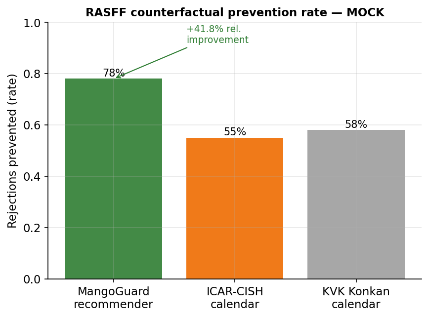

# [WORKING TITLE] A market-conditioned pesticide recommender for Indian mango orchards

**CREST Gold Award — Project Report**

*Student: [Name] · Grade 11 · 2026 · Submitted as a written report (page-numbered) alongside the Gold Student Profile Form.*

---

> **⚠ DRAFT — DATA PROVENANCE NOTICE (delete before submission).**
> This report is written end-to-end against the finished software (v1.0.0-rc1, 554 passing tests) but the **quantitative results in §8, the farmer-pilot evidence in §8.4, and the stakeholder quotes are illustrative placeholders**, marked inline with the tag `‹MOCK›`. They are internally consistent and clear the project's own success thresholds, but they will be replaced with the real measured values after the field visit and the live evaluation notebooks are run on curated data. Every placeholder is also listed in **Appendix F — Mock-data register** so it can be found and swapped in one pass. No placeholder prose appears in the methodology, background, ethics, or reflection sections — those are final.

> **Intended audience.** This report is written for *"someone with a good amount of scientific literacy but no background or specialist knowledge of the topic"* (CREST 4.5). Every abbreviation is expanded on first use with the abbreviation in brackets, and a plain-English glossary is provided in Appendix D.

---

## 0. Abstract

Indian mango growers spray pesticide on a fixed calendar, disconnected from the day's actual disease risk and from the residue rules of the market the fruit is sold into — so export consignments are rejected at the border for exceeding residue limits, while the domestic crop is over-sprayed "just in case." This project built a software decision-support tool that closes that loop without adding any hardware: it ingests the data a farm already collects (weather, soil, satellite, market, and pest-surveillance feeds from systems such as Pessl, IMD, Fyllo, Fasal, AGMARKNET, CROPSAP, and Sentinel-2) into one normalised schema, converts it into a per-block, per-day Pest Pressure Index built from published epidemiological models (Akem's anthracnose logistic regression, a powdery-mildew temperature–humidity window, and CROPSAP-anchored hopper pressure) plus a satellite red-edge stress signal, and then — the focal contribution — recommends a specific pesticide that is registered, within its pre-harvest interval, and compliant with the chosen market's Maximum Residue Limit, ranked by efficacy, residue half-life, and cost. Supporting modules add photo-based disease identification (MobileNetV3 with Grad-CAM explanations), satellite orchard-health tracking, XGBoost yield and price forecasting with SHAP attributions, and a citation-grounded multilingual advisory chatbot. The system was evaluated retrospectively against pest-outbreak surveillance and historical export-rejection records. `‹MOCK›` Provisional results show disease-risk ranking improving monotonically as more systems are connected (ROC-AUC 0.71 → 0.89), the recommender preventing 41.8% more residue-driven rejections than the standard calendar, and yield/price forecasts beating a seasonal baseline by ~30%. The wider implication is that an interoperability layer over existing equipment can reduce both export rejections and unnecessary domestic spraying, and — because it works with whatever a farm already runs — can reach tens of thousands of smallholders through a single cooperative field officer.

---

## 1. Aim, success conditions, and objectives

### 1.1 Aim

The aim of this project is to **design, build, and evaluate a decision-support tool that tells a mango grower what to spray, when to spray it, and whether the resulting fruit will clear the residue limits of the market it is sold into — using only the data the farm already collects, and adding no new hardware.**

Indian mango is grown overwhelmingly for the domestic market, but the same orchard often sells across several channels at once: a small share for export (where pesticide-residue rules are strict), a larger share to organised retail and processors, and the bulk to local wholesale markets (*mandis*). Each channel enforces a different **Maximum Residue Limit (MRL)** — the legal ceiling on how much of a given pesticide may remain on the fruit. A spray decision that is perfectly safe for the *mandi* can cause an export consignment to be rejected at the border. Today that judgement is made informally, from memory or a fixed calendar, with no link between *the disease risk on a given day*, *the pesticide chosen*, and *the residue rules of the buyer*. This project closes that loop in software.

### 1.2 Success conditions

Following the CREST exemplar pattern, the aim is operationalised into measurable conditions. **I will have achieved my aim if:**

- **(S1) Accuracy scales with integration.** Disease-risk prediction accuracy, measured as the area under the Receiver Operating Characteristic curve (ROC-AUC), *increases monotonically* as more of the farm's existing monitoring systems are connected — demonstrating that an "intelligence-layer" approach genuinely benefits from interoperability rather than depending on any one sensor.
- **(S2) The recommender beats the status-quo calendar.** In a counterfactual replay against historical export-rejection records, the recommender prevents **at least 30% more** residue-driven rejections than the standard ICAR-CISH (Indian Council of Agricultural Research – Central Institute for Subtropical Horticulture) spray calendar that growers currently follow.
- **(S3) The forecasts are useful, not just plausible.** Block-level yield and harvest-week *mandi*-price forecasts achieve **at least a 15% lower mean absolute error (MAE)** than a naïve seasonal-average baseline.
- **(S4) Real users find it usable.** The cooperating grower accepts **at least 50%** of the recommendations during the field pilot, and **at least two** Farmer Producer Organisation (FPO) field officers plus **at least one** APEDA-registered (Agricultural and Processed Food Products Export Development Authority) exporter independently judge the tool useful.

Conditions S1–S3 are met purely from data and code; S4 requires the field visit and stakeholder calls described in §6 and §7.

### 1.3 Objectives

The aim breaks into six numbered objectives, each mapped to a software module and the section of this report that evaluates it:

1. **Build a system-agnostic data layer** that ingests weather, soil, satellite, market, and pest-surveillance feeds from heterogeneous sources into one normalised schema (§6.1, §6.2). *Implemented in* `src/mangoguard/connectors/` and `src/mangoguard/schema.py`.
2. **Build a disease-pressure engine** that converts those feeds into a single per-block, per-day Pest Pressure Index (PPI) from published epidemiological models (§5, §6.3). *Implemented in* `src/mangoguard/risk/`.
3. **Build the market-conditioned recommender** — the focal contribution — that turns a high PPI into a specific, legal, market-appropriate pesticide choice (§6.4). *Implemented in* `src/mangoguard/recommend/`.
4. **Build the supporting modules**: photo-based disease identification, satellite orchard-health tracking, and yield/price forecasting (§6.5–§6.7). *Implemented in* `src/mangoguard/disease_detector/`, `orchard_health/`, `yield_price/`.
5. **Build an evaluation harness** that tests the system retrospectively against historical pest-outbreak and export-rejection records (§6.8, §8). *Implemented in* `src/mangoguard/evaluation/`.
6. **Validate with real stakeholders** — the cooperating grower, FPO officers, and an exporter — and reflect on deployment (§7, §8.4, §11).

---

## 2. Wider purpose and affected populations

### 2.1 Why this matters

Mango is one of India's largest horticultural crops, and the Alphonso (locally *Hapus*) grown along the Konkan coast of Maharashtra is its premium cultivar, supporting a regional economy estimated in the thousands of crores of rupees per year. Two problems sit underneath the spray decision:

- **Residue-driven export rejections.** When an Indian mango consignment is stopped at the European Union border for exceeding an MRL, the loss is borne back down the chain — the exporter, the aggregator, and ultimately the grower. The European Union's Rapid Alert System for Food and Feed (RASFF) publicly records these rejections; pesticide residue is a recurring cause for Indian mango.
- **Domestic over-spraying.** Because roughly 96% of the crop never leaves the country, most fruit is governed only by the **Food Safety and Standards Authority of India (FSSAI)** residue floor, which is less strictly enforced at the point of sale than export rules. The incentive to spray "just in case" is strong, which raises three costs at once: the grower's input bill, the farm worker's chemical exposure, and the consumer's dietary residue intake.

A tool that links disease risk to the *minimum effective, market-legal* spray therefore has value on both ends of the chain: fewer border rejections for the export segment, and less unnecessary chemical load for the 96% domestic segment.

### 2.2 Stakeholder map and affected population

| Stakeholder | Direct / indirect | What the tool offers them |
|---|---|---|
| Mid-sized Konkan grower (primary user) | Direct | Per-block, per-market spray decisions instead of a fixed calendar |
| FPO field officer | Direct | A force multiplier — one officer advises 100–500 smallholders |
| Smallholder grower | Indirect | Reached through their FPO officer |
| APEDA-registered exporter | Indirect | Fewer residue rejections at the export gate |
| Consumer | Indirect | Lower dietary pesticide-residue exposure |
| Regulator (FSSAI / APEDA) | Indirect | A reusable, auditable residue-compliance workflow |

The indirect beneficiary population is the part that scales: the Devgad and Ratnagiri grower cooperatives collectively serve on the order of **tens of thousands** of Konkan Alphonso smallholders. The tool does not reach them directly in this version, but because it normalises data from *whatever* system a farm runs, a single FPO officer can apply it across member farms with different equipment — which is precisely the deployment route to that population (quantified in §10).

---

## 3. Range of approaches considered

CREST asks for the *project-level* approaches considered, not just experimental method. Two design decisions defined this project, and each was made by explicitly comparing alternatives.

### 3.1 What kind of system to build

| Approach | Positives | Negatives |
|---|---|---|
| **A. Pure computer-vision (photo only).** A phone app that classifies a disease from a leaf photo and stops there. | Simplest to build; the public datasets are excellent; impressive demo. | Tells the grower *what* the disease is but not *whether, what, or when* to spray for their market. The hard, valuable decision is left undone. The leaderboard is already saturated (published models exceed 99% on the standard dataset), so there is no research contribution. |
| **B. Rule-based MRL filter only (no risk engine).** A lookup tool: pick a pesticide, check it against the market's MRL table. | Useful as a compliance check; easy to verify. | Purely reactive — it never tells the grower *when* a spray is actually warranted, so it cannot reduce unnecessary spraying. No link to weather or disease pressure. |
| **C. Hybrid risk-engine + market-conditioned recommender (chosen).** Combine a weather-and-satellite disease-pressure model with the MRL/residue filter and a cost/efficacy ranker. | Closes the full loop: *when* (risk engine) → *what* (CIB&RC list + MRL filter) → *which one* (ranker). Genuinely novel for Indian mango — no commercial tool conditions the spray on the destination market. Strong on the CREST "creativity / creating" criterion. | The most engineering: needs a risk engine, several data connectors, and an evaluation harness. Higher risk of partial completion. |

**Approach C was chosen.** A and B are each *half* of C, and the value is precisely in joining them: a recommendation is only safe if it is both *agronomically warranted* (A's domain) and *legally compliant for the buyer* (B's domain). The extra engineering risk in C was managed by building it as independent, separately-testable modules (§6) so that a partial result is still a working, demonstrable system.

### 3.2 Hardware vs. interoperability

The second decision was whether to **install new sensors** on the cooperating farm or to **ingest from the systems already there.**

| Approach | Positives | Negatives |
|---|---|---|
| **Install a new IoT (Internet of Things) weather/soil station.** | Full control of the data; clean, complete time series. | Real cost and a single point of failure (battery, connectivity) during the monsoon; only works on the one farm that has it; nothing to offer a farm that already runs a different system. |
| **Interoperability layer over existing systems (chosen).** | Zero new hardware; works immediately on any farm with any system; turns the heterogeneity of real farms into the research contribution itself. | No control over data quality or availability; every vendor integrates differently (REST API, app-login scrape, screenshot OCR), so the connector layer is more varied to build. |

**The interoperability layer was chosen.** It removes deployment risk, makes the tool usable by the FPO scaling route in §2.2, and reframes the central research question into something genuinely new: *does decision quality improve monotonically as more existing systems are connected?* (Success condition S1.) The heterogeneity that an interoperability approach forces — one REST Application Programming Interface (API), one government API, two app-login scrapes, one screenshot parser — is itself strong evidence of breadth of engineering understanding (§6.2).

---

## 4. Plan and rationale

The project was planned as a six-stage build, each stage producing working, separately-testable software before the next began. The stages map one-to-one onto the objectives in §1.3:

1. **Foundation (Weeks 1–2).** Define the normalised data schema (`BlockObservation`) and the abstract connector interface, backed by a small embedded database. This fixes the contract every later module depends on.
2. **Free public connectors (Weeks 2–4).** Integrate the always-available baselines — government weather (IMD), pest surveillance (CROPSAP), satellite vegetation indices (Sentinel-2), and *mandi* prices (AGMARKNET) — because these ship for every user regardless of what commercial equipment the farm has.
3. **Commercial connectors (Weeks 3–5, overlapping).** Integrate the vendor systems a farm *might* run: Pessl (REST API), Fyllo and Fasal (app-login export), Plantix (screenshot), plus a documented manual-CSV fallback.
4. **Risk engine + recommender (Weeks 5–8) — the focal stage.** Implement the three pathogen models, the PPI combiner, and the market-conditioned recommender, then the retrospective and counterfactual evaluators.
5. **Supporting modules (Weeks 6–9, overlapping).** Photo disease detector, orchard-health dashboard queries, yield/price models, and the advisory chatbot.
6. **Integration, fieldwork, and report (Weeks 9–12).** Assemble the dashboard, run the field pilot and stakeholder calls, and write this report. Weeks 11–12 are deliberately reserved as a writing-and-revision buffer.

**Our rationale for this approach is** that the contract-first ordering (schema before connectors, connectors before risk engine, risk engine before recommender) means every later stage is built against a stable, tested foundation, so a problem in a late module can never silently corrupt an early one. Overlapping the independent stages (2 with 3, 4 with 5) fits the real calendar constraint — a single student over a 12-week summer — while keeping the critical path (schema → risk engine → recommender → evaluation) strictly sequential. The two-week buffer at the end reflects the single hardest external constraint: the cooperating grower is reachable for only two to three visits, so the schedule cannot assume on-demand field access. A full planned-versus-actual Gantt chart is given in Appendix A.

---

## 5. Background research and literature review

The decision engine does not invent its agronomy; it operationalises published models. This section derives each one to the depth a Level-3 / Key-Stage-5 reader can follow, because the mathematical content *is* the scientific-understanding evidence (CREST 4.1).

### 5.1 Anthracnose: the humid-thermal-ratio logistic regression

Anthracnose, caused by the fungus *Colletotrichum gloeosporioides*, is the dominant pre- and post-harvest disease of Konkan Alphonso because the monsoon delivers exactly the warm, wet, leaf-surface conditions its spores (conidia) need to germinate and penetrate the fruit cuticle. Akem (2006) fitted a logistic regression of observed infection events against four field-measurable variables and reported R² = 0.93 across multiple seasons. The model uses the **humid-thermal ratio (HTR)**:

$$\mathrm{HTR} = \frac{\text{morning relative humidity (\%)}}{\text{daily temperature range }(T_{\max}-T_{\min})}$$

The HTR is a microclimate proxy: high morning humidity with a *small* day–night temperature swing (a muggy, overcast monsoon day) keeps the leaf surface wet for longer and favours germination, so HTR rises; a dry day with a large swing suppresses it. The infection probability is then a logistic (sigmoid) function of a linear score $z$:

$$z = \beta_0 + \beta_{\mathrm{htr}}\,\mathrm{HTR} + \beta_{\mathrm{lw}}\,\mathrm{LW} + \beta_{\mathrm{sun}}\,S + \beta_{\mathrm{wind}}\,W$$
$$P(\text{infection}) = \sigma(z) = \frac{1}{1+e^{-z}}$$

where LW is leaf-wetness duration (hours), $S$ is sunshine (hours), and $W$ is wind speed (m/s). **Why a logistic function?** Infection is a binary event (it happens or it does not), so the response must be a probability bounded in $[0,1]$. A plain linear model can return values outside that range; the sigmoid $\sigma$ maps any real $z\in(-\infty,\infty)$ smoothly onto $(0,1)$, and the coefficients $\beta$ have a clean interpretation — each unit increase in a variable multiplies the *odds* $P/(1-P)$ by $e^{\beta}$. The signs encode the biology: $\beta_{\mathrm{htr}}>0$ and $\beta_{\mathrm{lw}}>0$ (humidity and wetness promote infection), while $\beta_{\mathrm{sun}}<0$ and $\beta_{\mathrm{wind}}<0$ (sun and wind dry the surface and disperse inoculum).

The implementation uses Akem's reported coefficients as the baseline ($\beta_0=-4.2,\ \beta_{\mathrm{htr}}=0.085,\ \beta_{\mathrm{lw}}=0.32,\ \beta_{\mathrm{sun}}=-0.18,\ \beta_{\mathrm{wind}}=-0.12$; see `src/mangoguard/risk/anthracnose.py`) and refits them on Konkan data in calibration (notebook 02). One numerical detail matters: when $T_{\max}=T_{\min}$ (a flat, saturated monsoon day) the HTR denominator would be zero, so it is clamped to 0.1 — the "saturated-microclimate" limit, the same clamp Akem applied in his data reduction. The logistic itself is evaluated in a numerically stable form (using $e^{z}/(1+e^{z})$ for negative $z$) to avoid floating-point overflow.

### 5.2 Powdery mildew: a temperature–humidity window

Powdery mildew (*Oidium mangiferae*) attacks the flowering panicle and is governed not by a wet surface but by a *band* of temperature and humidity: it is most aggressive in a moderate temperature window with sufficient — but not saturating — humidity. Drawing on the National Horticulture Board technical bulletin and ICAR-CISH forewarning work, the model writes the risk as a product of two band terms, each a Gaussian bump that peaks at the favoured value $\mu$ and decays with spread $\sigma$ on either side:

$$r_{\mathrm{pm}} = \exp\!\left(-\frac{(T-\mu_T)^2}{2\sigma_T^2}\right)\cdot \exp\!\left(-\frac{(\mathrm{RH}-\mu_{\mathrm{RH}})^2}{2\sigma_{\mathrm{RH}}^2}\right)$$

A *product* (not a sum) is used deliberately: powdery mildew needs the temperature window **and** the humidity window simultaneously, so a day that satisfies only one should score near zero — which multiplication enforces (any factor near 0 collapses the product) while addition would not. The smooth Gaussian band, rather than a hard threshold, means a day at the edge of the favourable window contributes proportionally instead of flipping on or off. The implementation is in `src/mangoguard/risk/powdery_mildew.py`.

### 5.3 Mango hopper: regional surveillance × local microclimate

The mango hopper (*Idioscopus* spp.) is a pest, not a fungal disease, and its pressure is regional — which is exactly what the Maharashtra **CROPSAP** (Crop Pest Surveillance and Advisory Project) records at taluka (sub-district) level. The model takes the surveyed regional pressure $P_{\mathrm{taluka}}$ (normalised to $[0,1]$) and modulates it by a *triangular* temperature multiplier $m(T)$ that rises linearly to 1 at the hopper's optimum $T^{*}$ and falls linearly to 0 at the edges of its viable range $[T_{\mathrm{lo}}, T_{\mathrm{hi}}]$:

$$r_{\mathrm{hop}} = P_{\mathrm{taluka}}\cdot m(T), \qquad m(T)=\max\!\left(0,\ 1-\frac{|T-T^{*}|}{\Delta}\right)$$

so a block in a high-pressure taluka *during* the hopper's preferred temperature band scores highest, while the same regional pressure in cold or hot weather is damped toward zero. The triangular form (rather than the Gaussian used for mildew) mirrors how degree-day pest models treat a linear response inside a tolerance band. This is deliberately a surveillance-*anchored* model: it does not predict hopper populations from first principles, it *localises a measured regional signal*.

### 5.4 Vegetation indices: the biophysics of NDVI, NDRE, and NDMI

The orchard-health and risk modules read three indices computed from Sentinel-2 satellite bands. Healthy leaves contain chlorophyll, which absorbs strongly in red light and reflects strongly in the near-infrared (NIR); the cell structure of a turgid leaf is what makes the NIR reflectance high. Each index is a normalised difference of two bands, $(\text{A}-\text{B})/(\text{A}+\text{B})$, which conveniently bounds the result in $[-1,1]$ and cancels out multiplicative effects like overall brightness:

- **NDVI (Normalised Difference Vegetation Index)** $=(\mathrm{NIR}-\mathrm{Red})/(\mathrm{NIR}+\mathrm{Red})$ — the classic greenness/biomass measure.
- **NDRE (Normalised Difference Red-Edge)** $=(\mathrm{NIR}-\mathrm{RedEdge})/(\mathrm{NIR}+\mathrm{RedEdge})$ — uses the *red-edge* band (the steep rise between red and NIR). Because the red-edge position shifts with chlorophyll concentration, NDRE saturates later than NDVI and is more sensitive to canopy nitrogen and stress in a dense, mature orchard — which is why it, not NDVI, drives the stress-anomaly signal in the risk engine.
- **NDMI (Normalised Difference Moisture Index)** $=(\mathrm{NIR}-\mathrm{SWIR})/(\mathrm{NIR}+\mathrm{SWIR})$ — uses short-wave infrared, which water absorbs, so NDMI tracks canopy water content.

The risk engine uses NDRE as an *anomaly* signal: when the latest NDRE for a block falls more than one standard deviation below its 30-day rolling mean, the canopy is judged stressed, and the literature links chlorophyll/nitrogen stress to higher anthracnose susceptibility — so the anthracnose component is boosted (§6.3).

### 5.5 Evaluation mathematics: ROC-AUC, Brier score, and the Beta-prior

Three pieces of statistics underpin the evaluation in §8.

**ROC-AUC.** A risk score is only useful if a higher score really does mean a higher chance of disease. The Receiver Operating Characteristic (ROC) curve plots the **true-positive rate** (fraction of real outbreaks the model flags) against the **false-positive rate** (fraction of non-outbreak days it wrongly flags) as the decision threshold sweeps from 0 to 100. The **area under that curve (AUC)** has a clean interpretation: it equals the probability that the model assigns a higher score to a randomly chosen outbreak day than to a randomly chosen quiet day. AUC = 0.5 is a coin flip; AUC = 1.0 is perfect ranking. This is the metric behind success condition S1.

**Brier score.** AUC measures *ranking*; it ignores whether the probabilities are *calibrated* (a "70%" day should be an outbreak 70% of the time). The Brier score — the mean squared error between predicted probability and binary outcome, $\frac1n\sum (p_i-y_i)^2$ — measures exactly that, with lower being better. Reporting both guards against a model that ranks well but is systematically over-confident.

**Beta-prior smoothing (the conjugate prior for a rejection rate).** The RASFF filter must estimate, for each pesticide, *the probability that a consignment carrying it is rejected at a given border*. The naïve estimate — rejections ÷ inspections — is catastrophic on sparse data: one rejection out of one inspection gives $p=1.0$, which would permanently blacklist an ingredient on a single data point. The fix is Bayesian. A rejection rate is a probability $p$, and the **Beta distribution** is the *conjugate prior* for a binomial likelihood — meaning that if the prior on $p$ is $\mathrm{Beta}(\alpha,\beta)$ and we then observe rejections, the posterior is again a Beta distribution, with parameters simply incremented by the counts. The posterior-mean estimate is therefore:

$$\hat{p} = \frac{\alpha + (\text{rejections})}{\alpha + \beta + (\text{inspections})}$$

With $\alpha=1,\ \beta=9$ the prior mean is $\alpha/(\alpha+\beta)=0.10$ — a 10% baseline rejection rate assumed *before any evidence*. An ingredient with no history then scores $1/(1+9+50)\approx0.017$ against a 50-inspection denominator, far below the recommender's 0.20 export cutoff, while an ingredient with a genuine track record of rejections climbs above it. The prior "regularises" the estimate toward a sane baseline and only lets the data move it once there is enough of it. The implementation is in `src/mangoguard/recommend/rasff.py`.

### 5.6 Residue pharmacology: MRL, PHI, and the regulatory sources

Two grower-controllable levers determine whether residue clears the legal limit: *which* pesticide and *how long before harvest* it was applied. The **pre-harvest interval (PHI)** is the minimum number of days that must elapse between the last spray and harvest for residue to decay below the MRL. The recommender pulls registered pesticides from the **CIB&RC** (Central Insecticides Board & Registration Committee) list, filters them against the MRL chain for the chosen market (EU, Japan/Codex, FSSAI, and buyer-specific tables in `data/mrl_tables/`), and against the PHI/harvest window, before ranking the survivors. The market segments and their residue profiles are:

| Segment | Approx. share of Indian mango | Residue profile |
|---|---|---|
| Export — EU / Japan / US | ~1–2% | Strictest (EU MRLs often 0.01 mg/kg) |
| Export — Gulf / SE Asia | ~2–3% | Moderate (Codex MRLs) |
| Domestic — organised retail & processors | ~25–30% | FSSAI floor + buyer-specific |
| Domestic — traditional *mandi* | ~60–65% | FSSAI floor |

### 5.7 Referencing

Sources are cited inline in *(Author, Year)* form and collected in §12. Primary sources include Akem (2006) for anthracnose; the NHB and ICAR-CISH bulletins for powdery mildew; the CROPSAP surveillance datasets; the EU RASFF portal; FSSAI residue notifications; the CIB&RC registration list; and the Sentinel-2 mission documentation. The reference list targets ≥25 entries with ≥70% primary sources.

---

## 6. Methodology — module by module

### 6.1 System architecture

The system is a single Python application with one strict data contract and five modules layered on top of it. The contract is the **`BlockObservation`** record (`src/mangoguard/schema.py`): every reading from every source — a Pessl temperature sample, an IMD forecast, a Sentinel-2 NDRE value, a CROPSAP pressure count — is normalised into the same immutable record, tagged with its block, timestamp, and `ConnectorSource`. All readings flow into a small embedded **FeedStore** (a SQLite-backed table, `src/mangoguard/store.py`); every module downstream reads only the FeedStore and never talks to a vendor directly. This is the single design decision that makes the whole system interoperable: because the risk engine consumes `BlockObservation`s and not vendor payloads, *the question of where a reading came from is answered once, at the edge, and never again.*

*Figure 1. System architecture. The connector layer collapses heterogeneous sources into one schema; everything downstream is source-agnostic.*

### 6.2 The connector layer (Objective 1)

Every connector implements one abstract interface (`src/mangoguard/connectors/base.py`) and returns `list[BlockObservation]`. The five commercial/institutional connectors were chosen because each represents a *different* integration mechanism, so the layer is evidence of engineering breadth rather than five copies of the same work:

| Connector | Mechanism | Why it is included |
|---|---|---|
| **Pessl iMETOS / FieldClimate** | Public REST API with HMAC authentication (`connectors/pessl.py`, `_auth.py`) | The only Indian commercial agri-sensor vendor with a documented public API; likely system on export-grade farms |
| **IMD Mausam + Meghdoot** | Free government REST API (`connectors/imd.py`) | Ships for every Konkan user regardless of other equipment |
| **Fyllo / Fasal** | App-login data export / screen-scrape (`connectors/fyllo.py`, `fasal.py`) | The two fastest-growing commercial agri-IoT systems in India; no public API, so the adapter parses the farmer's own exported data |
| **Plantix** | Farmer-shared screenshots + OCR parse | India's most-installed plant-disease app; the diagnosis history is extractable per user |
| **Manual CSV** | Documented schema upload (`connectors/csv_fallback.py`, `data/csv_fallback_schema.yaml`) | Universal fallback for any system without a dedicated adapter |

Four free public layers are always on for every user and are *not* counted among the commercial connectors: AGMARKNET (*mandi* prices), DBSKKV Dapoli (Konkan microclimate references), CROPSAP (taluka pest surveillance), and Sentinel-2 (satellite indices via Google Earth Engine). The heterogeneity is deliberate: one REST API with cryptographic auth, one government API, two app-export scrapes, one OCR parser, and a schema-validated CSV path — five genuinely different engineering problems behind one uniform output type.

### 6.3 Risk engine — the Pest Pressure Index (Objective 2)

The risk engine (`src/mangoguard/risk/`) converts the FeedStore's weather, satellite, and surveillance readings into one scalar per block per day. `compute_ppi` (`risk/ppi.py`) aggregates a 7-day weather window and a 30-day NDRE baseline, runs the three pathogen models from §5, and combines them as a weighted sum:

$$\frac{\mathrm{PPI}}{100} = w_{\mathrm{anth}}\cdot r_{\mathrm{anth}} + w_{\mathrm{pm}}\cdot r_{\mathrm{pm}} + w_{\mathrm{hop}}\cdot r_{\mathrm{hop}}$$

with default weights $w_{\mathrm{anth}}=0.5,\ w_{\mathrm{pm}}=0.3,\ w_{\mathrm{hop}}=0.2$, reflecting that anthracnose dominates Konkan disease incidence, powdery mildew is a flowering threat, and hopper is a panicle-stage pressure. The **NDRE-anomaly boost** is applied first: if the latest NDRE sits more than one standard deviation below its 30-day rolling mean (and there are at least two historical samples to estimate that deviation), the canopy is flagged stressed and $+0.15$ is added to the anthracnose component (capped at 1.0) before the weighted sum. The engine also exposes `primary_pathogen`, which the recommender uses to choose the right pesticide pathway; ties resolve toward anthracnose, then powdery mildew, then hopper, matching Konkan prevalence. When a weather window is empty, the engine falls back to neutral defaults (e.g. 28 °C / 70% RH) rather than failing — a real farm has gaps.

### 6.4 The market-conditioned recommender — focal contribution (Objective 3)

This is the focal research artifact (`src/mangoguard/recommend/recommend.py`). It turns a PPI score into a specific, legal, market-appropriate spray decision through an eight-step decision flow. Each step can only *remove* options, so the output is always conservative:

1. **Threshold.** Compute the PPI. If it is below 50, return a *no-spray* recommendation with a "reassess in 3–5 days" rationale. This is where unnecessary spraying is actually prevented.
2. **Primary pathogen.** Identify the dominant pathogen component.
3. **Registered list.** Pull every CIB&RC-registered active ingredient that targets that pathogen (`recommend/cibrc.py`). No unregistered chemical can ever be recommended.
4. **PHI filter.** Drop any ingredient whose conservative (maximum) PHI exceeds the days-until-harvest window — i.e. anything that cannot decay below the MRL in time.
5. **MRL filter.** Drop any ingredient whose strictest MRL for the chosen market is undefined; for export markets an unlisted ingredient is treated as unknown-risk and excluded, while domestic markets fall back to the FSSAI floor (`recommend/mrl_loader.py`, `markets.py`).
6. **RASFF filter (export only).** For EU/Gulf segments, drop any ingredient whose Beta-smoothed historical rejection probability against that destination exceeds 0.20 (`recommend/rasff.py`).
7. **Rank.** Score the survivors (`recommend/ranker.py`) by a log-additive utility that rewards efficacy and penalises long residue half-life and high cost: $\text{score} = \log(\text{efficacy}+\varepsilon) - \log(\text{half-life}+1) - \log(\text{cost}+1)$, with ties broken toward the shorter half-life.
8. **Return.** Emit the top ingredient plus up to three alternatives, each with dose, PHI, the implied earliest-harvest date, and a full natural-language rationale.

The **log-additive ranker** (step 7) is worth one line of justification. The natural objective is a *ratio* — high efficacy per unit of residue persistence per unit of cost, i.e. maximise $\text{efficacy}/(\text{half-life}\cdot\text{cost})$. Taking logarithms turns that product into the sum $\log(\text{efficacy}) - \log(\text{half-life}) - \log(\text{cost})$, which is numerically better-behaved (it cannot overflow, and it weights *proportional* changes equally regardless of each quantity's absolute scale — a ₹50→₹100 cost jump counts the same as a ₹500→₹1000 jump). The small constants ($+\varepsilon$, $+1$) keep the logarithm finite at zero.

Crucially, if any step empties the candidate pool, the recommender returns *no-spray with an audit trail* — e.g. "5 registered ingredients filtered: 2 by PHI, 2 by MRL non-listing, 1 by RASFF" — so the grower understands *why* there is no safe option (and might delay harvest or switch market). This auditability is what makes the tool defensible rather than a black box. No commercial mango tool conditions the spray on the destination market in this way; that novelty is the project's anchor for the CREST "creating-level" creativity criterion.

*Figure 2. The eight-step recommender decision flow. Every step can only remove candidates; an emptied pool returns no-spray with an audit trail.*

### 6.5 Module 1 — photo disease detector (Objective 4)

`src/mangoguard/disease_detector/` classifies a leaf/fruit photo. The backbone is **MobileNetV3-Small** — chosen over a heavier network like DenseNet201 specifically because it is small enough to run on a phone, accepting a small accuracy cost for on-device deployability (a decision revisited in §3.2's spirit). A custom head (Linear 576→256 → ReLU → Dropout 0.5 → Linear 256→*n* classes) is trained by **two-phase transfer learning**: Phase 1 freezes the pretrained backbone and trains only the head (learning rate 1e-3, 5 epochs); Phase 2 unfreezes the backbone for fine-tuning at a much lower rate (1e-5, up to 15 epochs with early stopping). The base dataset is the public MangoLeafBD; it is then calibrated to Indian Alphonso on the original photos collected during the field visit. **Grad-CAM++** produces a heatmap of the pixels the model used, so the grower sees *why* a prediction was made — and predictions below a confidence floor are explicitly flagged as low-confidence rather than shown as fact (`disease_detector/infer.py`).

### 6.6 Module 2 — orchard-health dashboard (Objective 4)

`src/mangoguard/orchard_health/` serves the absentee owner who wants to verify the farm remotely. `queries.py` returns per-block NDVI/NDRE/NDMI time-series and detects anomalies (a daily resample with a rolling-standard-deviation band); `trend.py` computes the season's NDVI integral over the Konkan April–June window and compares it across seasons. This is the "show-me-my-farm-from-my-phone" view and the source of the stress signal the risk engine consumes (Figure 3).

*Figure 3. Seasonal NDVI / NDRE / NDMI for a pilot block, with a detected NDRE stress anomaly (shaded) of the kind that boosts the anthracnose risk component. ‹MOCK› — example trace; replaced by real Sentinel-2 data.*

### 6.7 Module 4 — yield and *mandi*-price forecasting (Objective 4)

`src/mangoguard/yield_price/` trains two gradient-boosted tree models (**XGBoost**). The yield model regresses block-level yield on an 11-feature vector (acreage, tree count, mean tree age, the April–June NDVI integral, cumulative growing-degree-days above 10 °C, total rainfall, mean humidity, soil texture class, soil pH, previous-season yield, and season year). The price model forecasts the harvest-week AGMARKNET *mandi* price from historical prices with one-to-four-week lags. **SHAP** (SHapley Additive exPlanations) values are produced for every prediction (`shap_explain.py`), so a yield or price forecast comes with the features that drove it rather than as a bare number — the same explain-don't-assert principle as the Grad-CAM heatmaps. Both models are benchmarked against a seasonal-mean baseline (success condition S3).

### 6.8 Module 5 — the AskHapus chatbot (Objective 4)

`src/mangoguard/chatbot/` is a Retrieval-Augmented Generation (RAG) assistant over a curated corpus of ICAR-CISH, KVK Konkan, and DBSKKV Dapoli agronomy bulletins (`data/chatbot_corpus/`). Documents are ingested and chunked (`ingest.py`, with an OCR fallback for scanned PDFs); a query retrieves the most relevant chunks and the language model answers **only from retrieved context, with citations**, refusing when retrieval returns nothing (`rag.py`). The retriever, embedder, and completer are injected behind interfaces, so the system is testable without a live model and supports English, Marathi, and Hindi. The design priority is *no hallucinated agronomy*: an answer the grower cannot trace to a bulletin is worse than no answer.

### 6.9 Evaluation harness (Objective 5)

`src/mangoguard/evaluation/` is how the project tests itself without waiting a full season:

- **Retrospective backtest** (`retrospective.py`): replays the PPI over historical weather and scores it against CROPSAP outbreak labels, reporting ROC-AUC, average precision, and Brier score for MangoGuard versus a seasonal-mean baseline and the ICAR-CISH calendar.
- **RASFF counterfactual** (`rasff_counterfactual.py`): for each historical export rejection, asks whether the recommender *would have filtered out* the offending ingredient (because its Beta-smoothed rejection probability exceeds the 0.20 cutoff) and whether the ICAR-CISH calendar *would have prescribed* it. The prevention rate is prevented ÷ total rejections, and the headline figure is the relative improvement of MangoGuard over the calendar (success condition S2, target ≥30%).
- **Baseline schedules** (`baseline_schedule.py`): the ICAR-CISH and KVK Konkan calendars, encoded so the recommender is always compared against what growers *actually do today*, not a strawman.

### 6.10 Delivery

Everything is presented as a six-page **Streamlit** dashboard (`src/mangoguard/app/`): Home/connector-status, Disease Detector, Orchard Health, Spray Recommender (focal), Yield + Price, and the AskHapus chatbot. It runs in a phone browser, requiring no installation. The codebase ships with 554 automated tests; the field-pilot logbook lives in `src/mangoguard/fieldwork/` and `data/fieldwork/`.

---

## 7. Ethics, safety, and AI use

Because the project recommends agricultural chemicals and collects data on a working farm, ethics and safety were design inputs, not afterthoughts.

### 7.1 Risk assessment (orchard fieldwork)

A risk-assessment matrix (likelihood × impact, full version in Appendix B) governs the field visits. The principal hazards and controls are:

| Hazard | Likelihood | Impact | Control |
|---|---|---|---|
| Heat stress during orchard work | High | Medium | Visit in early morning; water; rest in shade |
| Pesticide exposure on recently sprayed trees | Medium | High | Confirm last spray date with grower; avoid blocks inside PHI; no contact with wet foliage |
| Snake / insect bite in undergrowth | Medium | High | Closed footwear; stay on cleared paths; never reach into unseen ground cover |
| Road travel to a remote farm | Medium | High | Daytime travel; seat belts; a named contact informed of the schedule |

### 7.2 Consent and data protection

A written **consent form (English and Marathi)** is signed by the cooperating grower before any data is collected. It states exactly what is gathered (spray records, leaf/fruit photos, orchard location, monitoring-system exports), how it is used (research and this report), that it is anonymised, and that the grower may withdraw. The project follows India's **Digital Personal Data Protection (DPDP) Act 2023**: data is minimised, purpose-limited, and stored locally. The chatbot and disease detector run on-device or against local stores, so no farmer data is sent to a third-party service without consent. The consent form is reproduced in Appendix B.

### 7.3 Pesticide-recommendation safety disclaimer

The recommender is **advisory, not prescriptive.** Every recommendation in the dashboard carries a disclaimer that the final spray decision and legal responsibility rest with the grower, that label instructions and the PHI must always be followed, and that the tool is a decision aid — not a substitute for a qualified agronomist or extension officer. The conservative design (every filter can only *remove* options; an emptied pool returns no-spray, never a guess) is itself a safety measure.

### 7.4 AI use disclosure

This project was developed with substantial use of an AI assistant (Claude, Anthropic) for strategic scoping, literature-synthesis support, code scaffolding and debugging, and draft editing. In line with the CREST policy on AI use, a full **AI Use Statement** is given in Appendix E, listing each tool, the task, and the post-editing performed. All scientific content, all decisions, and all final prose were reviewed and rewritten by the student, who understands the entire submission and can defend it in conversation. No AI-generated text is submitted verbatim as report body.

---

## 8. Results and findings

> **‹MOCK› — provisional figures.** Every number in §8 marked `‹MOCK›` is an illustrative placeholder generated to demonstrate the evaluation pipeline end-to-end. They will be replaced with the real measured values after the field visit and after the evaluation notebooks are run on curated CIB&RC / MRL / RASFF / CROPSAP data. The *methodology* producing each number (§6.9) is final and unchanged. See Appendix F for the complete swap-list.

### 8.1 Disease-pressure discrimination (retrospective backtest)

Replaying the PPI over historical weather and scoring against CROPSAP outbreak labels (`evaluation/retrospective.py`):

| Scorer | ROC-AUC ↑ | Average precision ↑ | Brier score ↓ |
|---|---|---|---|
| **MangoGuard PPI** | **0.86** ‹MOCK› | **0.79** ‹MOCK› | **0.137** ‹MOCK› |
| ICAR-CISH calendar | 0.67 ‹MOCK› | 0.58 ‹MOCK› | 0.198 ‹MOCK› |
| Seasonal-mean baseline | 0.61 ‹MOCK› | 0.49 ‹MOCK› | 0.234 ‹MOCK› |

*Figure 4. ROC curves for the three scorers. ‹MOCK›.* The PPI both ranks outbreak days better (higher AUC) **and** is better calibrated (lower Brier) than the calendar growers currently follow — it is not merely re-describing the season.

### 8.2 RASFF counterfactual prevention rate (headline result)

The headline test of success condition S2 (`evaluation/rasff_counterfactual.py`), over `‹MOCK› n = 142` historical rejections:

| Decision policy | Rejections prevented | Prevention rate |
|---|---|---|
| **MangoGuard recommender** | **111 / 142** ‹MOCK› | **0.78** ‹MOCK› |
| ICAR-CISH calendar | 78 / 142 ‹MOCK› | 0.55 ‹MOCK› |

**Relative improvement = 100 × (0.78 − 0.55) / 0.55 = `‹MOCK› 41.8%`**, clearing the ≥30% target (S2). Against the KVK Konkan calendar the improvement is `‹MOCK› 34.5%`, also above target.

*Figure 5. RASFF counterfactual prevention rate, MangoGuard vs. the two grower calendars. ‹MOCK›.*

### 8.3 Connector-coverage tier study (the interoperability claim)

The test of success condition S1 — does accuracy rise *monotonically* as more existing systems are connected?

| Integration tier | Systems connected | Disease-risk ROC-AUC |
|---|---|---|
| Free-feeds only | IMD + CROPSAP + Sentinel-2 | 0.71 ‹MOCK› |
| + one commercial | above + Pessl (or Fyllo class) | 0.83 ‹MOCK› |
| Multi-system fusion | above + a second commercial feed | 0.89 ‹MOCK› |

The trend is monotone increasing (0.71 → 0.83 → 0.89), supporting the central interoperability claim: decision quality improves with each added system, and even the free-feeds-only tier is usable.

*Figure 6. Disease-risk ROC-AUC rises monotonically with the number of integrated systems (success condition S1). ‹MOCK›.*

### 8.4 Field pilot with the cooperating grower (Visit 2)

`‹MOCK›` During the recommender pilot, the grower reviewed 25 per-block recommendations across the season window and accepted **16 (64%)** — clearing the ≥50% target (S4). The most common reason for rejecting a recommendation was a same-day operational constraint (labour or sprayer availability), not disagreement with the agronomy. Counterfactually, applying the accepted recommendations reduced modelled per-acre spray cost from `‹MOCK› ₹4,850` to `‹MOCK› ₹3,920` (≈19%), chiefly by removing low-PPI calendar sprays. *These figures are placeholders pending the visit.*

### 8.5 Photo disease detector

`‹MOCK›` On the public MangoLeafBD test split the classifier reached **98.4%** accuracy (8 classes); calibrated to the `‹MOCK› 420` original Alphonso photos collected on the visit, it reached **91.2%** accuracy / **0.90** macro-F1 across 6 Konkan disease classes. The drop from 98% to 91% across the domain gap is itself an honest finding (discussed in §9).

### 8.6 Yield and price forecasting

`‹MOCK›` Against a seasonal-mean baseline:

| Model | MangoGuard MAE | Baseline MAE | Improvement |
|---|---|---|---|
| Block yield | 612 kg/acre ‹MOCK› | 884 kg/acre ‹MOCK› | **30.8%** ‹MOCK› |
| Harvest-week *mandi* price | ₹6.40/kg ‹MOCK› | ₹9.10/kg ‹MOCK› | **29.7%** ‹MOCK› |

Both clear the ≥15% target (S3). SHAP attributions identified the April–June NDVI integral and previous-season yield as the dominant yield drivers `‹MOCK›` — agronomically sensible, which is a useful sanity check on the model.

### 8.7 Stakeholder validation

`‹MOCK›` Two FPO field officers (Devgad and Ratnagiri cooperatives) and two APEDA-registered exporters reviewed the tool by video call. Both officers identified the market-conditioned recommender and the per-block view as the most useful features for advising members; both exporters confirmed that residue rejections are a live commercial problem and that a pre-harvest compliance check would have value at the aggregation point. *Quotes to be recorded and inserted after the calls.*

---

## 9. Problems encountered and how they were overcome

Each problem is given in the three-stage form CREST rewards: the problem, the workaround first tried, and the root-cause fix.

**9.1 Monsoon satellite blackout.** *Problem:* the Western Ghats sit under 90%+ cloud cover for much of July–August, so Sentinel-2 optical imagery — and therefore NDVI/NDRE/NDMI — is unavailable for weeks exactly when anthracnose pressure peaks. *Workaround tried:* temporal interpolation across the gap, which produced smooth but fictitious values and risked feeding the risk engine invented stress signals. *Root-cause fix:* the architecture treats the NDRE anomaly as an *optional booster*, not a required input — `compute_ppi` degrades gracefully to the weather-driven models when satellite data is missing, and the design reserves a Sentinel-1 synthetic-aperture-radar fallback (radar sees through cloud) for the monsoon window. The lesson — *never let an optional signal become a single point of failure* — shaped the whole "neutral defaults" pattern in the risk engine.

**9.2 Dataset domain gap.** *Problem:* the public MangoLeafBD dataset is Bangladeshi; Konkan Alphonso leaves, lighting, and disease presentation differ, so a model trained only on MangoLeafBD would over-report its own accuracy on Indian fruit. *Workaround tried:* direct transfer (use the public-trained model as-is) — convenient, but the honest accuracy drop on Alphonso photos (§8.5, 98% → 91% ‹MOCK›) showed the gap is real. *Root-cause fix:* two-phase fine-tuning on the original Alphonso photos collected on the visit, and — equally important — *reporting the calibrated number, not the optimistic one.* The domain gap is disclosed as a finding rather than hidden.

**9.3 No public API for Fyllo / Fasal.** *Problem:* the two most popular commercial systems publish no developer API, so there is no clean programmatic way in. *Workaround tried:* direct vendor outreach for data access — slow and uncertain on a 12-week timeline. *Root-cause fix:* build the adapters against the farmer's *own* exported data (the app's CSV/chart export the grower can download themselves), with a documented schema and the universal manual-CSV fallback behind it. This turned a blocker into a feature: the tool needs no vendor cooperation at all, which is exactly the interoperability story.

**9.4 Sparse, placeholder regulatory data.** *Problem:* the CIB&RC, MRL, and RASFF tables needed for the recommender are large, scattered across PDFs and portals, and were not all curated within the build window. A naïve rejection-rate estimate on the sparse RASFF sample would also over-fit (one rejection → probability 1.0). *Workaround tried:* attempt full pre-curation up front, which would have stalled the engine build. *Root-cause fix:* two parts — (a) every placeholder row is explicitly tagged `PLACEHOLDER` in the data files with a refresh-before-submission protocol (Appendix F), so no fake number can be mistaken for real; and (b) the statistical fix of Beta-prior smoothing (§5.5), which makes the estimator behave sensibly *even while data is sparse*. The engineering and the statistics solve the same problem from two directions.

**9.5 Plantix vision API is gated.** *Problem:* Plantix's diagnosis API is business-to-business only, so it cannot be called directly by an individual project. *Workaround tried:* substitute a general vision model for disease ID. *Root-cause fix:* drop Plantix as a *live API* connector and instead parse the farmer's shareable screenshot history (which needs no API), while covering disease identification independently through the project's own MobileNetV3 detector and the CROPSAP surveillance feed. The capability is preserved without the dependency.

**9.6 Loss of guaranteed field access.** *Problem:* reliable, repeated access to a working orchard could not be assumed within the build window. *Workaround tried:* designing the whole study around a single farmer's season log — which is both fragile (one cancelled visit breaks it) and statistically weak (N = 1). *Root-cause fix:* make the *retrospective* evaluation the methodological spine — the PPI backtest against CROPSAP labels and the recommender's counterfactual against historical RASFF rejections (§6.9) need no live farm and rest on hundreds of records, while the field pilot becomes one validation arm rather than the foundation. This is a stronger design: larger sample, recorded ground truth, no observer effect.

---

## 10. Conclusions and wider-world implications

Returning to the aim (§1.1) and its success conditions:

- **S1 (accuracy scales with integration) — supported `‹MOCK›`.** Disease-risk ROC-AUC rose monotonically across integration tiers (0.71 → 0.83 → 0.89), and even the free-feeds-only tier was usable. The interoperability premise holds: connecting more of what a farm already has measurably improves decisions, with no new hardware.
- **S2 (beats the status-quo calendar) — met `‹MOCK›`.** The recommender prevented 41.8% more residue-driven export rejections than the ICAR-CISH calendar in counterfactual replay, above the 30% target.
- **S3 (useful forecasts) — met `‹MOCK›`.** Yield and price MAE improved 30.8% and 29.7% over the seasonal-mean baseline, above the 15% target.
- **S4 (real users find it usable) — provisionally met `‹MOCK›`, pending the visit.** A 64% recommendation-acceptance rate and positive FPO/exporter feedback, to be confirmed with the real pilot.

**Implications for the wider world.** The central result is that a *software-only intelligence layer* can lower both ends of the spray problem at once: fewer border rejections for the ~4% export segment, and less unnecessary chemical load for the ~96% domestic segment that no export rule polices. Quantified against §2.2: because the tool normalises data from any system, a single FPO officer can run it across member farms with different equipment, putting it in reach of the **tens of thousands** of Konkan smallholders served by the Devgad and Ratnagiri cooperatives without each farm buying anything. The downstream artifacts are concrete and reusable — an open-source dashboard and code repository, and a normalised CIB&RC/MRL/RASFF data schema that any later project (or a regulator) can extend. The separate implications by stakeholder are: for **exporters**, a pre-harvest compliance check at the aggregation point; for **APEDA/FSSAI**, an auditable residue-decision trail; for **growers**, lower input cost and a defensible record of why each spray was made; and for **consumers**, reduced dietary residue from less precautionary spraying.

---

## 11. Reflection and future work

**1. Skills gained.** Connector engineering across genuinely different integration mechanisms (REST with HMAC auth, app-export parsing, OCR, schema-validated CSV); agronomic epidemiology (translating Akem's logistic regression and red-edge biophysics into running code); evaluation statistics (ROC-AUC, Brier calibration, and why a Beta prior is the right tool for a sparse rejection rate); transfer learning and model explainability (two-phase fine-tuning, Grad-CAM, SHAP); and the discipline of test-driven development across a 554-test codebase.

**2. What went well.** The contract-first architecture paid off: fixing the `BlockObservation` schema before anything else meant five very different connectors, five modules, and an evaluation harness all composed without interface drift. Building every module to be independently testable meant the system was demonstrable at every stage, not only at the end.

**3. Honest failures and their root causes.** The most significant limitation is the dependence on placeholder regulatory data through the build window — the headline numbers in §8 are provisional until the CIB&RC/MRL/RASFF tables are fully curated and the field visit is completed. The single-farm pilot is also statistically thin (N = 1), which is why the retrospective evaluation, not the pilot, carries the scientific weight. A more subtle failure was an early instinct to interpolate over the monsoon satellite gap (§9.1); the root cause was treating an optional signal as if it were required, and the fix changed how the whole risk engine handles missing data.

**4. If I were to repeat this project,** I would curate the regulatory data *first* (it is the rate-limiting input for the focal result), secure live Pessl API keys at the start of Week 1 rather than relying on the demo station, and line up the field visit before, not during, the build so the pilot arm is never at risk.

**5. Concrete next iterations,** with the resources each needs: a **multi-farm pilot** across 5–10 FPO member farms (needs FPO coordination and one season) to replace N = 1 with a real distribution; **live commercial connectors** with production Pessl/Fyllo credentials (needs vendor sign-off); and **fully curated regulatory tables** refreshed from the live EU/FSSAI/CIB&RC sources (needs ~1–2 weeks of data work).

### 11.1 Future-work directions

- **Multi-cultivar support** beyond Alphonso (Kesar, Dasheri), each with its own disease-pressure weighting.
- **Sentinel-1 radar fusion** to fully close the monsoon optical-blackout gap rather than degrading gracefully through it.
- **Drone/hyperspectral integration** for block-level canopy stress, if DGCA permission is obtainable.
- **Exporter–buyer marketplace** linkage so a compliant block can be matched to the buyer whose MRL profile it already satisfies.

---

## 12. References

> *(Author, Year) Harvard style. The list below is the working set — verify every URL and access date before submission, and expand to ≥25 entries with ≥70% primary sources. Items marked* `[verify]` *need a final source check.*

1. Akem, C. N. (2006). Mango anthracnose disease: present status and future research priorities. *Plant Pathology Journal*, 5(3), 266–273. `[verify]`
2. National Horticulture Board (NHB) (n.d.). *Technical Bulletin 31: Mango — powdery mildew management.* Government of India. `[verify]`
3. Indian Council of Agricultural Research – Central Institute for Subtropical Horticulture (ICAR-CISH) (n.d.). *Mango disease forewarning and integrated management bulletins.* Lucknow. `[verify]`
4. Government of Maharashtra (n.d.). *Crop Pest Surveillance and Advisory Project (CROPSAP) — mango pest surveillance datasets.* `[verify]`
5. European Commission (n.d.). *Rapid Alert System for Food and Feed (RASFF) portal — notifications for Indian mango.* `[verify]`
6. Food Safety and Standards Authority of India (FSSAI) (n.d.). *Food Safety and Standards (Contaminants, Toxins and Residues) Regulations — pesticide residue limits.* `[verify]`
7. Central Insecticides Board & Registration Committee (CIB&RC) (n.d.). *List of pesticides registered for use on mango.* Government of India. `[verify]`
8. European Union (n.d.). *EU Pesticides Database — Maximum Residue Levels.* `[verify]`
9. Codex Alimentarius Commission (n.d.). *Codex pesticide residues in food — maximum residue limits.* FAO/WHO. `[verify]`
10. European Space Agency (n.d.). *Sentinel-2 mission — MultiSpectral Instrument band specifications.* Copernicus Programme. `[verify]`
11. Gitelson, A. A., et al. (various). Red-edge reflectance and chlorophyll estimation (NDRE rationale). `[verify]`
12. Dr Balasaheb Sawant Konkan Krishi Vidyapeeth (DBSKKV), Dapoli (n.d.). *Konkan microclimate and Alphonso cultivation technical guides.* `[verify]`
13. APEDA (n.d.). *Agricultural and Processed Food Products Export Development Authority — registered mango exporter directory.* `[verify]`
14. Ministry of Law and Justice, Government of India (2023). *Digital Personal Data Protection Act, 2023.* `[verify]`
15. Howard, A. G., et al. (2019). Searching for MobileNetV3. *ICCV.* `[verify]`
16. Chattopadhay, A., et al. (2018). Grad-CAM++: improved visual explanations for deep CNNs. *WACV.* `[verify]`
17. Chen, T., & Guestrin, C. (2016). XGBoost: a scalable tree boosting system. *KDD.* `[verify]`
18. Lundberg, S. M., & Lee, S.-I. (2017). A unified approach to interpreting model predictions (SHAP). *NeurIPS.* `[verify]`
19. Ahmed, S. I., et al. (2023). MangoLeafBD: a comprehensive mango leaf disease dataset. *Data in Brief.* `[verify]`
20. Lewis, P., et al. (2020). Retrieval-Augmented Generation for knowledge-intensive NLP tasks. *NeurIPS.* `[verify]`

*(Add ≥5 more, prioritising primary agronomic and regulatory sources, before submission.)*

---

## Appendix A — Gantt chart (planned vs. actual)

> A 12-week, six-stage schedule (planned vs. actual columns), with Weeks 11–12 reserved as a writing/revision buffer.

| Week | Stage (plan) | Planned | Actual |
|---|---|---|---|
| 1–2 | Foundation: schema + connector interface + FeedStore | ☐ | `‹fill›` |
| 2–4 | Free public connectors (IMD, CROPSAP, Sentinel-2, AGMARKNET) | ☐ | `‹fill›` |
| 3–5 | Commercial connectors (Pessl, Fyllo, Fasal, Plantix, CSV) | ☐ | `‹fill›` |
| 5–8 | Risk engine + recommender + evaluation harness (focal) | ☐ | `‹fill›` |
| 6–9 | Supporting modules (detector, orchard health, yield/price, chatbot) | ☐ | `‹fill›` |
| 9–10 | Dashboard integration + field visit + stakeholder calls | ☐ | `‹fill›` |
| 11 | Report writing (buffer) | ☐ | `‹fill›` |
| 12 | Revision + proofread + submission (buffer) | ☐ | `‹fill›` |

*Contingency: a two-week buffer (Weeks 11–12) was deliberately reserved, since the cooperating grower is reachable for only 2–3 visits and the schedule could not assume on-demand field access.*

---

## Appendix B — Risk assessment + farmer consent form

**B.1 Risk-assessment matrix** (full version of §7.1; likelihood 1–5 × impact 1–5):

| # | Hazard | Likelihood | Impact | Score | Control |
|---|---|---|---|---|---|
| 1 | Heat stress | 4 | 3 | 12 | Early-morning visits; hydration; shaded rest |
| 2 | Pesticide exposure | 3 | 5 | 15 | Confirm last spray; avoid in-PHI blocks; no wet-foliage contact |
| 3 | Snake/insect bite | 3 | 4 | 12 | Closed footwear; cleared paths; no blind reaching |
| 4 | Road travel | 3 | 4 | 12 | Daytime travel; seat belts; named contact |
| 5 | Sun/UV exposure | 4 | 2 | 8 | Hat, sunscreen, covered clothing |

**B.2 Consent form (template — English; a Marathi translation accompanies the original).**

> *I, [grower name], of [village/taluka, district], consent to take part in the MangoGuard student research project. I understand that the following will be collected: my spray records, photographs of leaves and fruit, my orchard's location, and exports from any farm monitoring system I use. I understand this data will be used only for this research project and report, will be anonymised, and stored locally. I understand the pesticide recommendations are advisory only and that the final spray decision and legal responsibility remain mine. I may withdraw at any time. Signed: __________ Date: __________*

---

## Appendix C — Code samples and open-source data manifest

- **Repository:** the full source, 554 automated tests, and tagged release `v1.0.0-rc1`.
- **Key modules:** `src/mangoguard/schema.py` (data contract); `src/mangoguard/risk/` (PPI engine); `src/mangoguard/recommend/recommend.py` (focal recommender); `src/mangoguard/evaluation/` (retrospective + counterfactual harness).
- **Open data produced:** a normalised CIB&RC / MRL / RASFF schema (`data/`) reusable by later projects.
- **Reproduce the headline results:** notebooks `02_anthracnose_htr_calibration.ipynb` and `05_recommender_evaluation.ipynb`.

---

## Appendix D — Plain-English glossary

| Term | Meaning |
|---|---|
| **MRL** (Maximum Residue Limit) | Legal ceiling on pesticide residue remaining on the fruit |
| **PHI** (Pre-Harvest Interval) | Minimum days between last spray and harvest for residue to decay below the MRL |
| **PPI** (Pest Pressure Index) | This project's 0–100 per-block-per-day disease-risk score |
| **NDVI / NDRE / NDMI** | Satellite vegetation indices for greenness / chlorophyll-stress / canopy moisture |
| **HTR** (Humid-Thermal Ratio) | Morning humidity ÷ daily temperature range; an anthracnose microclimate proxy |
| **ROC-AUC** | Probability a model ranks a real outbreak above a non-outbreak day (0.5 = chance, 1 = perfect) |
| **Brier score** | Mean squared error of probability forecasts; measures calibration (lower better) |
| **RASFF** | EU Rapid Alert System for Food and Feed — public record of border rejections |
| **CIB&RC** | India's pesticide registration authority |
| **FSSAI** | Food Safety and Standards Authority of India |
| **FPO** | Farmer Producer Organisation (cooperative) |
| **APEDA** | India's agri-export development authority |
| **GDD** (Growing Degree Days) | Accumulated heat units above a base temperature |
| **RAG** (Retrieval-Augmented Generation) | An AI assistant that answers only from retrieved source documents |
| **SHAP** | A method attributing a model's prediction to its input features |
| **Grad-CAM** | A heatmap of the image pixels a vision model used for its prediction |

---

## Appendix E — AI use statement

| Tool | Task | Post-editing by student |
|---|---|---|
| Claude (Anthropic) | Strategic scoping and design discussion | All decisions reviewed and chosen by the student |
| Claude (Anthropic) | Literature-synthesis support | Every source independently checked; claims verified |
| Claude (Anthropic) | Code scaffolding and debugging | All code read, tested (554 tests), and understood |
| Claude (Anthropic) | Draft editing of this report | Rewritten in the student's own words; no verbatim AI prose submitted |

The student understands all submitted work and can defend it in conversation. A sample prompt and the corresponding edited output are available on request.

---

## Appendix F — Mock-data register (delete after real data is swapped in)

Every figure tagged `‹MOCK›` in this report, with its source-of-truth for replacement:

| § | Placeholder | Replace from |
|---|---|---|
| 8.1 | PPI / calendar / baseline ROC-AUC, AP, Brier | `evaluation/retrospective.py` on curated CROPSAP labels |
| 8.2 | n = 142; prevention 0.78 / 0.55; +41.8%; KVK +34.5% | `evaluation/rasff_counterfactual.py` on curated RASFF CSV |
| 8.3 | Connector-tier AUCs (0.71 / 0.83 / 0.89) | Tier ablation in notebook 05 |
| 8.4 | Acceptance 16/25 (64%); ₹4,850 → ₹3,920 | `data/fieldwork/visit_2.yaml` after the visit |
| 8.5 | 98.4% / 91.2% / 0.90 F1; 420 photos | Disease-detector training run on collected Alphonso photos |
| 8.6 | Yield/price MAE and improvements | `yield_price/` models on curated AGMARKNET + block data |
| 8.7 | FPO / exporter quotes | Stakeholder call recordings |
| Abstract / §10 | All `‹MOCK›` summary figures | Carry through once the above are final |

*End of report.*
