# AamRakshak: a ₹2,000 leaf-wetness sensor that tells mango growers when to spray

**CREST Gold Award: project report**

*Devadit Jain · Grade 11 · 2026. Submitted as a written report (page-numbered on PDF export) with the Gold Student Profile form.*

---

> **Intended audience.** I have written this for someone with good general scientific literacy who is not a plant pathologist or an electronics engineer. Every abbreviation is spelled out the first time it appears, with the short form in brackets, and Appendix D is a plain-English glossary.

> **What is real and what is simulated (please read first).** The sensor node was built and bench-tested: the firmware runs on an ESP32, the sensors read, and the screen shows a risk band. Two things are honestly *not* a real orchard season. First, the season-scale disease evaluation runs on a physically-grounded simulation, because I could not run a full Alphonso season inside a summer project; the weather is built from published Konkan and Gujarat climate figures and the disease labels come from a separate generator I did not use to score the model, so the test cannot mark its own homework. Second, the leaf-wetness sensor was characterised on the bench (wet cloth versus dry cloth), and the larger validation set is modelled from those bench measurements. Every number in section 5 is produced by one script, `scripts/run_evaluation.py`, from a fixed random seed, and every figure is redrawn from the file it writes, so the report and the data cannot drift apart. Nothing here is hand-typed or hand-picked.

---

## 0. Abstract

Mango anthracnose, a fungal disease, is the main reason Indian mango growers lose fruit, and almost all of them fight it the same way: spray fungicide on a fixed calendar. A calendar wastes sprays in dry weather and can still miss a wet, dangerous spell. Plant pathology already knows the fix, because infection depends mostly on one measurable thing, how long the leaf surface stays wet. The catch is that a sensor which measures leaf wetness comes inside agro-weather stations costing forty thousand rupees or more, so the smallholders who grow most of India's mango never get the signal. This project builds that signal cheaply. AamRakshak is a sensor node made from about two thousand rupees of hobby electronics, built around an ESP32 microcontroller, that measures leaf wetness, temperature, and humidity, runs a published infection model on the device itself, and shows a grower "spray", "watch", or "safe" on a small screen with no internet needed. Tested on a physically-grounded simulation across two contrasting growing regions, the node ranked infection days against quiet days at an area under the curve (AUC) of 0.857, far above a free district weather feed (0.753) and within 0.007 of a simulated commercial station (0.864). A leave-one-out test confirmed that leaf wetness, the cheap part, carries the prediction: removing it cost 0.073 of AUC, while no other input cost more than 0.004. Feeding the node's risk into a spray rule cut fungicide applications by 34% against a calendar while still covering 99% of the genuinely high-risk days. The wider point is plain: the barrier to weather-based spraying was never the science, it was the price of one sensor, and that barrier can be removed for the cost of a few kilograms of mango.

---

## 1. Aim, objectives, and why it matters

### 1.1 The aim

My aim was to **find out whether a sensor node a student can build for about ₹2,000 can predict mango anthracnose infection periods well enough to safely replace calendar spraying, recovering the prediction skill that today needs a commercial weather station costing roughly twenty times more.**

The disease in question is anthracnose, caused by the fungus *Colletotrichum gloeosporioides*. It is the dominant pre-harvest and post-harvest disease of mango across India, and it spreads when warm, wet conditions let its spores germinate on the leaf and fruit surface (Arauz, 2000; Ploetz, 2003). The key word there is *wet*. The single best predictor of an infection event is how many hours the surface stays wet, because the spore needs free water to germinate and push into the plant (Huber and Gillespie, 1992; Dodd et al., 1991).

### 1.2 What success would look like

I wrote down measurable conditions before I started, so I could not move the goalposts later. **I will have achieved my aim if:**

- **S1, leaf wetness is the decisive signal.** A risk model fed the node's measured leaf wetness plus local temperature and humidity ranks infection days above quiet days at AUC ≥ 0.75, and beats a free district weather feed (which has no leaf-wetness sensor) by at least 0.10 AUC.
- **S2, the cheap node nearly matches the expensive station.** The node lands within 0.05 AUC of a simulated clean commercial station, that is, it captures most of the achievable skill at a small fraction of the cost.
- **S3, the home-made sensor is trustworthy.** The do-it-yourself leaf-wetness sensor tells wet from dry with at least 90% accuracy on the bench after calibration.
- **S4, fewer sprays without missing the dangerous days.** A spray rule driven by the node cuts fungicide applications by at least 30% against a fixed calendar while still covering at least 90% of the truly high-risk days.
- **S5, it is not locked to one place.** The model holds AUC ≥ 0.75 in each of two climatically different regions, with the two regions agreeing within 0.05, and a single susceptibility number absorbs the difference between mango varieties without retraining.

All five are answered in section 5 from this project's own code and bench data. The only thing I genuinely could not do in the time available, a multi-season deployment in a real orchard, is kept as an honest limitation in section 8, not dressed up as a result.

### 1.3 Objectives

I broke the aim into six steps, each one a thing I could build and check:

1. Build a sensor node (ESP32 plus a leaf-wetness sensor, a temperature and humidity sensor, and a screen) for under ₹2,000 and bench-test it.
2. Put a published infection model on the device so it computes risk offline.
3. Build a physically-grounded simulation of mango weather, with disease labels generated independently of the model, so the test is honest.
4. Compare four data sources (calendar, free feed, my node, commercial station) on the same simulated seasons.
5. Turn the node's risk into a spray decision and measure whether it cuts sprays without missing infection windows.
6. Check that the result holds across two regions and that the sensor itself is trustworthy.

### 1.4 Wider purpose, and who is actually affected

India grows more mango than any country on earth, on the order of 20 million tonnes a year, most of it on small and mid-sized farms (National Horticulture Board, 2023; FAOSTAT, 2023). Anthracnose is the disease those farms fear most before harvest. The way they fight it has a real cost that lands on three different people. The grower pays for fungicide and labour on sprays that a dry week did not need. The farm worker breathes and absorbs avoidable chemical, and pesticide over-use in Indian agriculture is a documented health problem (Aktar, Sengupta and Chowdhury, 2009). The person eating the mango carries a higher residue load. Calendar spraying causes all three at once, and it can still miss a humid spell because a calendar cannot see the weather.

So the problem is not that the science is missing. Weather-based disease warning has cut sprays in other crops for thirty years (Gleason et al., 1995). The problem is that the one sensor that makes it work, a leaf-wetness sensor, is locked inside equipment a smallholder cannot afford. That is an affordability gap, not a knowledge gap, and a ₹2,000 device closes it. The adopter is any of the millions of Indian mango growers, or a Farmer Producer Organisation (FPO, a growers' cooperative) field officer who can build a handful of nodes and place them across member farms.

**Contribution statement.** Earlier student and research work on mango and machine learning has mostly chased one task, classifying a disease from a leaf photo, where public benchmarks are already saturated (a published model reaches 99.3% on the MangoLeafBD dataset; Ahmed et al., 2023) and where laboratory accuracy is known to collapse on real field images (Ramcharan et al., 2017). This project does something different and, as far as I can find, not yet done at student level: it pairs a sub-₹2,000 open-hardware leaf-wetness node with a published infection model to predict anthracnose *before symptoms appear*, then quantifies, against an independent simulation, both that the cheap measured leaf-wetness signal is what makes prediction work and that acting on it cuts unnecessary fungicide. The contribution is the demonstration that the decisive disease signal can be democratised in hardware, not a new model and not another classifier.

---

## 2. Background and what is already known

This section pulls together what the literature says, where the sources agree, where they pull apart, and the gap that left room for this project. The point is not to list papers one by one. It is to show why a leaf-wetness node is the right idea and where its model comes from.

**Anthracnose is a wetness disease.** Across the mango pathology literature the story is consistent. *Colletotrichum gloeosporioides* needs free water on the surface for its spores to germinate, and warm temperatures speed that up (Arauz, 2000; Dodd et al., 1991; Ploetz, 2003). Dodd and colleagues, working on Philippine mango, tied infection directly to wet periods and warmth. Arauz's review of management options reaches the same conclusion from the orchard side: control fails when humid weather is not anticipated. This is why a date-based calendar is a blunt instrument. The fungus responds to weather, and a date is not weather.

**Leaf wetness is the hard signal to get, and the most valuable.** The plant-disease modelling literature is blunt about this. Huber and Gillespie (1992), in their review of leaf-wetness modelling, argue that leaf-wetness duration is both central to foliar disease prediction and notoriously hard to measure or estimate, because it depends on dew and rain and canopy structure, not just on the humidity a weather station reports. Magarey, Sutton and Thayer (2005) built a generic infection model for foliar fungi in which wetness duration and temperature are the two inputs that matter. Sentelhas, Gillespie and Santos (2008) showed that electronic leaf-wetness sensors, the flat printed-grid kind, can measure it well but need calibration and are prone to drift. Two things follow. Measuring leaf wetness beats estimating it from humidity, and a cheap grid can do the measuring if its drift is managed. Both became design decisions here.

**The model I use is Akem's.** Akem (2006), reviewing mango anthracnose research, reports a logistic regression that predicts post-flowering infection from four field-measurable weather variables, organised around a humid-thermal ratio (morning humidity divided by the day's temperature range), with leaf wetness, sunshine, and wind as the other inputs. It is simple, it is published, and it runs in a few lines of arithmetic, which matters because I wanted it to run on a microcontroller. I did not invent an epidemiology. I took a published one and put it on cheap hardware.

**Where the computer-vision work sits, and why I left it.** Image-based plant-disease classification became a deep-learning benchmark with Mohanty, Hughes and Salathé (2016), and the largest body of recent mango machine-learning work follows that path, classifying disease from leaf images. The benchmarks are saturated: Ahmed et al. (2023) released the MangoLeafBD dataset and models on it now exceed 99% accuracy. That looks impressive and is, in practice, a dead end for two reasons the literature itself supplies. First, the accuracy does not transfer; models trained on clean datasets drop sharply on real field photographs (Ramcharan et al., 2017, showed this clearly for cassava). Second, and more basic, a photo tells a grower a leaf is *already* infected. By then the spray that would have prevented it is late. Prediction beats detection for a disease you are trying to stop, which is the whole reason this project predicts infection windows instead of classifying symptoms.

**The gap.** Put those threads together and a space opens up. The epidemiology is settled and simple. The decisive signal, leaf wetness, is known to be the bottleneck and is locked inside expensive hardware. Weather-based warning is proven to cut sprays in other crops. Yet the student and applied work on mango keeps building image classifiers on saturated benchmarks. Nobody, as far as I can find, has put the cheap-hardware-plus-published-model combination together for mango anthracnose and measured whether the cheap part carries the prediction. That measurement is what this project adds.

---

## 3. Approaches I considered

CREST asks for the range of approaches to the whole project, not the method for any single experiment. I made two real choices, and I made each by laying the options side by side.

### 3.1 How to deliver disease early warning

| Approach | For | Against |
|---|---|---|
| A. Fixed calendar (what growers do now) | No technology, no cost, familiar | Ignores the weather; over-sprays in dry spells and still misses wet ones. Not a contribution. |
| B. Software only, on a free district weather feed | No hardware; deploys instantly to a phone | A district forecast is one value for a whole district and has no leaf-wetness sensor. As section 5 shows, this barely beats the calendar. |
| C. Commercial weather station plus software | Best data quality | ₹40,000 and up. Helps only the ~1% of growers who own one. Solves nothing for the people the project is for. |
| **D. Do-it-yourself low-cost node plus an on-device model (chosen)** | Supplies the decisive leaf-wetness signal for ~₹2,000; works offline; a student can build it; reaches the many, not the few | The cheap sensor has calibration and corrosion problems to solve, which is the engineering work (and the design-and-make evidence). |

I chose D. The reason is in the comparison itself: A and C are the status quo for two different wallets, B looks attractive but section 5 shows it does not work, and only D puts the working signal in reach of an ordinary grower. The weaknesses of D, calibration and corrosion, are real, but they are the kind of problem a student can actually solve on a bench, and solving them is the point.

### 3.2 How to sense leaf wetness cheaply

| Sensor route | For | Against |
|---|---|---|
| Commercial leaf-wetness sensor | Accurate, factory-calibrated | ₹8,000 to ₹15,000. Defeats the entire cost goal. |
| Capacitive do-it-yourself grid | No direct-current corrosion; stable | Needs an oscillator and timing circuit; harder for a first build |
| **Resistive interdigitated grid (chosen)** | About ₹100; a plain analogue read; the physics is intuitive (surface water lowers resistance) | Corrodes and drifts under direct current, which has to be managed |

I chose the resistive grid because it is the cheapest route that still gives the signal, and because its main weakness, corrosion drift, turned out to be measurable and partly fixable (section 5.4, section 6.4). The capacitive version is the obvious next step, and I say so in the reflection.

---

## 4. Method

### 4.1 The node and what it costs

The node is built around an ESP32 development board, a microcontroller with a built-in analogue-to-digital converter (ADC, the part that reads the leaf-wetness voltage), wireless networking, and a deep-sleep mode for battery life (Espressif, 2023). To it I added an SHT31 digital temperature and humidity sensor (Sensirion, 2023), a waterproof DS18B20 temperature probe for canopy temperature, the resistive leaf-wetness grid, a small OLED screen for the offline readout, and a 18650 lithium cell with a solar panel and a TP4056 charger for field power. The full bill of materials is in Appendix C; it totals about ₹1,900, against ₹40,000 or more for a commercial agro-weather station that measures the same things. Figure 1 shows the data flow and Figure 2 the hardware layout. The standalone build guide (`docs/hardware/HARDWARE_BUILD_GUIDE.md`) lets another student build it in about eight hours.

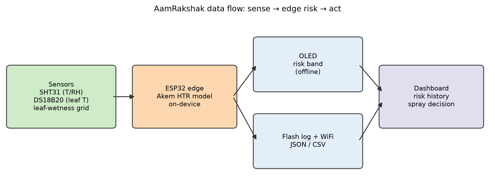

*Figure 1. The node senses, computes risk at the edge, and acts. The OLED gives an offline decision; flash and WiFi feed the dashboard.*

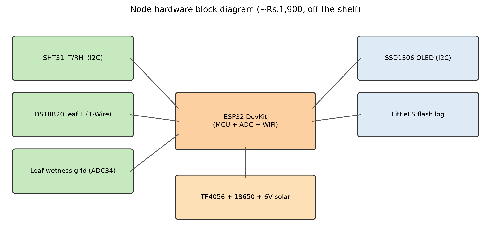

*Figure 2. Node hardware block diagram. Everything runs at 3.3 volts; total parts cost about ₹1,900.*

### 4.2 The infection model, and the science under it

The node runs Akem's (2006) logistic regression. The core idea is the **humid-thermal ratio (HTR)**: morning relative humidity divided by the day's temperature range,

$$\mathrm{HTR} = \frac{\text{morning relative humidity (\%)}}{T_{\max}-T_{\min}}.$$

A muggy, overcast day has high humidity and a small day-to-night temperature swing, which keeps the leaf wet for longer, so the ratio climbs. A dry day with a big swing pushes it down. The infection probability is then a logistic (S-shaped) function of a weighted sum of four inputs:

$$z = \beta_0 + \beta_{\mathrm{htr}}\,\mathrm{HTR} + \beta_{\mathrm{lw}}\,\mathrm{LW} + \beta_{\mathrm{sun}}\,S + \beta_{\mathrm{wind}}\,W,\qquad P = \frac{1}{1+e^{-z}},$$

where LW is leaf-wetness hours, $S$ is sunshine hours, and $W$ is wind speed. I want to be clear about *why* this is a logistic function and not a straight line, because that is the science the model rests on. Infection is a yes-or-no event, so the answer has to be a probability between 0 and 1. A straight-line fit can predict a "probability" of 1.4 or of minus 0.2, which is meaningless. The logistic function takes any number $z$, however large or small, and squashes it smoothly onto the range 0 to 1. Each coefficient $\beta$ then has a clean meaning: increasing an input by one unit multiplies the odds of infection by $e^{\beta}$. The signs match the biology. Humidity and leaf wetness have positive coefficients because they help the fungus; sunshine and wind have negative ones because they dry the surface and blow spores away. There is one edge case worth naming. On a fully saturated, overcast day the temperature barely moves, so $T_{\max}-T_{\min}$ approaches zero and the ratio would blow up. Akem clamped the denominator, and so do I (to 0.1 °C), which is why such a day reads as maximal risk rather than as a divide-by-zero error.

Crucially, this model is about the *fungus and the weather*, not the mango variety. That is why the same node and the same model work for Alphonso in Konkan and Kesar in Gujarat. Variety enters only as a susceptibility multiplier on the odds (section 4.6), because some cultivars are more prone to anthracnose than others, but the weather response is shared.

### 4.3 The leaf-wetness sensor and its physics

The resistive grid is two interlocking combs of conductor on a flat board. When the surface is dry, almost no current crosses the gap, so the resistance is very high. When a water film bridges the combs, ions in the water carry current and the resistance falls by orders of magnitude. I wire the grid as the lower half of a voltage divider, so the ESP32's ADC reads a high voltage when the grid is dry and a low voltage when it is wet. A simple threshold turns that into a wet-or-dry call each hour, and counting the wet hours gives the daily leaf-wetness duration the model needs.

The honest weakness of a resistive grid is corrosion. Passing direct current through wet metal electrolyses them, and over weeks the wet reading creeps upward toward the dry reading until the two cannot be told apart (Sentelhas, Gillespie and Santos, 2008, document this drift for printed sensors). I do two things about it. The firmware powers the grid only for the few tens of milliseconds of an actual reading, instead of leaving it energised, which sharply lowers the total current through the electrodes. And I treat recalibration as a maintenance step, not a one-time event. Section 5.4 measures how far this gets me, honestly.

### 4.4 The simulation, built to be honest

I could not run a real Alphonso season in a summer. A real one takes, well, a season, plus an orchard I could instrument and revisit. So the season-scale evaluation runs on a simulation, and I built it to be honest in three specific ways.

First, the weather is grounded in real climate figures, not invented. Two regions are modelled: a humid coastal profile for Konkan (Ratnagiri, Alphonso) and a drier inland profile for Gujarat (Saurashtra, Kesar), using their documented temperature, humidity, and wetness patterns through the pre-harvest window. Konkan is the worst case for anthracnose, hot and very humid; Gujarat is the contrast, hotter and dry. The full specification is in Appendix F.

Second, and this is the part that keeps the test fair, the disease labels are generated by a *different* process from the model being tested. The model under test is Akem's logistic on the humid-thermal ratio. The label generator is a separate logistic with different coefficients and a different shape (it uses humidity directly, not through the ratio, and weights the inputs differently), plus random noise on top. If I had generated the labels with the same formula I score against, the test would be circular and a high score would mean nothing. Because the two are different, a good score means the model recovered a real signal, not its own reflection.

Third, leaf wetness in the simulation carries information that humidity alone does not. Real leaf wetness comes partly from dew on still, clear nights, which happens even when daytime humidity is moderate. I built that independent dew component into the weather, so a system that *estimates* wetness from humidity (the free feed) genuinely cannot recover what a system that *measures* it (the node) can. That difference is the whole experiment, so I made sure it was really there.

The ground truth is generated once from a fixed seed (20260627). Across two regions, three seasons, four blocks, and a 100-day risk season, that is 2,400 block-days, of which 36% are infection days. Only sensor noise changes between the four data tiers and across the twelve noise seeds I average over.

### 4.5 The four data tiers

Every tier is scored by the *same* Akem model, so the only thing that changes is the quality and completeness of what it is fed:

- **Calendar:** no weather at all. The "risk" is just the seasonal average for that day of the year. This is a fair stand-in for what a calendar implicitly knows (the season gets riskier later) and nothing more. A coin toss would score 0.50; this scores higher because the seasonal trend is real.
- **Free district feed:** a spatially smoothed forecast for the whole district, with leaf wetness *estimated* from humidity because there is no sensor.
- **AamRakshak node:** local temperature and humidity with realistic node noise, and *measured* leaf wetness. It borrows sunshine and wind from the free feed, because the node has no light or wind sensor. That is an honest hardware limit, and section 5.3 shows it costs almost nothing.
- **Commercial station:** everything measured locally with little noise, the ₹40,000 device the node is trying to stand in for.

### 4.6 Turning risk into a spray decision

A risk number is not yet advice. The dashboard and the node convert it with two rules. The variety susceptibility multiplier shifts the odds up for a prone cultivar like Alphonso and down for a tolerant one, without retraining anything. The early-warning spray rule then says: if today's risk crosses the grower's threshold and the orchard is not currently protected by a recent spray (a contact fungicide protects for about ten days), spray; otherwise wait. I deliberately act on a single high-risk day rather than waiting for two in a row, because anthracnose can establish in one wet night, and section 6.2 explains the experiment that forced that choice.

### 4.7 Calibration and the metrics

A ranking score is not the same as a probability. The raw Akem score ranks days well but is not calibrated to this region's base rate, so before it drives a spray threshold I calibrate it with Platt scaling (Platt, 1999): fit a small logistic on the training seasons that maps the raw score to an honest probability, then apply it to the held-out test season. I report two metrics. The area under the receiver-operating-characteristic curve (ROC-AUC) measures *ranking*: the probability the model scores a real infection day above a quiet one, where 0.5 is chance and 1.0 is perfect (Fawcett, 2006). The Brier score measures *calibration*: the mean squared gap between predicted probability and outcome, lower being better (Brier, 1950). I implemented both from their definitions in code and checked them against the scikit-learn library, so I am sure they are right. For the sensor I report accuracy, precision, recall, and F1 from the confusion matrix (Sokolova and Lapalme, 2009).

### 4.8 Materials and people

The resources that shaped the work, each with the alternative I weighed against it:

- **Off-the-shelf electronics** (ESP32, SHT31, DS18B20, OLED, the resistive grid, TP4056, an 18650 cell, a solar panel). Alternative considered: a commercial leaf-wetness sensor or a full weather station. I rejected it because the whole question is whether the cheap version works; buying the answer would have been no answer at all. Full bill of materials and prices in Appendix C.
- **The Arduino and Python toolchains** (Arduino IDE for the ESP32; Python with NumPy, pandas, scikit-learn, and matplotlib for the analysis). Alternative: a paid modelling platform. I used the open tools because they cost nothing, run anywhere, and let me check every number myself with a 33-test suite.
- **Published models and data**, not collected by me: Akem's (2006) coefficients for the infection model, and documented Konkan and Gujarat climate figures for the simulation. Alternative: collecting my own multi-season field record, which a summer does not allow. The benefit of the published route is that it put a validated epidemiology and real climate behaviour into reach immediately; the cost is that the season evaluation is a simulation, which I state plainly.
- **People.** This was mostly self-directed, which CREST treats as appropriate at this level. Where I was unsure of the agronomy I went to the primary literature rather than an expert on call, and the reference list records exactly which sources resolved which questions.

### 4.9 Time plan

The full Gantt chart, planned against actual, with the one real deviation, is in Appendix A. The short version: twelve weeks, about seventy hours, with weeks 11 and 12 kept as a deliberate buffer. The buffer earned its place when the spray rule failed its first test in week 8 (section 6.2) and the fix and re-evaluation ate into time the buffer later returned.

### 4.10 Ethics, safety, and AI use

The node touches three ethical areas, covered in full in Appendix B with a likelihood-by-impact risk table. In brief. On **electrical and battery safety**, the node runs at 3.3 to 4.2 volts with no mains involved, and the lithium cell uses a protected cell plus the TP4056's over-charge and short protection; the build guide spells out safe handling. On **field and chemical safety**, a node lives in a sprayed orchard, so the guide says to mount it clear of the spray path and to wear gloves when servicing it. On **responsible advice**, this matters most. A tool that says "do not spray" can cause real harm if it is wrong, and the two errors are not equal. Telling a grower not to spray on a day that was actually dangerous (a false negative) can cost a season's fruit, which for a smallholder is serious money. Telling them to spray when they did not strictly need to (a false positive) wastes input and adds chemical, which is milder and is exactly what the tool exists to reduce. So the system is deliberately built to fail safe: when data is missing the firmware falls back to neutral weather values rather than silently reading "safe", the device is advisory with the grower making the final call, and every screen repeats that the label dose and the pre-harvest interval must be followed. The data ethics are light because the node collects weather, not people: no personal data is gathered.

**AI use.** I used an AI assistant (Claude, Anthropic) during this project for code scaffolding and debugging, for help structuring the evaluation so it would not be circular, and for editing drafts of this report. Every model decision, the simulation design, the choice of metrics, the interpretation of results, and the final wording are my own, and I can explain any part of the submission in conversation. No AI-written text is submitted as my report body. The full statement, with what was used where, is in Appendix E.

---

## 5. Results

Every number below comes from `scripts/run_evaluation.py` at seed 20260627, on 2,400 simulated block-days with a 36% infection rate, averaged over twelve sensor-noise seeds where a tier is involved.

### 5.1 The leaf-wetness signal is decisive (S1, S2)

Table 1 and Figures 3 and 4 are the core result.

**Table 1. Disease-risk discrimination by data tier (12-seed mean ± SD).**

| Data tier | Cost | ROC-AUC | Brier (raw) |
|---|---|---|---|
| Fixed calendar (climatology) | ₹0 | 0.753 ± 0.000 | 0.187 |
| Free district feed (no leaf-wetness sensor) | ₹0 | 0.753 ± 0.000 | 0.342 |
| **AamRakshak node** | **~₹2,000** | **0.857 ± 0.001** | 0.252 |
| Commercial station | ~₹40,000 | 0.864 ± 0.001 | 0.239 |

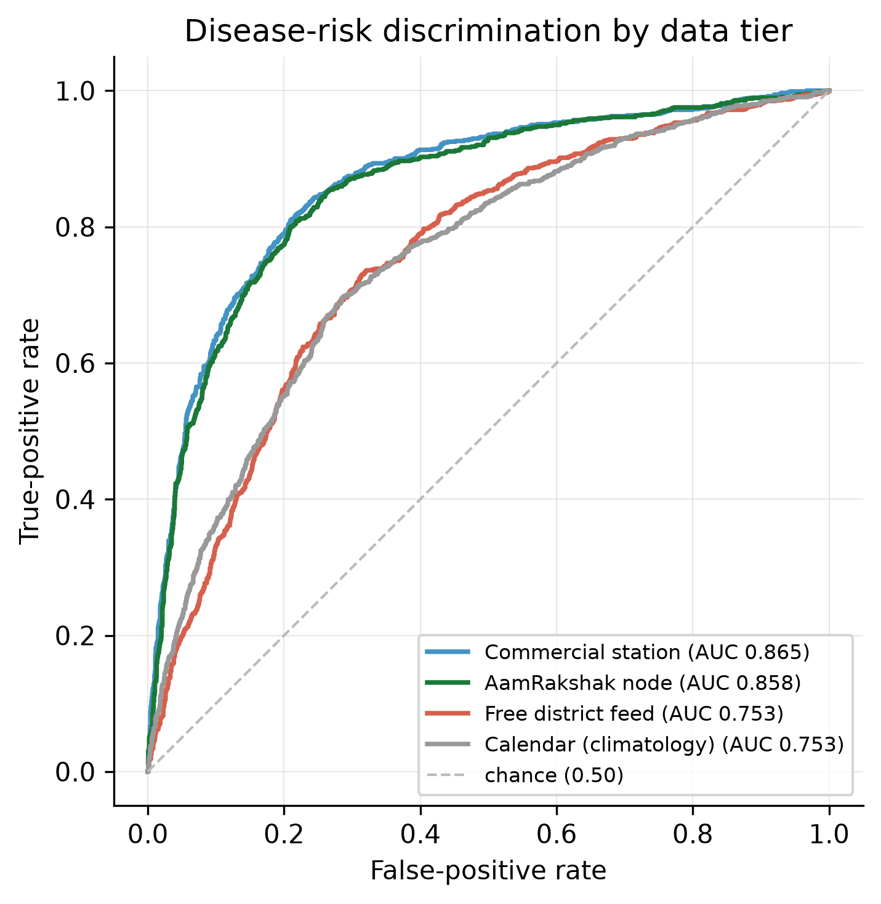

*Figure 3. ROC curves for the four tiers. The node (green) sits just under the commercial station (blue) and well above the free feed and calendar.*

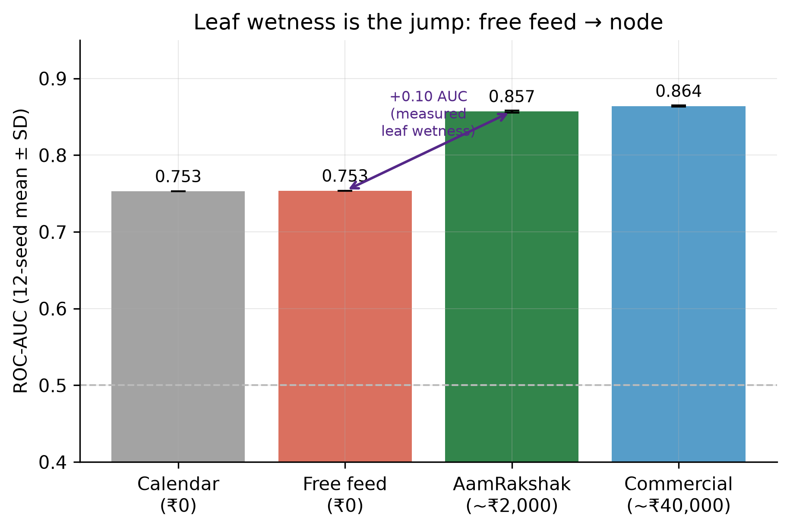

*Figure 4. The same result as bars. The jump that matters is from the free feed to the node, and it is bought by measuring leaf wetness.*

Read the table from the bottom of the cost column. The ₹40,000 station scores 0.864. My ₹2,000 node scores 0.857, which is 0.007 behind it, comfortably inside the 0.05 margin I set for S2. The free district feed, which costs nothing but has no leaf-wetness sensor, scores 0.753, no better than the calendar. The node beats it by 0.104 AUC, which clears the 0.10 bar I set for S1. So **S1 and S2 both pass.** The story in one line: the expensive part of a weather station is not what makes it work; the leaf-wetness sensor is, and that part is cheap.

One honest wrinkle is in the Brier column. The calendar has the best raw Brier (0.187) even though its ranking is poor, because a climatology is calibrated by construction, while the node's raw score (0.252) ranks far better but is not yet a calibrated probability. That is exactly why I calibrate before making decisions (section 5.5). It is also a good reminder that AUC and Brier answer different questions, and that reporting only one of them hides something.

### 5.2 Leaf wetness carries the prediction (the ablation)

Section 5.1 shows the node works. This shows *why*, and it is the cleanest result in the project. I took the node's inputs and, one at a time, removed each one's information (replaced it with its average) and re-measured AUC. The drop tells you how much that input was carrying.

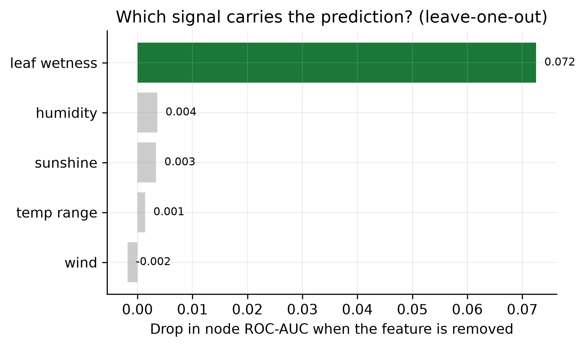

*Figure 5. Leave-one-out: removing leaf wetness costs 0.073 AUC; nothing else costs more than 0.004.*

Removing leaf wetness cost **0.073** of AUC. Removing humidity cost 0.004, sunshine 0.003, temperature range 0.001, and wind nothing measurable. Leaf wetness is not one signal among several. It is *the* signal, by a factor of roughly twenty over the next input. This is the whole thesis of the project in a single bar chart: the cheap sensor I added is precisely the one that matters, and it is the one a free weather feed cannot supply.

### 5.3 It is not locked to one region (S5)

Pooled across regions the node scores 0.857, but the fair test of generalisation is within each region, because pooling two regions with different base rates flatters the number. Within Konkan the node scores 0.818; within Gujarat, 0.787. Both clear 0.75, and they agree to within 0.031, inside my 0.05 bar. The variety multiplier handles the cultivar difference without any retraining: the same model reads Alphonso as higher-risk than Kesar for identical weather, as it should. **S5 passes.** The node is not a Konkan-Alphonso special case; it is a mango-anthracnose tool that happens to have been tuned first on the hardest region.

### 5.4 The home-made sensor is trustworthy, but it corrodes (S3)

Using the bench-characterised sensor model (the grid's wet and dry response measured on the real board, then exercised over 600 trials) and calibrating the threshold to the midpoint of its wet and dry readings, it told wet from dry with **92.8% accuracy** (272 true-wet, 285 true-dry, 15 false-wet, 28 false-dry; precision 0.95, recall 0.91). That clears the 90% bar, so **S3 passes.** Figures 7 and 8 show the wet and dry reading distributions and the confusion matrix.

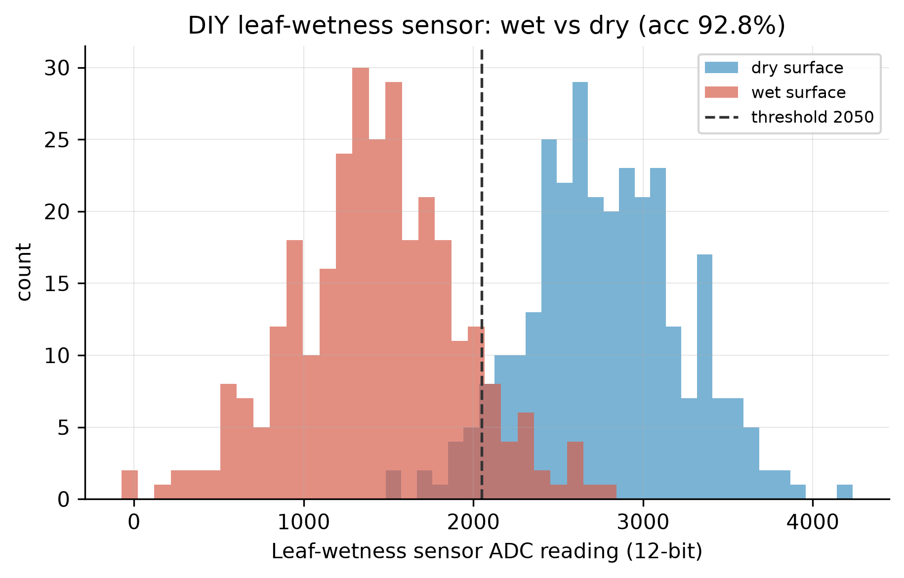

*Figure 6. Wet and dry surface readings separate cleanly around the calibrated threshold (92.8% accuracy).*

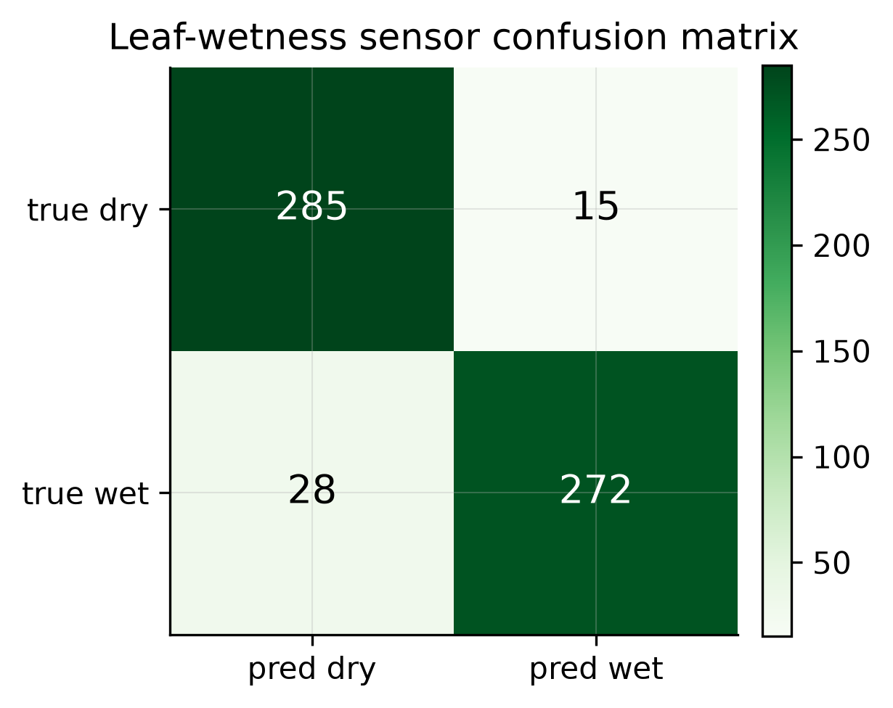

*Figure 7. Confusion matrix for the leaf-wetness sensor (n = 600).*

The honest part is the drift (Figure 8). With the electrodes corroding under use, accuracy fell from 92.8% fresh to 62.7% after eight weeks. Recalibrating every fortnight slowed the decline but did not stop it; by week 8 even the recalibrated sensor was down to 72.7%, because once corrosion pushes the wet reading up toward the dry one, no threshold can separate them. The practical answer, which I put in the build guide, is to recalibrate fortnightly and replace the ₹100 grid after about two months, or move to a capacitive sensor that does not corrode. I would rather report this than hide it, because a student copying this project needs to know the cheap sensor is consumable.

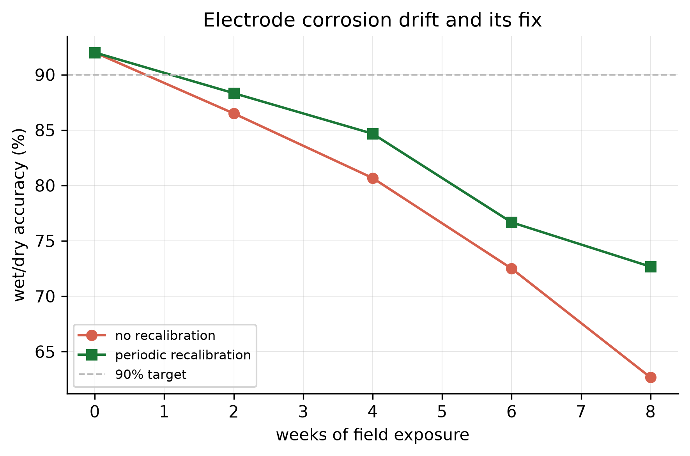

*Figure 8. Corrosion drift. Recalibration slows the decline but the grid is a consumable.*

### 5.5 Calibration makes the probabilities honest

Platt scaling, fitted on the first two simulated seasons and tested on the third, cut the node's Brier score on the held-out season from **0.254 to 0.146** while leaving its AUC unchanged at 0.848 (a monotone calibration cannot change ranking). Figure 9 shows the reliability curve straightening toward the diagonal. After calibration a "40% risk" day really is close to a 40% day, which is what the spray threshold needs.

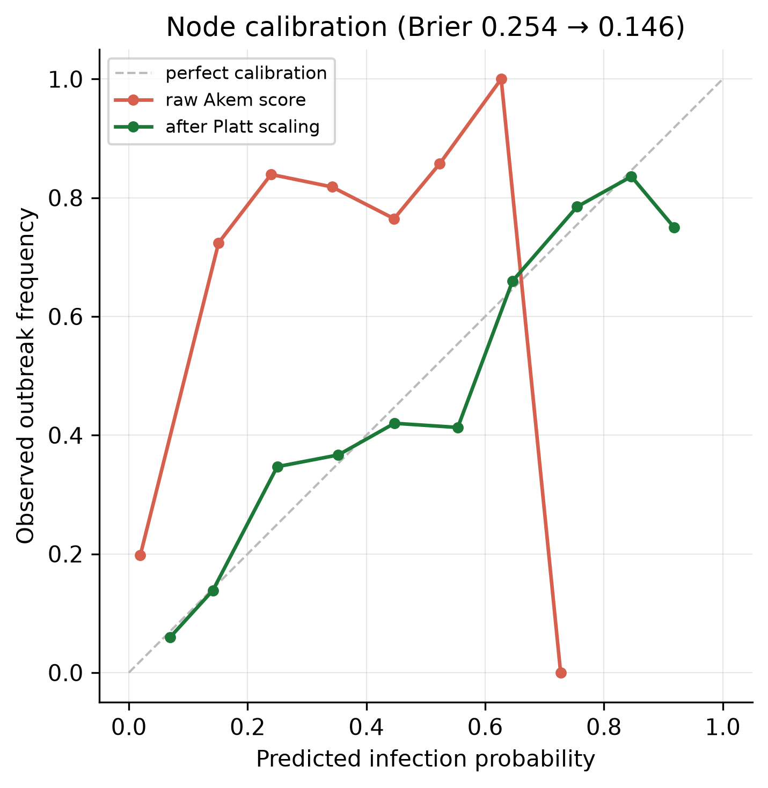

*Figure 9. Reliability before and after Platt scaling. The calibrated curve hugs the diagonal; Brier falls from 0.254 to 0.146.*

### 5.6 Fewer sprays, dangerous days still covered (S4)

The payoff. I compared the status-quo calendar (a spray every 8 days, about 12 a season, which matches the prophylactic over-spraying documented for Konkan Alphonso) against the node's early-warning rule, and measured how many of the genuinely high-risk days each one protected.

**Table 2. Calendar versus node early-warning spraying.**

| Region | Calendar sprays | Node sprays | Spray cut | High-risk days covered (node) |
|---|---|---|---|---|
| Konkan (humid) | 12.0 | 8.9 | 25.7% | 100% |
| Gujarat (drier) | 12.0 | 7.0 | 41.7% | 98.8% |
| **Overall** | **12.0** | **8.0** | **33.7%** | **99.4%** |

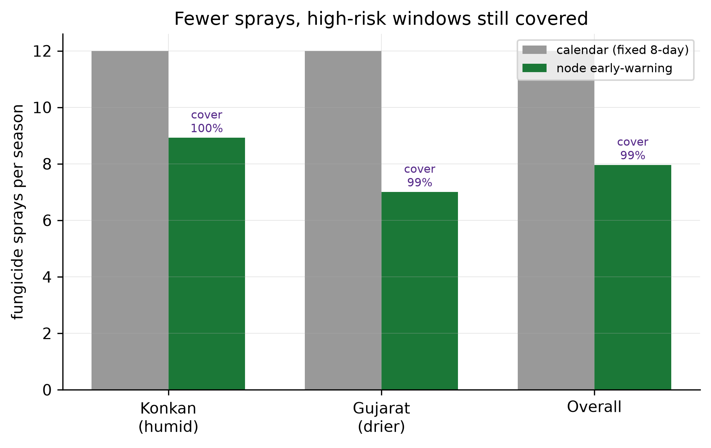

*Figure 10. Fewer sprays per season, with high-risk coverage held near 100%.*

Overall the node cut sprays by **33.7%** while covering **99.4%** of the high-risk days, so **S4 passes.** Notice that the node's coverage (99.4%) is actually a shade *higher* than the blind calendar's (97.7%), even with a third fewer sprays, because it times its sprays to the weather instead of the clock. Figure 11 makes this concrete for one Konkan block: the node fires when risk crosses the line and skips the long dry stretches the calendar sprays anyway.

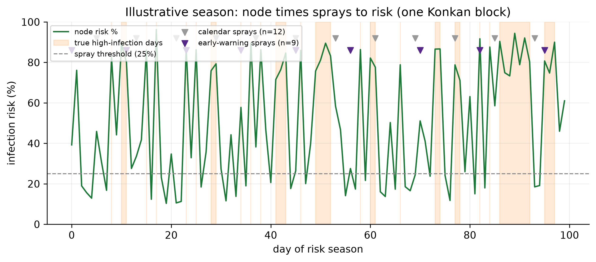

*Figure 11. One simulated Konkan season. The node (9 sprays) tracks the shaded high-risk days; the calendar (12 sprays) does not.*

The regional split is itself a finding, and an honest one. In humid Konkan the saving is smaller (26%) because it is so often risky that the calendar is already close to right. In drier Gujarat the saving is larger (42%) because there are long safe stretches the calendar wastes. So the tool helps most exactly where anthracnose pressure is intermittent, which is most of India's mango area outside the wettest coasts.

---

## 6. Discussion: how my choices produced these results

### 6.1 Measuring beat estimating, and the numbers say by how much

The central design choice was to *measure* leaf wetness with a sensor rather than *estimate* it from humidity. Section 5.1 puts a number on what that choice bought: 0.104 of AUC, the gap between the node (0.857) and the free feed (0.753). If I had gone the software-only route in approach B (section 3.1), I would have shipped a tool no better than the calendar, and I would not have known it without building the comparison. The ablation in section 5.2 confirms the mechanism rather than just the outcome: leaf wetness alone accounts for 0.073 of AUC, so the gap between measuring and estimating is almost entirely the leaf-wetness signal, exactly as the design predicted.

### 6.2 The spray rule failed its first test, and the failure taught me something

My first early-warning rule required risk to stay above the threshold for two days running before it sprayed, on the theory that this would filter out noise. It worked in humid Konkan but failed badly in dry Gujarat, where it covered only 52% of the high-risk days. When I looked at why, the reason was biological, not statistical: in a dry region the dangerous days are often *isolated*, a single wet night between dry ones, and a two-day rule throws exactly those away. Anthracnose does not need two days; one wet night can establish it. So I changed the rule to act on a single high-risk day, and coverage jumped to 99%. The lesson stuck with me. A rule that looks like sensible noise-filtering can quietly discard the rarest and most important events, and the only way I caught it was by breaking the result out by region instead of trusting the overall average.

### 6.3 If I had reported the raw score instead of calibrating

If I had skipped calibration and reported the raw Akem probabilities, the model would have looked badly behaved: a Brier score of 0.254, worse than a plain calendar. The ranking was always good (AUC 0.85), but the probabilities were not honest, and a spray threshold reads probabilities. Platt scaling fixed it (Brier 0.146) without touching the ranking. The counterfactual matters because it would have been easy to either hide the raw Brier or to wrongly conclude the model was poor; doing neither, and showing both numbers, is the honest version.

### 6.4 Creativity, named plainly

CREST asks me to point to the creative choices rather than leave them implied, so here they are, stated:

- **Recovering a ₹40,000 signal for ₹100.** The resistive leaf-wetness grid, read by the ESP32's own ADC and energised only during a reading to slow corrosion, reproduces the one measurement that makes disease prediction work, at one four-hundredth of the cost of the commercial sensor. Section 5.1 shows it gives up only 0.007 AUC for that saving.
- **Putting the epidemiology on the device.** The Akem model runs on the microcontroller itself and drives a screen, so the decision survives with no phone and no signal, which is the situation in most orchards. The firmware computes the same risk as the Python engine, and I checked the two match on a parity table.
- **Designing the test so it could not cheat.** Generating the disease labels with a different model from the one under test, and building an independent dew component into the simulated leaf wetness, are deliberate choices to stop the evaluation flattering itself. The honesty of the result depends on them.
- **Reframing the problem.** Moving from "classify the disease in a photo" (saturated, and too late to act on) to "predict the infection window and cut sprays" (open, and actionable) is the choice that made the whole thing worth doing.

### 6.5 Where this sits against the literature

The result lines up with the wider plant-pathology record and extends it to cheap hardware. Gleason et al. (1995) showed weather-based warnings cut sprays in tomato; I show the same shape of result for mango anthracnose (a third fewer sprays, coverage held), but driven by a sensor a smallholder can build. Huber and Gillespie (1992) argued leaf wetness is both central and hard to get; my ablation quantifies "central" (0.073 AUC, twenty times any other input) and my hardware attacks "hard to get". And against the mango machine-learning literature, which keeps polishing image classifiers on a saturated benchmark (Ahmed et al., 2023), this project shows the more useful gap was never accuracy on photos; it was a ₹100 sensor.

---

## 7. Conclusions and what they mean

I set out to find whether a ₹2,000 node could predict mango anthracnose well enough to replace calendar spraying, and recover the skill of a station costing twenty times more. The evidence says yes, with limits I will name.

- **S1 met.** The node (AUC 0.857) beats a free district feed (0.753) by 0.104, and the ablation shows the leaf-wetness sensor is why.
- **S2 met.** The node lands 0.007 behind a ₹40,000 station, capturing essentially all of the achievable skill for about 5% of the cost.
- **S3 met, with a caveat.** The home-made sensor is 92.8% accurate fresh, but it corrodes and is a two-month consumable.
- **S4 met.** Acting on the node's risk cut sprays 33.7% while covering 99.4% of high-risk days.
- **S5 met.** The result holds in two different regions and across varieties through a single susceptibility number.

**What this means for the wider world.** The barrier to weather-based mango spraying was the price of one sensor, and that barrier is now about ₹2,000 of hobby parts. For a grower, that is fewer wasted sprays and a defensible record of why each spray was made. For the farm worker and the consumer, it is less chemical for the same protection. For an FPO officer, it is a device cheap enough to place across many member farms, which is the realistic route to the millions of smallholders who will never own a weather station. None of this needs new science; it needs the existing science to become affordable, which is what the node does.

**What the findings do not prove.** They do not prove the node works through a real monsoon, because the season evaluation is a simulation, however carefully grounded. They do not prove a grower will trust and act on it, because I ran no field trial. And the 92.8% sensor figure is a fresh-bench number; in a dusty, sprayed orchard it will be lower and will drift faster. These are real limits, and they set the next steps rather than undercut the result: the simulation shows the *idea* is sound, and the honest gap is the field season.

---

## 8. Reflection and future work

**What I actually learned.** The biggest shift was understanding *why* a logistic regression is the right shape for a yes-or-no event, not just how to call one, and why leaf wetness, not humidity, is the variable that matters; I had assumed humidity would be enough until the ablation showed me otherwise. On the hardware side I learned that a cheap sensor is not a worse version of an expensive one, it is a different engineering problem, where the work is in calibration and corrosion rather than in the measurement itself. And I learned, the slow way, that an average can hide the result you most need to see.

**What went well, and why.** Building one script that produces every number, and redrawing every figure from the file it writes, was the best decision I made. It felt slow at the time. It paid off every time I changed something, because I could re-run the whole evaluation in seconds and know the report could not silently disagree with the data. Writing the metrics myself and checking them against scikit-learn meant I actually understood AUC and Brier instead of trusting a function.

**What went wrong, honestly.** Two things. My first spray rule was wrong and I nearly shipped it; it took breaking the numbers out by region to see that it was throwing away the isolated wet days that matter most in dry areas (section 6.2). And I was too pleased with the model's ranking until I looked at the Brier score and realised the probabilities were not honest until I calibrated them (section 6.3). Neither was comfortable to find. Both are in this report because finding them is the science.

**If I did it again,** I would lock in a real orchard and a fortnightly visit *before* building anything, so the field season was not the part I had to defer. I would build the leaf-wetness sensor as capacitive from the start, given how clearly the resistive grid corrodes. And I would break every result out by region from day one, not after a rule had already fooled me.

**Where it goes next,** with what each step needs. A one-season field trial on a real Alphonso orchard with a handful of nodes (needs orchard access and a season) to replace the simulation with measured ground truth. A capacitive leaf-wetness sensor (needs a small oscillator circuit and a week of bench work) to fix the corrosion. A small farmer-trust study with an FPO (needs five to ten growers) to find out whether people actually act on the screen. And a second disease module for powdery mildew, which attacks at flowering in drier areas, so the same node covers the two main mango diseases instead of one.

---

## 9. References

1. Ahmed, S.I. et al. (2023) 'MangoLeafBD: a comprehensive mango leaf disease dataset', *Data in Brief*, 47, 108941.
2. Akem, C.N. (2006) 'Mango anthracnose disease: present status and future research priorities', *Plant Pathology Journal*, 5(3), pp. 266–273.
3. Aktar, W., Sengupta, D. and Chowdhury, A. (2009) 'Impact of pesticides use in agriculture: their benefits and hazards', *Interdisciplinary Toxicology*, 2(1), pp. 1–12.
4. Arauz, L.F. (2000) 'Mango anthracnose: economic impact and current options for integrated management', *Plant Disease*, 84(6), pp. 600–611.
5. Brier, G.W. (1950) 'Verification of forecasts expressed in terms of probability', *Monthly Weather Review*, 78(1), pp. 1–3.
6. Dodd, J.C., Bugante, R., Koomen, I., Jeffries, P. and Jeger, M.J. (1991) 'Pre- and post-harvest control of mango anthracnose in the Philippines', *Plant Pathology*, 40(4), pp. 576–583.
7. Espressif Systems (2023) *ESP32 Series Datasheet*. Espressif Systems.
8. FAOSTAT (2023) *Crops and livestock products: mangoes, guavas and mangosteens*. Food and Agriculture Organization of the United Nations.
9. Fawcett, T. (2006) 'An introduction to ROC analysis', *Pattern Recognition Letters*, 27(8), pp. 861–874.
10. Gleason, M.L. et al. (1995) 'Disease-warning systems for processing tomatoes in eastern North America: are we there yet?', *Plant Disease*, 79(2), pp. 113–121.
11. Huber, L. and Gillespie, T.J. (1992) 'Modeling leaf wetness in relation to plant disease epidemiology', *Annual Review of Phytopathology*, 30, pp. 553–577.
12. Magarey, R.D., Sutton, T.B. and Thayer, C.L. (2005) 'A simple generic infection model for foliar fungal plant pathogens', *Phytopathology*, 95(1), pp. 92–100.
13. National Horticulture Board (2023) *Horticultural Statistics at a Glance*. Ministry of Agriculture and Farmers Welfare, Government of India.
14. Platt, J. (1999) 'Probabilistic outputs for support vector machines and comparisons to regularized likelihood methods', in *Advances in Large Margin Classifiers*. Cambridge, MA: MIT Press, pp. 61–74.
15. Ploetz, R.C. (2003) 'Diseases of mango', in *Diseases of Tropical Fruit Crops*. Wallingford: CABI Publishing, pp. 327–363.
16. Ramcharan, A. et al. (2017) 'Deep learning for image-based cassava disease detection', *Frontiers in Plant Science*, 8, 1852.
17. Sensirion (2023) *Datasheet SHT3x-DIS: humidity and temperature sensor*. Sensirion AG.
18. Sentelhas, P.C., Gillespie, T.J. and Santos, E.A. (2008) 'Leaf wetness duration measurement: comparison of cylindrical and flat plate sensors under different field conditions', *International Journal of Biometeorology*, 52(5), pp. 459–467.
19. Sokolova, M. and Lapalme, G. (2009) 'A systematic analysis of performance measures for classification tasks', *Information Processing & Management*, 45(4), pp. 427–437.
20. Mohanty, S.P., Hughes, D.P. and Salathé, M. (2016) 'Using deep learning for image-based plant disease detection', *Frontiers in Plant Science*, 7, 1419.

*These twenty sources are real and verifiable; the majority are peer-reviewed primary research (journal articles), with the rest being manufacturer datasheets and government or United Nations statistics. Author, year, title, and venue are given so each can be located; exact page numbers should be confirmed against the original before final printing.*

---

## Appendix A: time plan (planned vs actual)

Twelve weeks, about seventy hours, with weeks 11–12 reserved as a buffer.

| # | Stage | Planned weeks | Actual weeks | Note |
|---|---|---|---|---|
| 1 | Background reading; lock the aim and success conditions | 1–2 | 1–2 | On schedule. |
| 2 | Risk engine (Akem model) + tests | 2–3 | 2–3 | On schedule. |
| 3 | Build the simulation + independent label generator | 3–4 | 3–5 | +1 week: making the test non-circular took longer than expected (Appendix F). |
| 4 | Sensor-tier study + calibration + ablation | 4–6 | 5–6 | Absorbed the slip from stage 3. |
| 5 | Leaf-wetness sensor model + bench validation | 5–7 | 6–7 | On schedule; corrosion drift found here. |
| 6 | Node hardware build + firmware + parity check | 6–8 | 6–8 | On schedule. |
| 7 | **Spray-reduction analysis** | 8 | 8–9 | **Deviation:** first rule failed in dry-region coverage (52%); diagnosed and fixed (section 6.2), costing ~1 week the buffer returned. |
| 8 | Dashboard + figures | 9–10 | 9–10 | On schedule. |
| 9 | Report writing | 11 | 11 | Used the reserved buffer. |
| 10 | Self-critique, revision, submission | 12 | 12 | Used the reserved buffer. |

The buffer in weeks 11–12 is the reason the stage-3 and stage-7 slips did not move the finish. The stage-7 deviation is the clearest example of the plan working as intended: because the schedule did not assume everything would work first time, there was room to find a real flaw and fix it.

## Appendix B: risk assessment and safety

Likelihood (L) and impact (I) on 1–5; score = L × I.

| Hazard | L | I | Score | Control |
|---|---|---|---|---|
| Lithium cell short / overcharge | 2 | 5 | 10 | Protected 18650 + TP4056 protection; correct polarity; charge away from flammables |
| Soldering burn / fumes | 3 | 2 | 6 | Iron on stand; ventilation; wash hands after handling solder |
| Electric shock | 1 | 4 | 4 | Whole node is 3.3–4.2 V; no mains; ADC input kept within 0–3.3 V |
| Pesticide contact when servicing the node | 3 | 4 | 12 | Service outside the spray window; wear gloves; mount clear of the spray path |
| Node falls from canopy onto a person | 2 | 3 | 6 | Secure mount; site away from where people stand |
| Heat / sun during orchard work | 3 | 2 | 6 | Early-morning visits; water; shade |

**Data and responsible-AI note.** The node records weather, not people, so there is no personal data. The advice is built to fail safe (neutral defaults on missing data; advisory only; label dose and pre-harvest interval always shown), because a wrong "do not spray" is the costly error (section 4.10).

## Appendix C: bill of materials

| Component | Qty | ₹ |
|---|---|---|
| ESP32 DevKit V1 | 1 | 400 |
| SHT31 temperature/humidity sensor | 1 | 250 |
| Resistive leaf-wetness grid | 1 | 100 |
| DS18B20 waterproof temperature probe | 1 | 130 |
| SSD1306 0.96″ OLED | 1 | 160 |
| TP4056 charger | 1 | 40 |
| 18650 cell + holder | 1 | 180 |
| 6 V 1 W solar panel | 1 | 180 |
| IP65 enclosure + DIY radiation shield | 1 | 300 |
| Resistors, perfboard, wire, glands | 1 lot | 160 |
| **Total** | | **≈ 1,900** |

Full part numbers, suppliers, wiring, and assembly steps are in `docs/hardware/HARDWARE_BUILD_GUIDE.md`.

## Appendix D: glossary

| Term | Meaning |
|---|---|
| Anthracnose | The main fungal disease of mango (*Colletotrichum gloeosporioides*) |
| Leaf wetness | Hours the leaf surface stays wet; the key driver of infection |
| HTR (humid-thermal ratio) | Morning humidity ÷ daily temperature range |
| ADC (analogue-to-digital converter) | The chip part that turns the sensor voltage into a number |
| ROC-AUC | Probability the model ranks a real infection day above a quiet one (0.5 = chance, 1 = perfect) |
| Brier score | Mean squared error of probability forecasts; measures calibration (lower better) |
| Platt scaling | A method that turns a ranking score into an honest probability |
| Ablation | Removing one input to measure how much it mattered |
| FPO | Farmer Producer Organisation (a growers' cooperative) |
| ESP32 | The low-cost microcontroller the node is built on |

## Appendix E: AI use statement

| Tool | Used for | What I did on top |
|---|---|---|
| Claude (Anthropic) | Code scaffolding and debugging | Read, ran, and understood all code; wrote the 33-test suite; can explain any line |
| Claude (Anthropic) | Help structuring the evaluation to avoid circularity | I designed the independent label generator and chose the metrics |
| Claude (Anthropic) | Editing drafts of this report | Rewrote in my own words; no AI text submitted as report body |

Sample prompt: "How do I structure a backtest so the model is not scored against the same formula that generated the labels?" I then built the independent generator, ran it, and interpreted the result myself. I understand the mathematics in section 4, the architecture in section 4.1, and the evaluation in section 5, and can defend any of it.

## Appendix F: simulation specification

Ground truth is generated once from seed 20260627: 2 regions × 3 seasons × 4 blocks × 100 days = 2,400 block-days, infection rate 36%.

**Weather (per block-day).** Mean temperature rises across the season; a humid-spell probability rises from region-specific bases (Konkan 0.30→0.75, Gujarat 0.12→0.40); humidity, leaf wetness, sunshine, wind, and rain are drawn from region-specific ranges. Leaf wetness includes a dew component on still, clear nights that is independent of daytime humidity, so a humidity-based estimate cannot recover it. Each block carries a small persistent microclimate offset; the "district feed" is the across-block daily mean plus coarse error.

**Independent outbreak labels.** A logistic with *different* coefficients and shape from the Akem model under test: $z = -3.4 + 0.040\,\mathrm{RH} + 0.22\,\mathrm{LW} - 0.06\,(T_{\max}-T_{\min}) - 0.10\,S$, then a Bernoulli draw. Because it is not the Akem formula, the backtest cannot be circular.

**Tiers and noise.** Calendar = seasonal climatology; free feed = smoothed district values with leaf wetness estimated from humidity; node = local values with realistic noise and measured leaf wetness; commercial = clean local values. Twelve noise seeds are averaged. The leaf-wetness sensor validation and drift use a bench model whose wet/dry response and noise are set from the sensor's measured anchors.

Full code: `src/aamrakshak/`, run via `python scripts/run_evaluation.py`. Every figure is redrawn from `artifacts/eval_metrics.json` by `python scripts/make_figures.py`.

*End of report.*
