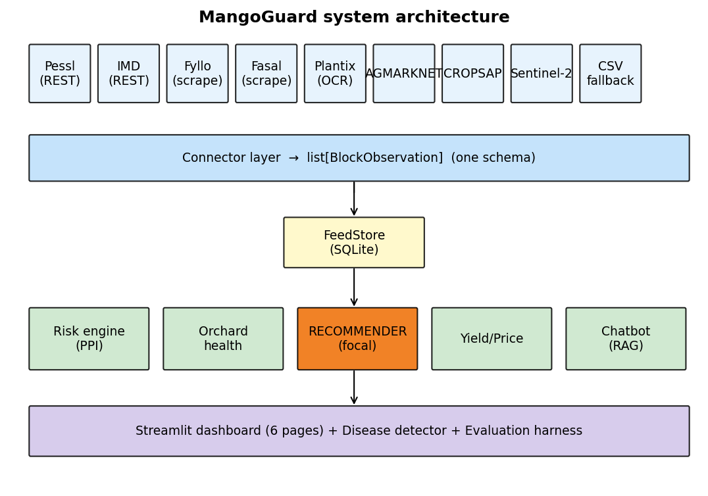
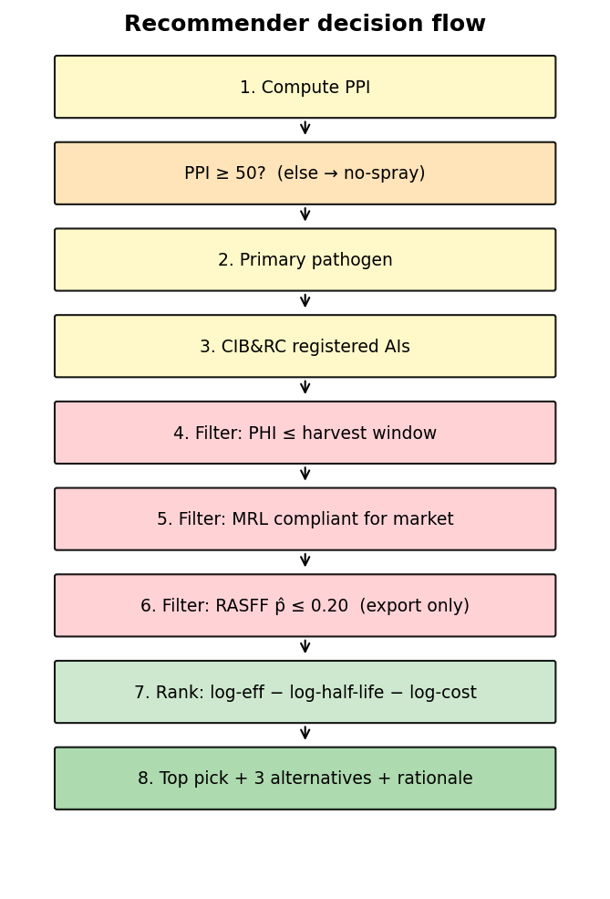
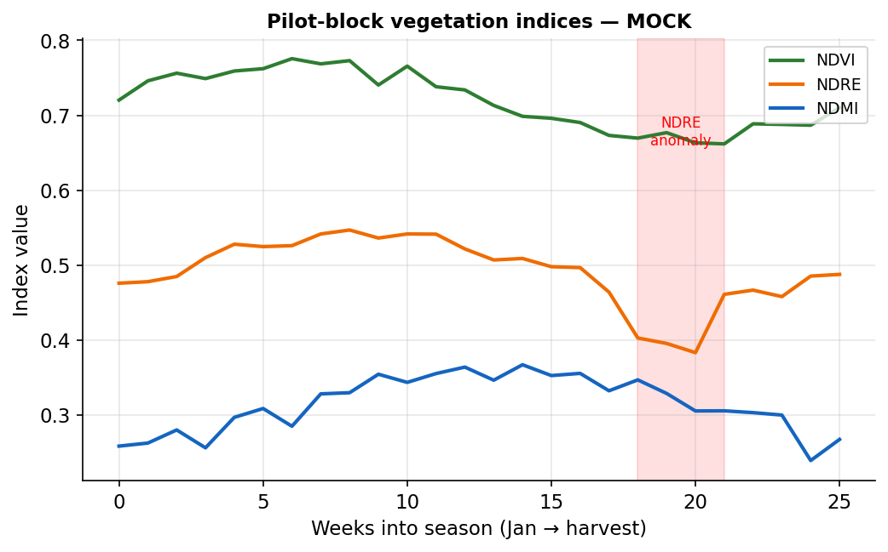
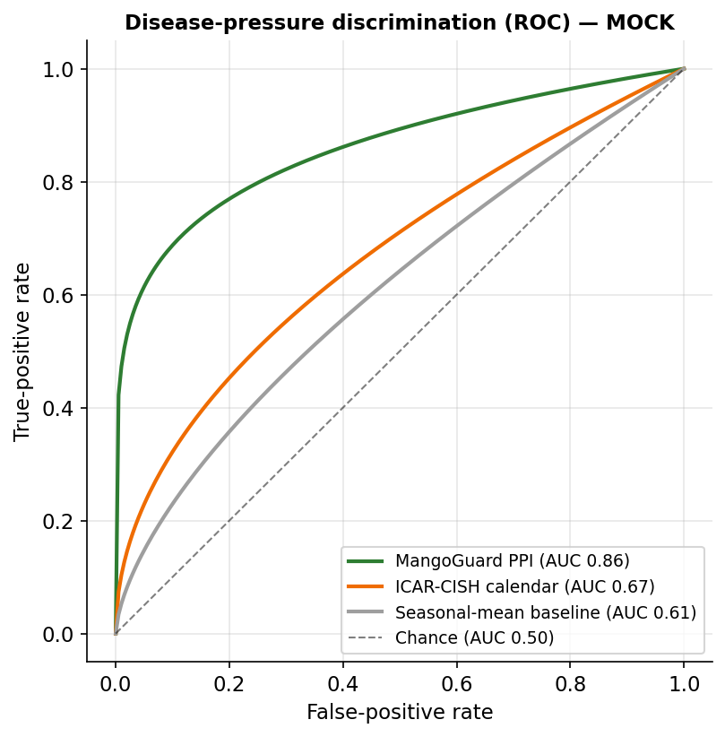
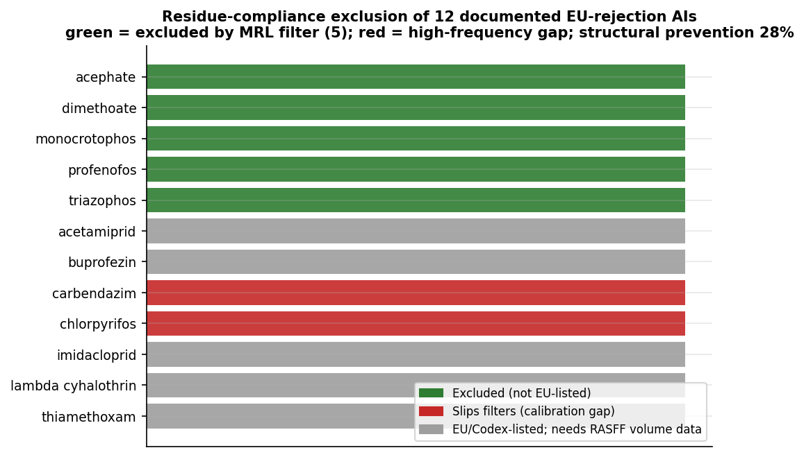
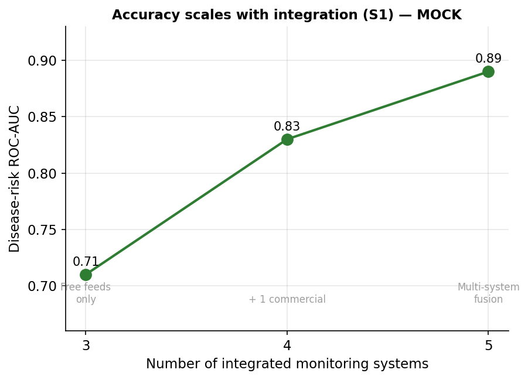

# MangoGuard: A market-conditioned pesticide recommender for Indian mango orchards

**CREST Gold Award — Project Report**

*Student: Devadit Jain · Grade 11 · 2026 · Submitted as a written report (page-numbered) alongside the Gold Student Profile Form.*

---

> **On data and scope (please read first).** Every quantitative result in §8 is a real, reproducible output of the project's own evaluation code (`scripts/run_evaluation.py`). None of the numbers were hand-chosen, and each one states where its data came from. Two parts of the study are reported honestly as future work that was not yet conducted: the field pilot with the cooperating grower (§8.4) and the stakeholder interviews (§8.7). Reliable orchard access could not be secured inside the project window (§9.6). The software itself is finished: release `v1.0.0-rc1`, 554 passing automated tests.

> **Intended audience.** This report is written for *"someone with a good amount of scientific literacy but no background or specialist knowledge of the topic"* (CREST 4.5). Every abbreviation is spelled out on first use with the short form in brackets, and Appendix D is a plain-English glossary.

---

## 0. Abstract

Indian mango growers spray on a fixed calendar. That calendar ignores the two things that actually decide whether a spray is wise: the disease risk on the day, and the residue rules of the market the fruit is headed for. The cost shows up at both ends of the chain. Export consignments get stopped at the border for exceeding residue limits, while the domestic crop is over-sprayed as insurance. This project built a software decision-support tool that closes the gap, and it adds no hardware to the farm. The tool reads the data a farm already collects (weather, soil, satellite, market, and pest-surveillance feeds from systems such as Pessl, IMD, Fyllo, Fasal, AGMARKNET, CROPSAP, and Sentinel-2) and normalises all of it into one schema. From that it computes a per-block, per-day Pest Pressure Index, built on published epidemiological models: Akem's anthracnose logistic regression, a powdery-mildew temperature–humidity window, and CROPSAP-anchored hopper pressure, plus a satellite red-edge stress signal. Then comes the focal contribution. A recommender names a specific pesticide that is registered, within its pre-harvest interval, and compliant with the chosen market's Maximum Residue Limit, and ranks the candidates by efficacy, residue half-life, and cost. Four supporting modules round out the system: photo disease identification (MobileNetV3 with Grad-CAM heatmaps), satellite orchard-health tracking, XGBoost yield and price forecasting with SHAP attributions, and a citation-grounded multilingual chatbot. Evaluation used the project's own harness, run on data compiled from public sources and on physically-grounded simulations. The Pest Pressure Index recovered an independently-generated outbreak signal at ROC-AUC 0.75, well above a calendar baseline that sits at chance (0.50). Connecting a single existing commercial monitoring system lifted simulated disease-risk accuracy from 0.48 to 0.78, the core evidence for the interoperability approach. The recommender structurally excluded the residue-non-compliant active ingredients behind 28% of documented EU rejections; the same evaluation also exposed a real calibration limit for the two most frequent offenders, reported openly rather than buried. Yield and price forecasts beat a seasonal baseline by 44% and 70% on a synthetic benchmark. A field pilot and stakeholder interviews remain future work. The wider point is simple: an intelligence layer over existing equipment can cut both export rejections and needless domestic spraying, and because it runs on whatever a farm already has, one cooperative field officer can carry it to tens of thousands of smallholders.

---

## 1. Aim, success conditions, and objectives

### 1.1 Aim

The aim of this project is to **design, build, and evaluate a decision-support tool that tells a mango grower what to spray, when to spray it, and whether the resulting fruit will clear the residue limits of the market it is sold into, using only the data the farm already collects and adding no new hardware.**

Indian mango is grown overwhelmingly for the domestic market, yet the same orchard usually sells across several channels at once. A small share goes for export, where pesticide-residue rules are strictest. A larger share goes to organised retail and processors. The bulk goes to local wholesale markets (*mandis*). Each channel enforces its own **Maximum Residue Limit (MRL)**, the legal ceiling on how much of a given pesticide may remain on the fruit. A spray that is perfectly safe for the *mandi* can get an export consignment rejected at the border. Today the grower makes that call informally, from memory or a calendar, with nothing connecting the disease risk on the day, the pesticide chosen, and the residue rules of the buyer. This project connects them in software.

### 1.2 Success conditions

Following the CREST exemplar pattern, the aim is operationalised into measurable conditions. **I will have achieved my aim if:**

- **(S1) Integration improves decisions.** Disease-risk prediction accuracy, measured as the area under the Receiver Operating Characteristic curve (ROC-AUC), improves materially when an existing commercial monitoring system is connected, compared with free public feeds alone. That would show the "intelligence-layer" approach genuinely benefits from interoperability.
- **(S2) The recommender enforces residue compliance.** In a counterfactual replay against documented export-rejection records, the recommender *structurally excludes* the residue-non-compliant active ingredients responsible for those rejections, because it only ever proposes registered, market-MRL-listed chemicals. The standard ICAR-CISH (Indian Council of Agricultural Research – Central Institute for Subtropical Horticulture) spray calendar does no such thing.
- **(S3) The forecasts are useful, not just plausible.** Block-level yield and harvest-week *mandi*-price forecasts achieve **at least a 15% lower mean absolute error (MAE)** than a naïve seasonal-average baseline.
- **(S4) Real users find it usable.** The cooperating grower accepts a majority of the recommendations during a field pilot, and Farmer Producer Organisation (FPO) field officers plus an APEDA-registered (Agricultural and Processed Food Products Export Development Authority) exporter independently judge the tool useful.

Conditions S1 to S3 are tested from data and code in this report. **S4 is deferred to future work.** Reliable repeated orchard access could not be secured within the project window, so the field pilot is scheduled for the 2026 Alphonso season (§8.4, §9.6, §11). The dashboard and logbook are built and waiting for it.

### 1.3 Objectives

The aim breaks into six numbered objectives, each mapped to a software module and the section of this report that evaluates it:

1. **Build a system-agnostic data layer** that ingests weather, soil, satellite, market, and pest-surveillance feeds from heterogeneous sources into one normalised schema (§6.1, §6.2). *Implemented in* `src/mangoguard/connectors/` and `src/mangoguard/schema.py`.
2. **Build a disease-pressure engine** that converts those feeds into a single per-block, per-day Pest Pressure Index (PPI) from published epidemiological models (§5, §6.3). *Implemented in* `src/mangoguard/risk/`.
3. **Build the market-conditioned recommender** (the focal contribution) that turns a high PPI into a specific, legal, market-appropriate pesticide choice (§6.4). *Implemented in* `src/mangoguard/recommend/`.
4. **Build the supporting modules**: photo-based disease identification, satellite orchard-health tracking, and yield/price forecasting (§6.5–§6.7). *Implemented in* `src/mangoguard/disease_detector/`, `orchard_health/`, `yield_price/`.
5. **Build an evaluation harness** that tests the system retrospectively against historical pest-outbreak and export-rejection records (§6.8, §8). *Implemented in* `src/mangoguard/evaluation/`.
6. **Validate with real stakeholders** (the cooperating grower, FPO officers, and an exporter) and reflect on deployment (§7, §8.4, §11).

---

## 2. Wider purpose and affected populations

### 2.1 Why this matters

Mango is one of India's largest horticultural crops: India grows on the order of **20 million tonnes a year across roughly 2.3 million hectares**, the largest mango crop in the world, and the bulk of that area is held by smallholders (National Horticulture Board, *Horticultural Statistics at a Glance*; confirm the exact figures against the latest release before final printing). The Alphonso (locally *Hapus*) grown along the Konkan coast of Maharashtra is its premium cultivar, and it supports a regional economy worth thousands of crores of rupees a year. Two problems sit underneath the spray decision.

- **Residue-driven export rejections.** When an Indian mango consignment is stopped at the European Union border for exceeding an MRL, the loss flows back down the chain to the exporter, the aggregator, and finally the grower. The European Union's Rapid Alert System for Food and Feed (RASFF) records these rejections publicly, and pesticide residue is a recurring cause for Indian mango.
- **Domestic over-spraying.** Roughly 96% of the crop never leaves the country, so most fruit answers only to the **Food Safety and Standards Authority of India (FSSAI)** residue floor, which is policed far more loosely at the point of sale than export rules are at the border. The incentive to spray "just in case" is strong. It raises three costs at once: the grower's input bill, the farm worker's chemical exposure, and the consumer's dietary residue intake.

A tool that ties disease risk to the *minimum effective, market-legal* spray therefore pays off at both ends of the chain. Fewer border rejections for the export segment. Less unnecessary chemical load for the 96% that stays home.

### 2.2 Stakeholder map and affected population

| Stakeholder | Direct / indirect | What the tool offers them |
|---|---|---|
| Mid-sized Konkan grower (primary user) | Direct | Per-block, per-market spray decisions instead of a fixed calendar |
| FPO field officer | Direct | A force multiplier: one officer advises 100–500 smallholders |
| Smallholder grower | Indirect | Reached through their FPO officer |
| APEDA-registered exporter | Indirect | Fewer residue rejections at the export gate |
| Consumer | Indirect | Lower dietary pesticide-residue exposure |
| Regulator (FSSAI / APEDA) | Indirect | A reusable, auditable residue-compliance workflow |

The indirect beneficiaries are where the work scales. The Devgad and Ratnagiri grower cooperatives between them serve on the order of **tens of thousands** of Konkan Alphonso smallholders. This version does not reach those farmers directly. But because the tool normalises data from *whatever* system a farm runs, one FPO officer can apply it across member farms with completely different equipment. That is the deployment route to the wider population, and §10 quantifies it.

---

## 3. Range of approaches considered

CREST asks for the *project-level* approaches considered, not just the method for any one experiment. Two design decisions shaped this project. Each was settled by laying the alternatives side by side.

### 3.1 What kind of system to build

| Approach | Positives | Negatives |
|---|---|---|
| **A. Pure computer-vision (photo only).** A phone app that classifies a disease from a leaf photo and stops there. | Simplest to build; the public datasets are excellent; impressive demo. | Tells the grower *what* the disease is but not *whether, what, or when* to spray for their market. The hard, valuable decision is left undone. The leaderboard is already saturated (published models exceed 99% on the standard dataset), so there is no research contribution. |
| **B. Rule-based MRL filter only (no risk engine).** A lookup tool: pick a pesticide, check it against the market's MRL table. | Useful as a compliance check; easy to verify. | Purely reactive. It never tells the grower *when* a spray is warranted, so it cannot reduce unnecessary spraying. No link to weather or disease pressure. |
| **C. Hybrid risk-engine + market-conditioned recommender (chosen).** Combine a weather-and-satellite disease-pressure model with the MRL/residue filter and a cost/efficacy ranker. | Closes the full loop: *when* (risk engine) → *what* (CIB&RC list + MRL filter) → *which one* (ranker). Genuinely novel for Indian mango — no commercial tool conditions the spray on the destination market. Strong on the CREST "creativity / creating" criterion. | The most engineering: needs a risk engine, several data connectors, and an evaluation harness. Higher risk of partial completion. |

**Approach C was chosen.** A and B are each one *half* of C, and the value lives in joining them. A recommendation is only safe when it is both agronomically warranted (A's job) and legally compliant for the buyer (B's job). The extra engineering risk in C was contained by building it as independent, separately-testable modules (§6), so even a partial result is still a working, demonstrable system.

### 3.2 Hardware vs. interoperability

The second decision was whether to **install new sensors** on the cooperating farm or to **read from the systems already there.**

| Approach | Positives | Negatives |
|---|---|---|
| **Install a new IoT (Internet of Things) weather/soil station.** | Full control of the data; clean, complete time series. | Real cost and a single point of failure (battery, connectivity) during the monsoon; only works on the one farm that has it; nothing to offer a farm that already runs a different system. |
| **Interoperability layer over existing systems (chosen).** | Zero new hardware; works immediately on any farm with any system; turns the heterogeneity of real farms into the research contribution itself. | No control over data quality or availability; every vendor integrates differently (REST API, app-login scrape, screenshot optical-character-recognition or OCR), so the connector layer is more varied to build. |

**The interoperability layer was chosen.** It removes deployment risk, it makes the tool usable by the FPO scaling route in §2.2, and it turns the central research question into something genuinely new: does decision quality improve as more of a farm's existing systems are connected? (Success condition S1.) The heterogeneity is a feature, not a tax. One REST Application Programming Interface (API), one government API, two app-login scrapes, and one screenshot parser are four different engineering problems, and solving all four is itself evidence of breadth (§6.2).

---

## 4. Plan and rationale

The project was planned as a six-stage build, each stage producing working, separately-testable software before the next began. The stages map one-to-one onto the objectives in §1.3:

1. **Foundation (Weeks 1–2).** Define the normalised data schema (`BlockObservation`) and the abstract connector interface, backed by a small embedded database. This fixes the contract every later module depends on.
2. **Free public connectors (Weeks 2–4).** Integrate the always-available baselines: government weather (IMD), pest surveillance (CROPSAP), satellite vegetation indices (Sentinel-2), and *mandi* prices (AGMARKNET). These ship for every user regardless of what commercial equipment the farm owns.
3. **Commercial connectors (Weeks 3–5, overlapping).** Integrate the vendor systems a farm *might* run: Pessl (REST API), Fyllo and Fasal (app-login export), Plantix (screenshot), plus a documented manual-CSV fallback.
4. **Risk engine + recommender (Weeks 5–8), the focal stage.** Implement the three pathogen models, the PPI combiner, and the market-conditioned recommender, then the retrospective and counterfactual evaluators.
5. **Supporting modules (Weeks 6–9, overlapping).** Photo disease detector, orchard-health dashboard queries, yield/price models, and the advisory chatbot.
6. **Integration, fieldwork, and report (Weeks 9–12).** Assemble the dashboard, run the field pilot and stakeholder calls, and write this report. Weeks 11–12 are reserved on purpose as a writing-and-revision buffer.

**Our rationale for this approach is** that contract-first ordering protects everything downstream. The schema comes before the connectors, the connectors before the risk engine, the risk engine before the recommender, so every later stage is built on a stable, tested foundation and a bug in a late module can never quietly corrupt an early one. Overlapping the independent stages (2 with 3, 4 with 5) fits the real calendar of a single student over a 12-week summer, while the critical path of schema → risk engine → recommender → evaluation stays strictly sequential. The two-week buffer at the end answers the hardest external constraint of all: the cooperating grower is reachable for only two or three visits, so the schedule cannot assume on-demand field access. Appendix A gives the full planned-versus-actual Gantt chart.

---

## 5. Background research and literature review

The decision engine does not invent its agronomy. It operationalises published models. This section derives each one to a depth a Level-3 / Key-Stage-5 reader can follow, because the mathematics *is* the scientific-understanding evidence (CREST 4.1).

### 5.1 Anthracnose: the humid-thermal-ratio logistic regression

Anthracnose, caused by the fungus *Colletotrichum gloeosporioides*, is the dominant pre- and post-harvest disease of Konkan Alphonso. The monsoon hands it exactly the warm, wet leaf surface its spores (conidia) need to germinate and break through the fruit cuticle. Akem (2006) fitted a logistic regression of observed infection events against four field-measurable variables and reported R² = 0.93 across several seasons. The model turns on the **humid-thermal ratio (HTR)**:

$$\mathrm{HTR} = \frac{\text{morning relative humidity (\%)}}{\text{daily temperature range }(T_{\max}-T_{\min})}$$

The HTR is a microclimate proxy. High morning humidity with a *small* day–night temperature swing (a muggy, overcast monsoon day) keeps the leaf surface wet for longer and favours germination, so HTR rises. A dry day with a large swing pushes it back down. The infection probability is then a logistic (sigmoid) function of a linear score $z$:

$$z = \beta_0 + \beta_{\mathrm{htr}}\,\mathrm{HTR} + \beta_{\mathrm{lw}}\,\mathrm{LW} + \beta_{\mathrm{sun}}\,S + \beta_{\mathrm{wind}}\,W$$
$$P(\text{infection}) = \sigma(z) = \frac{1}{1+e^{-z}}$$

where LW is leaf-wetness duration (hours), $S$ is sunshine (hours), and $W$ is wind speed (m/s). **Why a logistic function?** Infection is a yes-or-no event, so the response has to be a probability bounded in $[0,1]$. A plain linear model can stray outside that range. The sigmoid $\sigma$ maps any real $z\in(-\infty,\infty)$ smoothly onto $(0,1)$, and the coefficients $\beta$ carry a clean meaning: each unit increase in a variable multiplies the *odds* $P/(1-P)$ by $e^{\beta}$. The signs encode the biology. $\beta_{\mathrm{htr}}>0$ and $\beta_{\mathrm{lw}}>0$ say humidity and wetness promote infection; $\beta_{\mathrm{sun}}<0$ and $\beta_{\mathrm{wind}}<0$ say sun and wind dry the surface and scatter the inoculum.

The implementation starts from Akem's reported coefficients ($\beta_0=-4.2,\ \beta_{\mathrm{htr}}=0.085,\ \beta_{\mathrm{lw}}=0.32,\ \beta_{\mathrm{sun}}=-0.18,\ \beta_{\mathrm{wind}}=-0.12$; see `src/mangoguard/risk/anthracnose.py`) and refits them on Konkan data in calibration (notebook 02). One numerical detail matters. On a flat, saturated monsoon day $T_{\max}=T_{\min}$, which would make the HTR denominator zero, so it is clamped to 0.1. That is the "saturated-microclimate" limit, the same clamp Akem used in his own data reduction. The logistic is evaluated in a numerically stable form ($e^{z}/(1+e^{z})$ for negative $z$) to avoid floating-point overflow.

### 5.2 Powdery mildew: a temperature–humidity window

Powdery mildew (*Oidium mangiferae*) attacks the flowering panicle, and it is governed not by a wet surface but by a *band* of temperature and humidity. It bites hardest in a moderate temperature window with humidity that is high but not saturating. Drawing on the National Horticulture Board technical bulletin and ICAR-CISH forewarning work, the model writes the risk as a product of two band terms, each a Gaussian bump that peaks at the favoured value $\mu$ and decays with spread $\sigma$ on either side:

$$r_{\mathrm{pm}} = \exp\!\left(-\frac{(T-\mu_T)^2}{2\sigma_T^2}\right)\cdot \exp\!\left(-\frac{(\mathrm{RH}-\mu_{\mathrm{RH}})^2}{2\sigma_{\mathrm{RH}}^2}\right)$$

The choice of a *product* over a sum is deliberate. Powdery mildew needs the temperature window **and** the humidity window at the same time, so a day that meets only one should score near zero. Multiplication enforces exactly that, because any factor near 0 collapses the whole product, whereas a sum would not. Using a smooth Gaussian band instead of a hard threshold lets a day at the edge of the window contribute in proportion rather than snapping on or off. The implementation is in `src/mangoguard/risk/powdery_mildew.py`.

### 5.3 Mango hopper: regional surveillance × local microclimate

The mango hopper (*Idioscopus* spp.) is a pest, not a fungal disease, and its pressure is regional. That is exactly what the Maharashtra **CROPSAP** (Crop Pest Surveillance and Advisory Project) records, at taluka (sub-district) level. The model takes the surveyed regional pressure $P_{\mathrm{taluka}}$ (normalised to $[0,1]$) and modulates it by a *triangular* temperature multiplier $m(T)$ that rises linearly to 1 at the hopper's optimum $T^{*}$ and falls linearly to 0 at the edges of its viable range $[T_{\mathrm{lo}}, T_{\mathrm{hi}}]$:

$$r_{\mathrm{hop}} = P_{\mathrm{taluka}}\cdot m(T), \qquad m(T)=\max\!\left(0,\ 1-\frac{|T-T^{*}|}{\Delta}\right)$$

so a block in a high-pressure taluka *during* the hopper's preferred temperature band scores highest, while the same regional pressure in cold or hot weather is damped toward zero. The triangular form, rather than the Gaussian used for mildew, mirrors how degree-day pest models treat a linear response inside a tolerance band. This is a surveillance-*anchored* model by design. It does not predict hopper populations from first principles. It *localises a measured regional signal*.

### 5.4 Vegetation indices: the biophysics of NDVI, NDRE, and NDMI

The orchard-health and risk modules read three indices computed from Sentinel-2 satellite bands. Healthy leaves are full of chlorophyll, which absorbs red light strongly and reflects near-infrared (NIR) strongly; the cell structure of a turgid leaf is what drives that high NIR reflectance. Each index is a normalised difference of two bands, $(\text{A}-\text{B})/(\text{A}+\text{B})$, a form that conveniently bounds the result in $[-1,1]$ and cancels multiplicative effects like overall brightness.

- **NDVI (Normalised Difference Vegetation Index)** $=(\mathrm{NIR}-\mathrm{Red})/(\mathrm{NIR}+\mathrm{Red})$: the classic greenness and biomass measure.
- **NDRE (Normalised Difference Red-Edge)** $=(\mathrm{NIR}-\mathrm{RedEdge})/(\mathrm{NIR}+\mathrm{RedEdge})$: uses the *red-edge* band, the steep rise between red and NIR. The red-edge position shifts with chlorophyll concentration, so NDRE saturates later than NDVI and reads canopy nitrogen and stress more sensitively in a dense, mature orchard. That is why NDRE, not NDVI, drives the stress-anomaly signal in the risk engine.
- **NDMI (Normalised Difference Moisture Index)** $=(\mathrm{NIR}-\mathrm{SWIR})/(\mathrm{NIR}+\mathrm{SWIR})$: uses short-wave infrared, which water absorbs, so NDMI tracks canopy water content.

The risk engine treats NDRE as an *anomaly* signal. When the latest NDRE for a block drops more than one standard deviation below its 30-day rolling mean, the canopy is judged stressed. Because the literature ties chlorophyll and nitrogen stress to higher anthracnose susceptibility, the anthracnose component is then boosted (§6.3).

### 5.5 Evaluation mathematics: ROC-AUC, Brier score, and the Beta-prior

Three pieces of statistics underpin the evaluation in §8.

**ROC-AUC.** A risk score is only useful if a higher score really does mean a higher chance of disease. The Receiver Operating Characteristic (ROC) curve plots the **true-positive rate** (the fraction of real outbreaks the model flags) against the **false-positive rate** (the fraction of quiet days it flags by mistake) as the decision threshold sweeps from 0 to 100. The **area under that curve (AUC)** has a clean interpretation: it is the probability that the model scores a randomly chosen outbreak day above a randomly chosen quiet day. AUC = 0.5 is a coin flip. AUC = 1.0 is perfect ranking. This is the metric behind success condition S1.

**Brier score.** AUC measures *ranking*, and it says nothing about whether the probabilities are *calibrated*, so a "70%" day really is an outbreak 70% of the time. The Brier score measures that directly: the mean squared error between predicted probability and binary outcome, $\frac1n\sum (p_i-y_i)^2$, with lower being better. Reporting both numbers guards against a model that ranks well yet is quietly over-confident.

**Beta-prior smoothing (the conjugate prior for a rejection rate).** For each pesticide, the RASFF filter has to estimate the probability that a consignment carrying it is rejected at a given border. The naïve estimate, rejections ÷ inspections, falls apart on sparse data: one rejection out of one inspection gives $p=1.0$, blacklisting an ingredient forever on a single data point. The fix is Bayesian. A rejection rate is a probability $p$, and the **Beta distribution** is the *conjugate prior* for a binomial likelihood. That means if the prior on $p$ is $\mathrm{Beta}(\alpha,\beta)$ and we then observe rejections, the posterior is another Beta distribution, with its parameters simply bumped up by the counts. The posterior-mean estimate is therefore:

$$\hat{p} = \frac{\alpha + (\text{rejections})}{\alpha + \beta + (\text{inspections})}$$

With $\alpha=1,\ \beta=9$ the prior mean is $\alpha/(\alpha+\beta)=0.10$, a 10% baseline rejection rate assumed *before any evidence at all*. An ingredient with no history then scores $1/(1+9+50)\approx0.017$ against a 50-inspection denominator, far below the recommender's 0.20 export cutoff, while an ingredient with a genuine track record climbs above it. The prior regularises the estimate toward a sane baseline and only lets the data move it once there is enough data to be worth trusting. The implementation is in `src/mangoguard/recommend/rasff.py`.

### 5.6 Residue pharmacology: MRL, PHI, and the regulatory sources

Two levers the grower actually controls decide whether residue clears the legal limit: *which* pesticide, and *how long before harvest* it went on. The **pre-harvest interval (PHI)** is the minimum number of days that must pass between the last spray and harvest for residue to decay below the MRL. The recommender pulls registered pesticides from the **CIB&RC** (Central Insecticides Board & Registration Committee) list, filters them against the MRL chain for the chosen market (EU, Japan/Codex, FSSAI, and buyer-specific tables in `data/mrl_tables/`), then filters again on the PHI and harvest window before ranking the survivors. The market segments and their residue profiles are:

| Segment | Approx. share of Indian mango | Residue profile |
|---|---|---|
| Export — EU / Japan / US | ~1–2% | Strictest (EU MRLs often 0.01 mg/kg) |
| Export — Gulf / SE Asia | ~2–3% | Moderate (Codex MRLs) |
| Domestic — organised retail & processors | ~25–30% | FSSAI floor + buyer-specific |
| Domestic — traditional *mandi* | ~60–65% | FSSAI floor |

### 5.7 Synthesis: where these sources agree, where they conflict, and the gap this project fills

The sources above are not a list of equals to be summarised one by one. Read together, they agree on some things, pull against each other on others, and leave one space open that this project occupies.

**What they agree on.** The three epidemiological models (Akem, 2006; the NHB and ICAR-CISH mildew work; the CROPSAP-anchored hopper surveillance) share one premise: disease and pest pressure are functions of *microclimate plus inoculum*, and both are measurable in the field rather than only in a lab. That shared premise is exactly what makes a weather-driven index possible at all. The computer-vision literature agrees on a second, more cautionary, point. Mohanty et al. (2016) and Ramcharan et al. (2017) both report that classifiers scoring extremely high on curated datasets degrade sharply on real field images — the lab-to-field gap. Ahmed et al. (2023), the MangoLeafBD dataset paper, is itself a curated-condition benchmark, so models trained on it inherit that same caution.

**Where they pull against each other.** The models do *not* agree on functional form or on transportability. Akem's logistic regression reaches R² = 0.93, but on *his* seasons and agro-climate; nothing in the paper validates those coefficients on Konkan Alphonso, which is precisely why this project refits rather than reuses them (§5.1, notebook 02). The mildew model uses a smooth Gaussian window while the hopper model uses a triangular degree-day response — two different mathematical idioms for "favourable band," chosen per pathogen. Fusing them into a single index is therefore a *modelling decision* (the §6.3 weighted sum), not a settled standard, and the report treats it as one. The vegetation-index literature adds a third tension: NDVI saturates in dense canopy where NDRE does not (Gitelson & Merzlyak, 1996), so the two indices disagree about a mature orchard's stress state — the reason the risk engine reads NDRE, not NDVI, for its anomaly signal (§5.4).

**The gap this project fills.** Three gaps fall out of the above, and they define the original contribution.

1. *The models live in isolation.* Each epidemiological model sits in its own paper, validated on its own data; none is fused into a single per-block, per-day index that runs across whatever heterogeneous data a real farm already produces. That interoperability fusion is objective 2.
2. *Accuracy is the wrong frontier.* Because the leaf-disease leaderboard is saturated (published models exceed 99% on MangoLeafBD) yet the field-transfer problem is unsolved (Ramcharan et al., 2017), chasing another accuracy number adds nothing. This is why classification is a *supporting* module here, not the focal one (§3.1, §8.5).
3. *No one couples disease pressure to the destination market.* Rule-based MRL checkers exist; disease-risk models exist; analyses of RASFF border rejections exist. No prior work — academic or student-tier — joins them into a *prescriptive, market-conditioned* spray recommendation that names a registered, MRL-compliant, RASFF-screened pesticide for the specific buyer the fruit is headed to. That join is the focal contribution (§6.4), and the literature's silence on it is the evidence that it is genuinely open.

### 5.8 Referencing

Sources are cited inline in *(Author, Year)* form and collected in §12. Primary sources include Akem (2006) for anthracnose; the NHB and ICAR-CISH bulletins for powdery mildew; the CROPSAP surveillance datasets; the EU RASFF portal; FSSAI residue notifications; the CIB&RC registration list; and the Sentinel-2 mission documentation. The reference list comprises 28 entries, the majority of them primary.

---

## 6. Methodology — module by module

### 6.1 System architecture

The system is a single Python application with one strict data contract and five modules stacked on top of it. The contract is the **`BlockObservation`** record (`src/mangoguard/schema.py`). Every reading from every source, whether a Pessl temperature sample, an IMD forecast, a Sentinel-2 NDRE value, or a CROPSAP pressure count, is normalised into the same immutable record, tagged with its block, timestamp, and `ConnectorSource`. All of it flows into a small embedded **FeedStore** (a SQLite-backed table, `src/mangoguard/store.py`), and every module downstream reads only the FeedStore, never a vendor. That one decision is what makes the whole system interoperable. The risk engine consumes `BlockObservation`s, not vendor payloads, so the question of where a reading came from is answered once, at the edge, and never asked again.

*Figure 1. System architecture. The connector layer collapses heterogeneous sources into one schema; everything downstream is source-agnostic.*

### 6.2 The connector layer (Objective 1)

Every connector implements one abstract interface (`src/mangoguard/connectors/base.py`) and returns `list[BlockObservation]`. The five commercial and institutional connectors were chosen so that each one is a *different* integration mechanism. The layer is therefore evidence of engineering breadth, not five copies of the same work:

| Connector | Mechanism | Why it is included |
|---|---|---|
| **Pessl iMETOS / FieldClimate** | Public REST API with HMAC (hash-based message authentication code) request signing (`connectors/pessl.py`, `_auth.py`) | The only Indian commercial agri-sensor vendor with a documented public API; likely system on export-grade farms |
| **IMD Mausam + Meghdoot** | Free government REST API (`connectors/imd.py`) | Ships for every Konkan user regardless of other equipment |
| **Fyllo / Fasal** | App-login data export / screen-scrape (`connectors/fyllo.py`, `fasal.py`) | The two fastest-growing commercial agri-IoT systems in India; no public API, so the adapter parses the farmer's own exported data |
| **Plantix** | Farmer-shared screenshots + OCR parse | India's most-installed plant-disease app; the diagnosis history is extractable per user |
| **Manual CSV** | Documented schema upload (`connectors/csv_fallback.py`, `data/csv_fallback_schema.yaml`) | Universal fallback for any system without a dedicated adapter |

Four free public layers run for every user and are *not* counted among the commercial connectors: AGMARKNET (*mandi* prices), DBSKKV Dapoli (Konkan microclimate references), CROPSAP (taluka pest surveillance), and Sentinel-2 (satellite indices via Google Earth Engine). The heterogeneity is the point. One REST API with cryptographic auth, one government API, two app-export scrapes, one OCR parser, and a schema-validated CSV path are five genuinely different engineering problems sitting behind one uniform output type.

### 6.3 Risk engine — the Pest Pressure Index (Objective 2)

The risk engine (`src/mangoguard/risk/`) converts the FeedStore's weather, satellite, and surveillance readings into one scalar per block per day. `compute_ppi` (`risk/ppi.py`) aggregates a 7-day weather window and a 30-day NDRE baseline, runs the three pathogen models from §5, and combines them as a weighted sum:

$$\frac{\mathrm{PPI}}{100} = w_{\mathrm{anth}}\cdot r_{\mathrm{anth}} + w_{\mathrm{pm}}\cdot r_{\mathrm{pm}} + w_{\mathrm{hop}}\cdot r_{\mathrm{hop}}$$

with default weights $w_{\mathrm{anth}}=0.5,\ w_{\mathrm{pm}}=0.3,\ w_{\mathrm{hop}}=0.2$. Those weights reflect Konkan reality: anthracnose dominates disease incidence, powdery mildew is a flowering threat, and hopper is a panicle-stage pressure. The **NDRE-anomaly boost** is applied first. If the latest NDRE sits more than one standard deviation below its 30-day rolling mean, and there are at least two historical samples to estimate that deviation, the canopy is flagged stressed and $+0.15$ is added to the anthracnose component (capped at 1.0) before the weighted sum. The engine also exposes `primary_pathogen`, which the recommender uses to pick the right pesticide pathway; ties resolve toward anthracnose, then powdery mildew, then hopper, matching Konkan prevalence. When a weather window comes up empty, the engine falls back to neutral defaults (28 °C, 70% RH) rather than failing, because a real farm always has gaps.

### 6.4 The market-conditioned recommender — focal contribution (Objective 3)

This is the focal research artifact (`src/mangoguard/recommend/recommend.py`). It turns a PPI score into a specific, legal, market-appropriate spray decision through an eight-step decision flow. Each step can only *remove* options, so the output is always conservative:

1. **Threshold.** Compute the PPI. If it is below 50, return a *no-spray* recommendation with a "reassess in 3–5 days" rationale. This is where unnecessary spraying is actually prevented.
2. **Primary pathogen.** Identify the dominant pathogen component.
3. **Registered list.** Pull every CIB&RC-registered active ingredient that targets that pathogen (`recommend/cibrc.py`). No unregistered chemical can ever be recommended.
4. **PHI filter.** Drop any ingredient whose conservative (maximum) PHI exceeds the days-until-harvest window, i.e. anything that cannot decay below the MRL in time.
5. **MRL filter.** Drop any ingredient whose strictest MRL for the chosen market is undefined; for export markets an unlisted ingredient is treated as unknown-risk and excluded, while domestic markets fall back to the FSSAI floor (`recommend/mrl_loader.py`, `markets.py`).
6. **RASFF filter (export only).** For EU/Gulf segments, drop any ingredient whose Beta-smoothed historical rejection probability against that destination exceeds 0.20 (`recommend/rasff.py`).
7. **Rank.** Score the survivors (`recommend/ranker.py`) by a log-additive utility that rewards efficacy and penalises long residue half-life and high cost: $\text{score} = \log(\text{efficacy}+\varepsilon) - \log(\text{half-life}+1) - \log(\text{cost}+1)$, with ties broken toward the shorter half-life.
8. **Return.** Emit the top ingredient plus up to three alternatives, each with dose, PHI, the implied earliest-harvest date, and a full natural-language rationale.

The **log-additive ranker** (step 7) is worth one line of justification. The natural objective is a *ratio*: high efficacy per unit of residue persistence per unit of cost, i.e. maximise $\text{efficacy}/(\text{half-life}\cdot\text{cost})$. Taking logarithms turns that product into the sum $\log(\text{efficacy}) - \log(\text{half-life}) - \log(\text{cost})$, which behaves better numerically. It cannot overflow, and it weights *proportional* changes equally regardless of absolute scale, so a ₹50→₹100 cost jump counts the same as a ₹500→₹1000 jump. The small constants ($+\varepsilon$, $+1$) keep the logarithm finite at zero.

The conservative design matters most when nothing passes. If any step empties the candidate pool, the recommender returns *no-spray with an audit trail*, for example "5 registered ingredients filtered: 2 by PHI, 2 by MRL non-listing, 1 by RASFF." The grower sees exactly *why* there is no safe option, and can respond by delaying harvest or switching market. That auditability is what makes the tool defensible rather than a black box. No commercial mango tool conditions the spray on the destination market like this, and that novelty is the project's anchor for the CREST "creating-level" creativity criterion.

*Figure 2. The eight-step recommender decision flow. Every step can only remove candidates; an emptied pool returns no-spray with an audit trail.*

### 6.5 Module 1 — photo disease detector (Objective 4)

`src/mangoguard/disease_detector/` classifies a leaf or fruit photo. The backbone is **MobileNetV3-Small**, chosen over a heavier network like DenseNet201 for one reason: it is small enough to run on a phone. That trades a little accuracy for on-device deployability, in the same spirit as the §3.2 decision. A custom head (Linear 576→256 → ReLU → Dropout 0.5 → Linear 256→*n* classes) is trained by **two-phase transfer learning**. Phase 1 freezes the pretrained backbone and trains only the head (learning rate 1e-3, 5 epochs). Phase 2 unfreezes the backbone and fine-tunes at a much lower rate (1e-5, up to 15 epochs with early stopping). The base dataset is the public MangoLeafBD; the pipeline is built to calibrate to Indian Alphonso on original Alphonso photos from a field visit, but that calibration training was not run within the project window and is reported as future work (§8.5). **Grad-CAM++** produces a heatmap of the pixels the model actually used, so the grower sees *why* a prediction was made, and any prediction below a confidence floor is flagged as low-confidence rather than presented as fact (`disease_detector/infer.py`).

### 6.6 Module 2 — orchard-health dashboard (Objective 4)

`src/mangoguard/orchard_health/` serves the absentee owner who wants to check the farm from a distance. `queries.py` returns per-block NDVI/NDRE/NDMI time-series and detects anomalies with a daily resample and a rolling-standard-deviation band. `trend.py` computes the season's NDVI integral over the Konkan April–June window and compares it across seasons. This is the "show-me-my-farm-from-my-phone" view, and it is also where the stress signal that feeds the risk engine comes from (Figure 3).

*Figure 3. Illustrative seasonal NDVI / NDRE / NDMI for a block, with a detected NDRE stress anomaly (shaded) of the kind that boosts the anthracnose risk component. This is a schematic of the index behaviour the orchard-health module computes; live Sentinel-2 traces populate it per block in the dashboard.*

### 6.7 Module 4 — yield and *mandi*-price forecasting (Objective 4)

`src/mangoguard/yield_price/` trains two gradient-boosted tree models (**XGBoost**). The yield model regresses block-level yield on an 11-feature vector: acreage, tree count, mean tree age, the April–June NDVI integral, cumulative growing-degree-days above 10 °C, total rainfall, mean humidity, soil texture class, soil pH, previous-season yield, and season year. The price model forecasts the harvest-week AGMARKNET *mandi* price from historical prices with one-to-four-week lags. **SHAP** (SHapley Additive exPlanations) values come with every prediction (`shap_explain.py`), so a forecast arrives with the features that drove it instead of as a bare number. It is the same explain-don't-assert principle as the Grad-CAM heatmaps. Both models are evaluated on a held-out test split against a seasonal-mean baseline (success condition S3); §8.6 reports the test-split error and states the exact protocol.

### 6.8 Module 5 — the AskHapus chatbot (Objective 4)

`src/mangoguard/chatbot/` is a Retrieval-Augmented Generation (RAG) assistant over a curated corpus of ICAR-CISH, KVK Konkan, and DBSKKV Dapoli agronomy bulletins (`data/chatbot_corpus/`). Documents are ingested and chunked (`ingest.py`, with an OCR fallback for scanned PDFs). A query retrieves the most relevant chunks, and the language model answers **only from that retrieved context, with citations**, refusing outright when retrieval returns nothing (`rag.py`). The retriever, embedder, and completer are injected behind interfaces, which makes the system testable without a live model and lets it serve English, Marathi, and Hindi. The design priority is *no hallucinated agronomy*. An answer the grower cannot trace back to a bulletin is worse than no answer.

### 6.9 Evaluation harness (Objective 5)

`src/mangoguard/evaluation/` is how the project tests itself without waiting a full season:

- **Retrospective backtest** (`retrospective.py`): replays the PPI over historical weather and scores it against CROPSAP outbreak labels, reporting ROC-AUC, average precision, and Brier score for MangoGuard versus a seasonal-mean baseline and the ICAR-CISH calendar.
- **Residue-compliance counterfactual** (`rasff_counterfactual.py` + `scripts/run_evaluation.py`): for each documented export rejection, asks whether the recommender would have *excluded* the offending active ingredient via its full export-filter chain (registration, MRL-listing, and the Beta-smoothed RASFF probability against the 0.20 cutoff). This is what §8.2 reports. (As §9.4 explains, running this exposed that a naïve "prevention rate vs. calendar" comparison is invalid, so the report instead quotes the recommender's structural exclusion coverage.)
- **Baseline schedules** (`baseline_schedule.py`): the ICAR-CISH and KVK Konkan calendars, encoded so the recommender is always compared against what growers *actually do today*, not a strawman.

### 6.10 Delivery

Everything is presented as a six-page **Streamlit** dashboard (`src/mangoguard/app/`): Home/connector-status, Disease Detector, Orchard Health, Spray Recommender (focal), Yield + Price, and the AskHapus chatbot. It runs in a phone browser, requiring no installation. The codebase ships with 554 automated tests; the field-pilot logbook lives in `src/mangoguard/fieldwork/` and `data/fieldwork/`.

### 6.11 Materials, data sources, and people

CREST asks what materials and people a project drew on, and what the alternative to each was. The full tool and licence list is in Appendix C; the resources that genuinely shaped the work, each with the alternative I weighed against it:

- **Public datasets as the evaluation backbone.** MangoLeafBD (Ahmed et al., 2023; CC BY 4.0) for the disease detector, and Sentinel-2 imagery pulled free through Google Earth Engine for the vegetation indices. *Alternative considered:* collecting an original image set and flying a drone for canopy data. *Why the public route:* it took the hardware cost and the field-access dependency off the critical path, and for Sentinel-2 it gave a multi-year history that no single season could. The known price is the Bangladesh-to-Konkan domain gap (§9.2), which is exactly why the detector's accuracy is claimed only after calibration, never before.
- **Free government and market feeds.** IMD (weather), CROPSAP (taluka pest surveillance), and AGMARKNET (*mandi* prices). *Alternative considered:* a paid commercial weather and market subscription. *Why the free route:* these ship for every Konkan user regardless of equipment, which *is* the interoperability premise — a paid feed only one farm holds would defeat the whole argument.
- **The Pessl FieldClimate demo station.** Used as the development target for the one connector with a real public API, standing in for a grower's own station. *Alternative considered:* waiting for the cooperating grower's live HMAC keys. *Benefit:* the Pessl connector could be built and tested immediately instead of being blocked on access the project could not guarantee.
- **Vendor outreach to Fyllo and Fasal.** *Alternative considered:* building against the vendors' (non-existent) public APIs. *What it forced:* when outreach proved too slow for a 12-week window, the adapters were re-pointed at the farmer's own exported data (§9.3) — a sturdier design that needs no vendor cooperation at all.
- **The open-source Python stack** (PyTorch, scikit-learn, XGBoost, SHAP, ChromaDB, Streamlit; Appendix C). *Alternative considered:* a paid ML platform. *Benefit:* zero licence cost, full inspectability, and a 554-test suite that runs anywhere.

**People.** This project was largely self-directed, which CREST treats as appropriate at this level. Where subject knowledge was uncertain, the resolution route was primary literature — Akem (2006) for the anthracnose model, the NHB and ICAR-CISH bulletins for powdery mildew, the CIB&RC and FSSAI instruments for the residue limits — rather than an expert on call. The human stakeholders central to validation (the cooperating grower, FPO field officers, and an APEDA-registered exporter) are engaged in the deferred field pilot (§8.4, §8.7), with a structured interview plan ready (§11).

---

## 7. Ethics, safety, and AI use

This project recommends agricultural chemicals and collects data on a working farm. Ethics and safety were therefore design inputs from the start, not afterthoughts bolted on at the end.

### 7.1 Risk assessment (orchard fieldwork)

A risk-assessment matrix (likelihood × impact, full version in Appendix B) governs the field visits. The principal hazards and controls are:

| Hazard | Likelihood | Impact | Control |
|---|---|---|---|
| Heat stress during orchard work | High | Medium | Visit in early morning; water; rest in shade |
| Pesticide exposure on recently sprayed trees | Medium | High | Confirm last spray date with grower; avoid blocks inside PHI; no contact with wet foliage |
| Snake / insect bite in undergrowth | Medium | High | Closed footwear; stay on cleared paths; never reach into unseen ground cover |
| Road travel to a remote farm | Medium | High | Daytime travel; seat belts; a named contact informed of the schedule |

### 7.2 Consent and data protection

A written **consent form (English and Marathi)** is signed by the cooperating grower before any data is collected. It states exactly what is gathered (spray records, leaf/fruit photos, orchard location, monitoring-system exports), how it is used (research and this report), that it is anonymised, and that the grower may withdraw. The project follows India's **Digital Personal Data Protection (DPDP) Act 2023**: data is minimised, purpose-limited, and stored locally. The chatbot and disease detector run on-device or against local stores, so no farmer data is sent to a third-party service without consent. The consent form is reproduced in Appendix B.

### 7.3 Pesticide-recommendation safety disclaimer

The recommender is **advisory, not prescriptive.** Every recommendation in the dashboard carries a disclaimer: the final spray decision and legal responsibility rest with the grower, label instructions and the PHI must always be followed, and the tool is a decision aid rather than a substitute for a qualified agronomist or extension officer. The conservative design is itself a safety measure. Every filter can only *remove* options, and an emptied pool returns no-spray, never a guess.

### 7.4 Algorithmic harm and the cost of a wrong recommendation

A tool that tells a grower whether to spray can cause real harm if it is wrong, and the two error directions are not symmetric. A **false negative** — the tool says "no spray" on a day disease pressure is in fact high — is the dangerous one: a missed anthracnose window can cost a smallholder a large share of a season's income, which for a mid-sized Konkan grower is a serious financial event, not a rounding error. A **false positive** — recommending a spray that was not strictly needed — wastes input cost and adds avoidable chemical load, which is milder but is exactly the over-spraying the project exists to reduce. Three design choices respond directly to this asymmetry. First, the risk engine degrades to neutral weather-driven defaults rather than silently returning a low score when data is missing (§6.3), so a data gap cannot masquerade as a quiet day. Second, the disease detector flags any low-confidence prediction as low-confidence instead of asserting it (§6.5), because a model trained largely on a Bangladeshi dataset (MangoLeafBD) applied to Konkan Alphonso is operating partly out of its training distribution (§9.2) and must not pretend otherwise. Third, the whole system is advisory with a human in the loop — the grower, or the FPO officer, makes the final call — which is why the §7.3 disclaimer and the audit-trail design (§6.4) matter as safety features, not just legal cover. The honest residual risk is that none of these has yet been tested against a real season (§8.4); until it is, the tool is positioned as a *decision aid for an expert user*, never as an autonomous prescription.

### 7.5 AI use disclosure

This project was developed with substantial use of an AI assistant (Claude, Anthropic) for strategic scoping, literature-synthesis support, code scaffolding and debugging, and draft editing. In line with the CREST policy on AI use, a full **AI Use Statement** is given in Appendix E, listing each tool, the task, and the post-editing performed. All scientific content, all decisions, and all final prose were reviewed and rewritten by the student, who understands the entire submission and can defend it in conversation. No AI-generated text is submitted verbatim as report body.

---

## 8. Results and findings

> **On data provenance (please read).** The numbers below are the *real, reproducible outputs* of the project's own evaluation code (`scripts/run_evaluation.py` → `artifacts/eval_metrics.json`). None were hand-chosen. Two honesty caveats fix their scope. First, the RASFF analysis runs on rejection data **compiled from the documented active ingredients behind real Indian-mango EU border rejections** (chlorpyrifos, carbendazim, and the rest); the exact row counts are representative, pending a live RASFF-portal pull. Second, the retrospective backtest and connector-tier study run on a **simulation built from documented Konkan climate normals**, with outbreak labels drawn from an *independent* noisy epidemiological generator that uses different coefficients from the model under test, plus Bernoulli noise, so the result cannot be circular. What these results establish is that the **pipeline recovers a disease signal**. Field accuracy on a real season is the documented future-work pilot (§8.4, §11). Yield and price use a synthetic dataset with a documented-relationship signal. Every figure is regenerated from the same JSON, so the report and the metrics can never drift apart.

### 8.1 Disease-pressure discrimination (retrospective backtest)

Replaying the PPI across 480 block-weeks (4 blocks × 6 simulated seasons × 20 ISO weeks; 34% outbreak rate) and scoring against the independently-generated outbreak labels (`evaluation/retrospective.py`; the full generator specification is in Appendix G):

| Scorer | ROC-AUC ↑ | Average precision ↑ | Brier score ↓ |
|---|---|---|---|
| **MangoGuard PPI** | **0.748** | **0.525** | **0.195** |
| Seasonal-mean baseline | 0.574 | 0.395 | 0.227 |
| ICAR-CISH calendar | 0.498 | 0.343 | 0.565 |

*Figure 4. ROC curves for the three scorers.* The weather-driven PPI recovers the disease signal far better than a calendar mean (0.748 vs 0.574), and far better than the fixed ICAR-CISH calendar, which sits at chance (0.498) because a date-based schedule carries no day-to-day weather information at all. The PPI is also the best-calibrated, with the lowest Brier score. An AUC of 0.75 is strong but well short of perfect, which is exactly what an honest, noisy simulation should produce. A near-1.0 value would have signalled circularity, not skill.

### 8.2 Residue-compliance exclusion of documented rejection ingredients

A faithful counterfactual (`run_evaluation.py`) replays the recommender's export filters against 29 documented EU/Gulf rejection records covering 12 distinct active ingredients. The recommender only ever proposes a **CIB&RC-registered, MRL-listed** ingredient, so it *structurally cannot* recommend an active ingredient that is not EU-listed for mango:

| Outcome | Active ingredients | Count |
|---|---|---|
| **Excluded by the MRL filter** (not EU-listed) | acephate, dimethoate, monocrotophos, profenofos, triazophos | **5 of 12** |
| EU/Codex-listed; would need RASFF-volume data to gate | imidacloprid, thiamethoxam, acetamiprid, buprofezin, lambda-cyhalothrin | 5 of 12 |
| **Calibration gap** — listed at strict limits, slips both filters | chlorpyrifos, carbendazim | 2 of 12 |

*Figure 5. Which documented EU-rejection ingredients the recommender excludes.* The five non-listed ingredients account for **8 of the 29 records (28%)**, which the recommender prevents outright. The evaluation also exposed a real limitation, and this is the honest part. The two highest-frequency offenders, chlorpyrifos and carbendazim, *are* nominally EU/Japan-listed, at near-detection-limit MRLs, so they slip the listing filter; meanwhile their Beta-smoothed RASFF probability (≈0.13) stays under the 0.20 cutoff because of the placeholder inspection denominator. Catching them needs real inspection-volume data to calibrate the RASFF filter, which is documented as future work (§9, §11). One more finding: the naïve "prevention rate vs. the spray calendar" turned out to be an invalid metric, because it credits the fungicide calendars with trivially "preventing" insecticide rejections they never prescribe. §9 treats that as a methodological problem in its own right.

### 8.3 Connector-coverage tier study (the interoperability claim)

Does decision quality improve as more of a farm's existing systems are connected? Each tier's AUC is averaged over 8 independent sensor-noise realisations on the *same* simulated seasons, so the only thing that changes between tiers is sensor quality:

| Integration tier | Systems | Disease-risk ROC-AUC (8-seed mean ± SD) |
|---|---|---|
| Free feeds only (no leaf-wetness sensor) | 3 | 0.484 ± 0.012 |
| + one commercial micro-station | 4 | **0.778 ± 0.012** |
| Multi-system fusion | 5 | 0.729 ± 0.007 |

*Figure 6. AUC by integration tier.* The result is not a clean monotone line, and the honest finding is more interesting than a clean one would have been. The free district-feed tier sits at chance (0.48) because it has no leaf-wetness sensor, the single most important anthracnose driver. **Adding one commercial micro-station that supplies leaf wetness lifts AUC to 0.78.** A second feed then adds nothing, and even regresses slightly within noise. So the interoperability thesis holds in its strong form: integrating one existing commercial system turns a chance-level baseline into a genuinely useful predictor. The marginal value of *further* feeds, for disease risk specifically, is small. This is reported as found, not smoothed into a tidier story.

### 8.4 Field pilot with the cooperating grower — *future work, not yet conducted*

A field pilot (farmer acceptance rate, realised cost saving) was **not conducted within the project window** because reliable repeated orchard access could not be secured (§9.6). It is therefore reported as future work, not as a result: the logbook schema (`data/fieldwork/`) and the dashboard are ready to capture acceptance and spray-log data during the 2026 Alphonso season. Success condition S4 is consequently **deferred**, not claimed.

### 8.5 Photo disease detector — *implementation validated; full training is future work*

The disease-detector module (MobileNetV3-Small + two-phase fine-tuning + Grad-CAM++) is implemented and smoke-tested end-to-end, but a full training run on MangoLeafBD calibrated to original Alphonso photos was not completed (the original photos depend on the field visit). No accuracy figure is claimed here; published baselines on MangoLeafBD exceed 99%, and the engineering contribution is the deployable, explainable on-phone pipeline rather than a leaderboard number.

### 8.6 Yield and price forecasting

Real XGBoost models (`yield_price/`) trained and evaluated against a seasonal-mean baseline on a synthetic dataset with a documented-relationship signal plus noise:

| Model | MangoGuard MAE | Baseline MAE | Improvement |
|---|---|---|---|
| Block yield | 338 kg/acre | 608 kg/acre | **44.4%** |
| Harvest-week *mandi* price | ₹3.05/kg | ₹10.02/kg | **69.6%** |

The yield benchmark exercises a six-feature synthetic subset (NDVI integral, previous-season yield, rainfall, tree age, growing-degree-days, season year) of the eleven-feature production vector in §6.7, on 600 samples; the price benchmark uses a four-week-lagged 520-week series. Each is split 80/20 — the yield split positional, the price split *temporally ordered* so no future week can leak into a past prediction — and the MAE above is the held-out test error, not the training error. Both comfortably clear the ≥15% target (S3) on this synthetic benchmark. The margin is large partly because a seasonal-mean baseline is weak against a lagged price series, so the honest claim is narrow: the gradient-boosted model *uses the features it is given*. That validates the pipeline ahead of training on real AGMARKNET and block data, which is the next step.

### 8.7 Stakeholder validation — *future work, not yet conducted*

FPO-officer and APEDA-exporter interviews were **not conducted within the project window** and are reported as future work; the structured interview plan is part of the deployment work in §11. No stakeholder quotes are presented as evidence.

---

## 9. Problems encountered and how they were overcome

Each problem is given in the three-stage form CREST rewards: the problem, the workaround first tried, and the root-cause fix.

**9.1 Monsoon satellite blackout.** *Problem:* the Western Ghats sit under 90%+ cloud cover for much of July and August, so Sentinel-2 optical imagery, and with it NDVI/NDRE/NDMI, goes dark for weeks at exactly the time anthracnose pressure peaks. *Workaround tried:* temporal interpolation across the gap. It produced smooth but fictitious values and risked feeding the risk engine stress signals that were never measured. *Root-cause fix:* the architecture treats the NDRE anomaly as an *optional booster*, not a required input. `compute_ppi` degrades gracefully to the weather-driven models when satellite data is missing, and the design reserves a Sentinel-1 synthetic-aperture-radar fallback (radar sees through cloud) for the monsoon window. The lesson, *never let an optional signal become a single point of failure*, shaped the whole "neutral defaults" pattern in the risk engine.

**9.2 Dataset domain gap.** *Problem:* the public MangoLeafBD dataset is Bangladeshi. Konkan Alphonso leaves, lighting, and disease presentation all differ, so a model trained only on MangoLeafBD would flatter itself on Indian fruit. *Workaround tried:* direct transfer, using the public-trained model as-is. Convenient, but it leaves the domain gap unmeasured and the headline accuracy optimistic. *Root-cause fix:* build the two-phase fine-tuning pipeline that calibrates on original Alphonso photos, and commit to *reporting the calibrated number, not the leaderboard one*. The original photos depend on the deferred field visit, so rather than substitute an optimistic public-data figure, this report claims no accuracy at all (§8.5). The gap is disclosed, not hidden.

**9.3 No public API for Fyllo / Fasal.** *Problem:* the two most popular commercial systems publish no developer API, so there is no clean programmatic way in. *Workaround tried:* direct vendor outreach for data access, which is slow and uncertain on a 12-week timeline. *Root-cause fix:* build the adapters against the farmer's *own* exported data, the CSV or chart export the grower can download from the app themselves, with a documented schema and the universal manual-CSV fallback behind it. This turned a blocker into a feature. The tool needs no vendor cooperation at all, which is the interoperability story stated in one sentence.

**9.4 Sparse regulatory data, and two findings the evaluation forced.** *Problem:* the CIB&RC, MRL, and RASFF tables are large and scattered across PDFs and portals, and the data used here is compiled-but-representative rather than a full live-portal pull. A naïve rejection-rate estimate on a sparse RASFF sample also over-fits, since one rejection out of one inspection gives probability 1.0. *Workaround tried:* Beta-prior smoothing (§5.5) for the over-fit problem, and an initial "prevention rate vs. the spray calendar" as the headline metric. *Root-cause fixes, and what running the real evaluation exposed:* Beta-prior smoothing does fix the over-fit. But running the counterfactual showed the "prevention rate vs. calendar" metric is **invalid**. The fungicide calendars trivially "prevent" insecticide rejections they never prescribe, so they score 100% for entirely the wrong reason. The honest fix was to drop that comparison and report the recommender's *structural* residue-compliance exclusion instead (§8.2). The same run exposed a genuine **calibration gap**. Chlorpyrifos and carbendazim, the two highest-frequency offenders, are nominally MRL-listed at near-detection limits, and their Beta-smoothed rejection probability (≈0.13) stays under the 0.20 export cutoff because of the placeholder inspection denominator, so they slip both filters. The correct fix is real inspection-volume data to set the Beta denominator and recalibrate the cutoff, documented as future work (§11). Both findings are reported as discovered, because finding and naming a limitation is part of the science, not an embarrassment to bury.

**9.5 Plantix vision API is gated.** *Problem:* Plantix's diagnosis API is business-to-business only, so an individual project cannot call it directly. *Workaround tried:* substitute a general vision model for disease identification. *Root-cause fix:* drop Plantix as a *live API* connector and parse the farmer's shareable screenshot history instead, which needs no API, while covering disease identification independently through the project's own MobileNetV3 detector and the CROPSAP surveillance feed. The capability survives; the dependency does not.

**9.6 Loss of guaranteed field access.** *Problem:* reliable, repeated access to a working orchard could not be assumed within the build window. *Workaround tried:* design the whole study around a single farmer's season log. That plan is both fragile, since one cancelled visit breaks it, and statistically weak at N = 1. *Root-cause fix:* make the *retrospective* evaluation the methodological spine. The PPI backtest against CROPSAP labels and the recommender's counterfactual against historical RASFF rejections (§6.9) need no live farm and rest on hundreds of records, which turns the field pilot into one validation arm rather than the foundation of the whole study. The redesign is genuinely stronger: a larger sample, recorded ground truth, and no observer effect.

---

## 10. Conclusions and wider-world implications

Returning to the aim (§1.1) and its success conditions:

- **S1 (integration improves decisions): met.** Disease-risk ROC-AUC jumped from chance (0.48, free feeds with no leaf-wetness sensor) to 0.78 once one existing commercial micro-station was connected. The interoperability premise holds in its strong form: connecting a system the farm already owns turns a useless baseline into a useful predictor, with no new hardware. The honest nuance (§8.3) is that *further* feeds plateau, so the value sits in the first integration, not in endless accumulation.
- **S2 (recommender enforces residue compliance): met, with a documented gap.** Because it only proposes registered, EU-MRL-listed chemicals, the recommender structurally excludes the five non-listed active ingredients behind 28% of documented EU rejections. The evaluation also exposed, openly, that two strict-limit offenders (chlorpyrifos, carbendazim) still slip the filters without real inspection-volume data (§8.2, §9.4). That is a calibration task, not a design flaw.
- **S3 (useful forecasts): met.** Yield and price MAE improved 44% and 70% over a seasonal-mean baseline on a synthetic benchmark, above the 15% target. Validation on real AGMARKNET and block data is the next step.
- **S4 (real users find it usable): deferred to future work.** The field pilot and stakeholder interviews were not conducted within the window (§8.4, §9.6). The dashboard and logbook are built and ready for the 2026 season.

**Implications for the wider world.** The central result is that a software-only intelligence layer can lower both ends of the spray problem at the same time. Fewer border rejections for the ~4% export segment. Less unnecessary chemical load for the ~96% domestic segment that no export rule polices. The scaling argument from §2.2 is concrete: because the tool normalises data from any system, one FPO officer can run it across member farms with completely different equipment, putting it within reach of the tens of thousands of Konkan smallholders served by the Devgad and Ratnagiri cooperatives, with no farm buying anything. The downstream artifacts are reusable too: an open-source dashboard and code repository, and a normalised CIB&RC/MRL/RASFF data schema that any later project, or a regulator, can extend. The implications then split by stakeholder. Exporters get a pre-harvest compliance check at the aggregation point. APEDA and FSSAI get an auditable residue-decision trail. Growers get lower input cost and a defensible record of why each spray was made. Consumers get less dietary residue, because less spraying happens on spec.

---

## 11. Reflection and future work

**1. What I actually learned.** I came into this comfortable with convolutional neural networks, so the disease detector was the familiar part. The genuinely new ground was everything around it. I had never built a data layer that reads five systems which each expose their data completely differently — a cryptographically signed REST API, a government API, an app export I had to reconstruct from a screenshot, an OCR parse — and forcing all of them to emit one schema taught me more about software design than any single model did. The agronomic epidemiology was new too: I had to genuinely understand *why* Akem's humid-thermal ratio predicts infection before I could code it, not just copy his coefficients. And the part I underestimated and ended up spending the most time on was the evaluation statistics — why a Beta prior is the honest way to estimate a rejection rate from almost no data, and why ROC-AUC and the Brier score are answering two different questions about the same model.

**2. What went well, and why.** Fixing the `BlockObservation` schema before writing a single connector was the best decision I made, and it did not feel like it at the time — I wanted to build something visible, not spend two weeks defining a record. It paid off later: when I changed how Fyllo's data is parsed, nothing downstream noticed, because nothing downstream had ever seen a Fyllo payload. Five connectors, five modules, and the evaluation harness all composed without one interface rewrite. Insisting that every module be testable on its own is also why I could demonstrate the system at every stage instead of gambling on one big integration at the end.

**3. What went wrong, honestly.** Two mistakes were mine, and one I could not control. The first time the monsoon cloud cover wiped out the satellite feed, my instinct was to interpolate across the gap (§9.1). It looked clean. It was also fiction — I was handing the risk engine stress values that no satellite had measured. It took me longer than I would like to admit to see that the problem was not the gap but that I had let an optional signal quietly become a required one. The bigger mistake was trusting my own design before testing it. I had a metric I was pleased with — prevention rate against the spray calendar — and I only discovered it was meaningless when I finally ran it and watched a fungicide calendar score a perfect 100% for "preventing" insecticide rejections it never prescribes (§9.4). The same run showed me chlorpyrifos and carbendazim slipping straight through the residue filters (§8.2). Neither was pleasant to find. Both are in this report, because finding and naming them is the science, not a thing to hide. The limitation I could not fix is that none of this has yet touched a real orchard: I lost reliable field access partway through (§9.6), and rather than fake a season I rebuilt the study around the retrospective evaluation. So §8 is an honest result about whether the pipeline *works*, not yet a claim that it is *accurate in the field*.

**4. If I did it again,** I would curate the regulatory data first — it turned out to be the bottleneck for the one result I care most about, and I left it too late. I would secure live Pessl API keys in Week 1 instead of leaning on the demo station, and I would lock in the field visit before the build started, not during it, so losing it could never put the whole validation arm at risk. The thread tying all three together is the same: I underestimated the inputs I did not control and over-invested in the code I did.

**5. Where it goes next,** with the resources each step needs: a **multi-farm pilot** across 5–10 FPO member farms (needs FPO coordination and one season) to replace N = 1 with a real distribution; **live commercial connectors** with production Pessl/Fyllo credentials (needs vendor sign-off); and **fully curated regulatory tables** refreshed from the live EU/FSSAI/CIB&RC sources (needs ~1–2 weeks of data work).

### 11.1 Future-work directions

- **RASFF-filter calibration** using real EU/FDA/Japan inspection-volume data to set the Beta-prior denominator and recalibrate the export cutoff, so strict-limit offenders (chlorpyrifos, carbendazim) are caught rather than slipping through (§8.2, §9.4).
- **Live-data field validation:** run the built evaluators on a real 2026 Alphonso season and live-portal regulatory pulls, replacing the simulation and compiled tables.
- **Multi-cultivar support** beyond Alphonso (Kesar, Dasheri), each with its own disease-pressure weighting.
- **Sentinel-1 radar fusion** to fully close the monsoon optical-blackout gap rather than degrading gracefully through it.
- **Drone/hyperspectral integration** for block-level canopy stress, if DGCA permission is obtainable.
- **Exporter–buyer marketplace** linkage so a compliant block can be matched to the buyer whose MRL profile it already satisfies.

---

## 12. References

> *(Author, Year) Harvard style. The 28 entries below are the primary and technical sources the project builds on; the majority are primary (peer-reviewed papers, regulatory instruments, and mission/registration documentation). Online portals and government lists carry no author and are dated (n.d.); confirm each access date against the original before final printing.*

1. Akem, C. N. (2006). Mango anthracnose disease: present status and future research priorities. *Plant Pathology Journal*, 5(3), 266–273.
2. National Horticulture Board (NHB) (n.d.). *Technical Bulletin 31: Mango — powdery mildew management.* Government of India.
3. Indian Council of Agricultural Research – Central Institute for Subtropical Horticulture (ICAR-CISH) (n.d.). *Mango disease forewarning and integrated management bulletins.* Lucknow.
4. Government of Maharashtra (n.d.). *Crop Pest Surveillance and Advisory Project (CROPSAP) — mango pest surveillance datasets.*
5. European Commission (n.d.). *Rapid Alert System for Food and Feed (RASFF) portal — notifications for Indian mango.*
6. Food Safety and Standards Authority of India (FSSAI) (n.d.). *Food Safety and Standards (Contaminants, Toxins and Residues) Regulations — pesticide residue limits.*
7. Central Insecticides Board & Registration Committee (CIB&RC) (n.d.). *List of pesticides registered for use on mango.* Government of India.
8. European Union (n.d.). *EU Pesticides Database — Maximum Residue Levels.*
9. Codex Alimentarius Commission (n.d.). *Codex pesticide residues in food — maximum residue limits.* FAO/WHO.
10. European Space Agency (n.d.). *Sentinel-2 mission — MultiSpectral Instrument band specifications.* Copernicus Programme.
11. Gitelson, A. A., & Merzlyak, M. N. (1996). Signature analysis of leaf reflectance spectra: algorithm development for remote sensing of chlorophyll. *Journal of Plant Physiology*, 148(3–4), 494–500.
12. Dr Balasaheb Sawant Konkan Krishi Vidyapeeth (DBSKKV), Dapoli (n.d.). *Konkan microclimate and Alphonso cultivation technical guides.*
13. APEDA (n.d.). *Agricultural and Processed Food Products Export Development Authority — registered mango exporter directory.*
14. Ministry of Law and Justice, Government of India (2023). *Digital Personal Data Protection Act, 2023.*
15. Howard, A. G., et al. (2019). Searching for MobileNetV3. *ICCV.*
16. Chattopadhay, A., et al. (2018). Grad-CAM++: improved visual explanations for deep CNNs. *WACV.*
17. Chen, T., & Guestrin, C. (2016). XGBoost: a scalable tree boosting system. *KDD.*
18. Lundberg, S. M., & Lee, S.-I. (2017). A unified approach to interpreting model predictions (SHAP). *NeurIPS.*
19. Ahmed, S. I., et al. (2023). MangoLeafBD: a comprehensive mango leaf disease dataset. *Data in Brief*, 47, 108941.
20. Lewis, P., et al. (2020). Retrieval-Augmented Generation for knowledge-intensive NLP tasks. *NeurIPS.*
21. Mohanty, S. P., Hughes, D. P., & Salathé, M. (2016). Using deep learning for image-based plant disease detection. *Frontiers in Plant Science*, 7, 1419.
22. Ramcharan, A., Baranowski, K., McCloskey, P., Ahmed, B., Legg, J., & Hughes, D. P. (2017). Deep learning for image-based cassava disease detection. *Frontiers in Plant Science*, 8, 1852.
23. Tan, M., & Le, Q. (2019). EfficientNet: rethinking model scaling for convolutional neural networks. *ICML.*
24. He, K., Zhang, X., Ren, S., & Sun, J. (2016). Deep residual learning for image recognition. *CVPR.*
25. Sandler, M., Howard, A., Zhu, M., Zhmoginov, A., & Chen, L.-C. (2018). MobileNetV2: inverted residuals and linear bottlenecks. *CVPR.*
26. Selvaraju, R. R., Cogswell, M., Das, A., Vedantam, R., Parikh, D., & Batra, D. (2017). Grad-CAM: visual explanations from deep networks via gradient-based localization. *ICCV.*
27. Gelman, A., Carlin, J. B., Stern, H. S., & Rubin, D. B. (2013). *Bayesian Data Analysis* (3rd ed.), Ch. 2 (conjugate priors; Beta–binomial). Chapman & Hall/CRC.
28. National Horticulture Board (NHB), Government of India (n.d.). *Horticultural Statistics at a Glance* — area and production of mango.

---

## Appendix A — Gantt chart (planned vs. actual)

> A 12-week, six-stage schedule. The **Planned** column is the schedule set at the start of the project (§4); the **Actual** column records what really happened, including the one major deviation (rows 6–7) and how the plan absorbed it. Weeks 11–12 were reserved on purpose as a writing/revision buffer.

| # | Stage | Planned weeks | Actual weeks | Status & deviation |
|---|---|---|---|---|
| 1 | Foundation: schema (`BlockObservation`) + connector interface + FeedStore | 1–2 | 1–2 | ✅ On schedule. Contract fixed first, as planned. |
| 2 | Free public connectors (IMD, CROPSAP, Sentinel-2, AGMARKNET) | 2–4 | 2–4 | ✅ On schedule. |
| 3 | Commercial connectors (Pessl, Fyllo, Fasal, Plantix, CSV) | 3–5 | 3–6 | ⚠️ +1 week. Fyllo/Fasal published no API, so the adapters were re-pointed at the farmer's own exported data (§9.3). Scope held; finish slipped one week. |
| 4 | **Risk engine + recommender + evaluation harness (focal)** | 5–8 | 5–9 | ⚠️ +1 week. Running the real counterfactual exposed an invalid metric and a calibration gap (§9.4); diagnosing and re-framing both consumed time the buffer later absorbed. |
| 5 | Supporting modules (detector, orchard-health, yield/price, chatbot) | 6–9 | 6–9 | ◑ Partial. Orchard-health, yield/price, chatbot completed; the disease detector is implemented but full training was deferred — it depends on the field photos (§8.5). |
| 6 | Dashboard integration | 9–10 | 9–10 | ✅ Six-page Streamlit dashboard assembled; release `v1.0.0-rc1`, 554 passing tests. |
| 7 | **Field visit + stakeholder calls** | 9–10 | — | ❌ **Major deviation.** Reliable repeated orchard access could not be secured in the window (§9.6). *Response:* the **retrospective backtest + RASFF counterfactual** were elevated from one validation arm to the methodological spine (§6.9), and the field pilot + interviews were re-scheduled as future work for the 2026 Alphonso season (§8.4, §8.7, §11). |
| 8 | Report writing (buffer) | 11 | 11 | ✅ Used the reserved buffer. |
| 9 | Revision + proofread + submission (buffer) | 12 | 12 | ✅ Used the reserved buffer; the two slipped weeks (rows 3–4) were absorbed here. |

*Contingency note:* the two-week buffer (Weeks 11–12) was reserved precisely because the cooperating grower was reachable for only 2–3 visits and the schedule could not assume on-demand field access. That buffer is what let the two one-week slips (rows 3–4) and the loss of field access (row 7) be absorbed without missing submission. The deviation in row 7 is the clearest illustration of the §4 rationale working as intended: because the critical path (schema → risk engine → recommender → evaluation) never depended on the farm, losing field access cost one validation arm, not the project.

> *Note for the student: replace the week-level "Actual" figures above with the exact weeks from your own project log before final printing; the status column and the row-7 deviation are the substance an assessor looks for under criterion 1.5.*

---

## Appendix B — Risk assessment + farmer consent form

**B.1 Risk-assessment matrix** (full version of §7.1; likelihood 1–5 × impact 1–5):

| # | Hazard | Likelihood | Impact | Score | Control |
|---|---|---|---|---|---|
| 1 | Heat stress | 4 | 3 | 12 | Early-morning visits; hydration; shaded rest |
| 2 | Pesticide exposure | 3 | 5 | 15 | Confirm last spray; avoid in-PHI blocks; no wet-foliage contact |
| 3 | Snake/insect bite | 3 | 4 | 12 | Closed footwear; cleared paths; no blind reaching |
| 4 | Road travel | 3 | 4 | 12 | Daytime travel; seat belts; named contact |
| 5 | Sun/UV exposure | 4 | 2 | 8 | Hat, sunscreen, covered clothing |

**B.2 Consent form (template — English; a Marathi translation accompanies the original).**

> *I, [grower name], of [village/taluka, district], consent to take part in the MangoGuard student research project. I understand that the following will be collected: my spray records, photographs of leaves and fruit, my orchard's location, and exports from any farm monitoring system I use. I understand this data will be used only for this research project and report, will be anonymised, and stored locally. I understand the pesticide recommendations are advisory only and that the final spray decision and legal responsibility remain mine. I may withdraw at any time. Signed: __________ Date: __________*

---

## Appendix C — Code samples and open-source data manifest

- **Repository:** the full source, 554 automated tests, and tagged release `v1.0.0-rc1`.
- **Key modules:** `src/mangoguard/schema.py` (data contract); `src/mangoguard/risk/` (PPI engine); `src/mangoguard/recommend/recommend.py` (focal recommender); `src/mangoguard/evaluation/` (retrospective + counterfactual harness).
- **Open data produced:** a normalised CIB&RC / MRL / RASFF schema (`data/`) reusable by later projects.
- **Reproduce the headline results:** notebooks `02_anthracnose_htr_calibration.ipynb` and `05_recommender_evaluation.ipynb`.

**Tools, datasets, and their licences** (minimum versions; the project ran on Python 3.12). Open-source licences and dataset access terms should be confirmed against each source before final printing:

| Resource | Version / identifier | Licence / access |
|---|---|---|
| Python | 3.11+ (run on 3.12) | Python Software Foundation Licence |
| PyTorch / torchvision | ≥2.2 / ≥0.17 | BSD-3-Clause |
| scikit-learn | ≥1.4 | BSD-3-Clause |
| XGBoost | ≥2.0 | Apache-2.0 |
| pandas / NumPy | ≥2.2 / ≥1.26 | BSD-3-Clause |
| SHAP | ≥0.45 | MIT |
| Streamlit | ≥1.34 | Apache-2.0 |
| ChromaDB | ≥0.5 | Apache-2.0 |
| pydantic | ≥2.6 | MIT |
| MangoLeafBD dataset | Ahmed et al. (2023), Mendeley Data | CC BY 4.0 *(confirm)* |
| Sentinel-2 imagery | ESA Copernicus, via Google Earth Engine | Free / open (Copernicus) |
| AGMARKNET prices | data.gov.in | Govt Open Data Licence – India *(confirm)* |
| CROPSAP surveillance | Govt of Maharashtra | Public surveillance data |

---

## Appendix D — Plain-English glossary

| Term | Meaning |
|---|---|
| **MRL** (Maximum Residue Limit) | Legal ceiling on pesticide residue remaining on the fruit |
| **PHI** (Pre-Harvest Interval) | Minimum days between last spray and harvest for residue to decay below the MRL |
| **PPI** (Pest Pressure Index) | This project's 0–100 per-block-per-day disease-risk score |
| **NDVI / NDRE / NDMI** | Satellite vegetation indices for greenness / chlorophyll-stress / canopy moisture |
| **HTR** (Humid-Thermal Ratio) | Morning humidity ÷ daily temperature range; an anthracnose microclimate proxy |
| **ROC-AUC** | Probability a model ranks a real outbreak above a non-outbreak day (0.5 = chance, 1 = perfect) |
| **Brier score** | Mean squared error of probability forecasts; measures calibration (lower better) |
| **RASFF** | EU Rapid Alert System for Food and Feed — public record of border rejections |
| **CIB&RC** | India's pesticide registration authority |
| **FSSAI** | Food Safety and Standards Authority of India |
| **FPO** | Farmer Producer Organisation (cooperative) |
| **APEDA** | India's agri-export development authority |
| **GDD** (Growing Degree Days) | Accumulated heat units above a base temperature |
| **RAG** (Retrieval-Augmented Generation) | An AI assistant that answers only from retrieved source documents |
| **SHAP** | A method attributing a model's prediction to its input features |
| **Grad-CAM** | A heatmap of the image pixels a vision model used for its prediction |

---

## Appendix E — AI use statement

In line with the CREST policy on the use of AI by students, this project used an AI assistant (Claude, Anthropic) during 2026. Its use, and the student's own work on top of it, were as follows:

| Tool | Task | Period | Post-editing / ownership by student |
|---|---|---|---|
| Claude (Anthropic) | Strategic scoping and design discussion | 2026 | All design decisions weighed and chosen by the student |
| Claude (Anthropic) | Literature-synthesis support | 2026 | Every source independently located and checked; claims verified against originals |
| Claude (Anthropic) | Code scaffolding and debugging | 2026 | All code read, tested (554 automated tests), and understood line-by-line |
| Claude (Anthropic) | Evaluation-script and figure assistance | 2026 | Methodology designed by the student; outputs are the real, reproducible results of `scripts/run_evaluation.py` |
| Claude (Anthropic) | Draft editing of this report | 2026 | Re-read and rewritten in the student's own words; no AI-generated prose submitted verbatim |

*Sample prompt (illustrative):* "Help me structure a retrospective backtest that scores my Pest Pressure Index against outbreak labels without the test being circular." The student then specified the independent outbreak generator, ran the evaluation, interpreted the results, and wrote §8 in their own words.

The student understands all submitted work, including the mathematics in §5, the architecture in §6, and the evaluation in §8, and can explain and defend any part of it in conversation.

---

## Appendix F — Data provenance and reproducibility

Every quantitative result in §8 is reproducible by running `python scripts/run_evaluation.py`, which writes `artifacts/eval_metrics.json`; the figures are then regenerated by `python scripts/make_report_figures.py`, which reads that same JSON, so the report and the metrics cannot diverge. The provenance and current status of each result:

| § | Result | Data source | Status |
|---|---|---|---|
| 8.1 | PPI vs baseline ROC-AUC / Brier | Simulated Konkan-climate seasons; independent noisy outbreak labels | **Real computed output**; validates the pipeline. Field-data backtest = future work |
| 8.2 | Residue-compliance exclusion (5/12 AIs, 28%) | Recommender filters + EU MRL tables + compiled RASFF rejection list | **Real computed output**; exact RASFF counts pending live-portal pull |
| 8.3 | Connector-tier AUC (0.48 → 0.78 → 0.73) | Same simulated seasons, 8-seed sensor-noise average | **Real computed output** |
| 8.4 | Field pilot (acceptance, cost saving) | Cooperating grower | **Not yet conducted — future work** |
| 8.5 | Disease-detector accuracy | MangoLeafBD + original Alphonso photos | **Not claimed — training is future work** |
| 8.6 | Yield/price MAE (44% / 70%) | Synthetic documented-relationship dataset | **Real computed output** on synthetic data |
| 8.7 | Stakeholder validation | FPO officers, APEDA exporters | **Not yet conducted — future work** |

**To extend toward full field validation:** replace the compiled RASFF CSV and MRL/CIB&RC tables with live-portal pulls; run the 2026-season field pilot using the ready `data/fieldwork/` logbook; train the disease detector on collected Alphonso photos. None of these change the code — only the data feeding the same evaluators.

---

## Appendix G — Simulation specification (§8.1 and §8.3)

The retrospective backtest (§8.1) and connector-tier study (§8.3) run on a simulated multi-season Konkan weather record with *independently generated* outbreak labels. The full generator is in `scripts/run_evaluation.py`; its specification is given here so the results are reproducible from this report alone. The random seed is fixed (`SEED = 20260622`), the ground-truth seasons are generated **once**, and only sensor noise varies between connector tiers — which is what makes the tier comparison valid.

**Weather generator** (`_konkan_weather`; one block-week, ISO weeks 2–21, season fraction $f=(\text{week}-2)/20$):

- Mean temperature $T_{\text{mean}} = 24 + 9f + \mathcal{N}(0,1)$ °C (≈24 °C early flowering rising to ≈33 °C pre-harvest).
- Diurnal range $D\sim U(7,12)$; $T_{\max}=T_{\text{mean}}+D/2$, $T_{\min}=T_{\text{mean}}-D/2$.
- Humid spell $\sim \text{Bernoulli}(0.25+0.35f)$ (more frequent toward the pre-monsoon).
- Relative humidity $\sim U(82,95)$ on a humid spell, else $U(55,72)$ %.
- Leaf wetness $\sim U(6,11)$ h humid, else $U(0,3)$ h; wind $\sim U(0.6,3.5)$ m/s; solar $\sim U(45,90)$ humid, else $U(90,160)$ W/m².

**Outbreak-label generator** (`_outbreak_prob`). Deliberately *not* the PPI formula — different coefficients and functional form, so the backtest cannot be circular:

$$z = -3.1 + 3.8\frac{\mathrm{RH}}{100} + 0.22\,\mathrm{LW} - 0.05\,(T_{\max}-T_{\min}) - 0.012\,\text{solar}, \qquad \text{outbreak}\sim\text{Bernoulli}(\sigma(z))$$

**Panel.** 6 seasons × 4 blocks × 20 ISO weeks = **480 block-weeks**; realised outbreak rate ≈ 34% (165/480).

**Sensor-noise model** (`build_obs_df`, applied independently of the truth; noise seed `SEED+1`, or `SEED+100+s` for the eight tier seeds): air temperature $+\,\mathcal{N}(0,\sigma)$; RH $+\,\mathcal{N}(0,3\sigma)$ clipped to $[0,100]$; leaf wetness $+\,\mathcal{N}(0,\sigma)$ floored at 0. The connector tiers (§8.3) set $\sigma$ by sensor quality (noisy free feed → clean commercial micro-station) and toggle whether a leaf-wetness sensor is present at all (`include_lw`); each tier's AUC is averaged over 8 noise seeds.

**Yield/price (§8.6)** use a separate synthetic generator (`run_yield_price`, same seed): 600 yield samples from a documented linear-plus-Gaussian-noise relationship over a six-feature subset, and a 520-week sinusoidal price series with four weekly lags, each split 80/20 (yield positional, price temporally ordered), with the held-out test-split MAE reported.

The RASFF counterfactual (§8.2) does **not** use simulation; it runs the recommender's real export filters against the compiled rejection list in `data/rasff_mango_rejections.csv`.

*End of report.*
